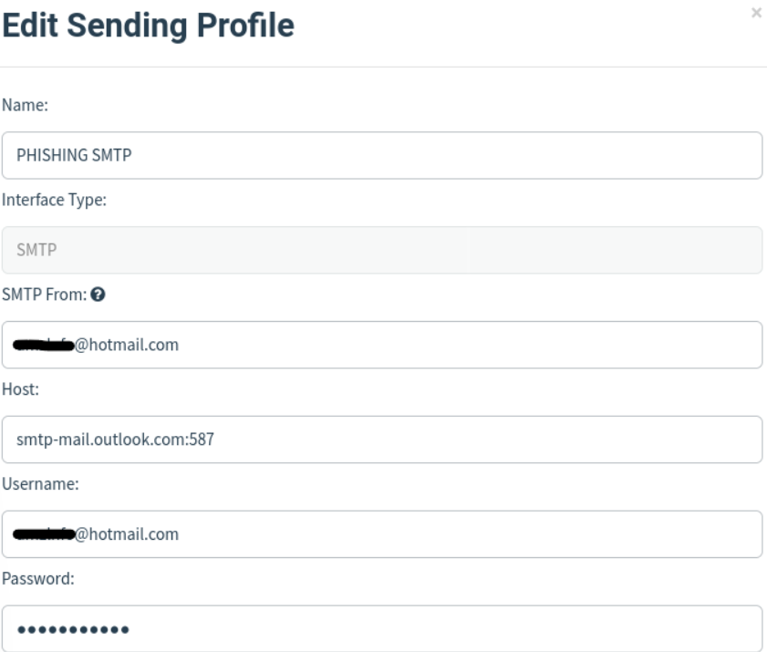

# Phishing - Tools

Primero descargaremos la herramienta de auditoria para `Phishing` llamada `Gophish` para poder crear la estructura basica del `phishing`....

URL = https://github.com/gophish/gophish

Para instalarlo haremos lo siguiente...

```shell
git clone https://github.com/gophish/gophish.git
```

```shell
cd gophish/
```

```shell
go build
```

Y con esto ya estaria instalado, por lo que lo ejecutaremos para que se cree el servidor donde se alojara la pagina web de `Gophish`...

```shell
gophish
```

> Estructura Basica

`Gophish` lo utilizaremos para poder crear el `Email` falso, con la configuracion determinada acorde a las necesidades del usuario...

Despues utilizaremos en `terminal` el servidor `apache2` en local...

Tambien tendremos que configurar un servidor `SMTP` para poder añadirlo a la configuracion de `Gophish` y que se pueda enviar el correo falso...

URL (Configuracion de `SMTP`) = https://serverspace.io/es/support/help/postfix-as-a-send-only-smtp-on-ubuntu/

O en vez de utilizar `SMTP` podremos crear un correo de `hotmail` y utilizar el servidor por defecto de `Microsoft` de `SMTP`...

> Configuracion `SMTP` de `Microsoft`

<figure><figcaption></figcaption></figure>

El servidor `SMTP` es el siguiente...

```
Host: smtp-mail.outlook.com
Port: 587
```

Como se ve en la captura en el `host` ira...

```
smtp-mail.outlook.com:587
```

En la parte de `usuario` pondremos nuestro correo de `hotmail` y en la parte de contraseña nuestra contraseña de `hotmail` y por utlimo donde pone `SMTP From` pondremos nuestro correo de `hotmail`...

Por lo que ya estaria configurado el servidor `SMTP`...

Tambien tendremos que instalar la herramienta `ngrok` para tunelizar la direccion del servidor de `apache2` a una direccion publica sin necesidad de comprar un dominio, por lo que cuando configuremos esa herramienta podremos ver la pagina de `phishing` en cualquier dispositivo ya que estaria tunelizado de forma publica...

URL (ngrok) = https://ngrok.com/download

Una vez configurada la herramienta con tu `API Key` e iniciada se abrira la tunelizacion del servidor `phishing` por lo que ya lo podremos ver en otros dispositivos y con esa `URL` que nos proporciona `ngrok` la colocaremos en el codigo programado del `email` en la pagina de `gophish` para que cuando abra el `email`y pinche el link te redirija a la pagina `phishing` tunelizada por `ngrok`...

Y ya por ultimo tendremos que crear una base de dato en `mysql` para que cuando se ingresen los datos en el login nos lo guarde en nuestra base de datos para poder verlos por lo que tendremos que crear otra pagina que le redirija al usuario en `.php` paar que capte los datos y los guarde en `mysql`...

Todo el proceso de creacion paso a paso y la configuracion esta en la pagina siguiente llamada `Phishing_techniques and results`...
